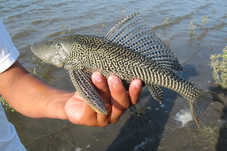

# What is Molecular Ecology? {#intro}

The phrase 'molecular ecology' is nothing new; it is in many ways synonymous with 'ecological genetics' as first applied by pioneers like Dobzhansky, Ford, and others (en.wikipedia.org/wiki/Molecular_ecology). Maybe the question of terminology comes down to people *who identify as geneticists but want to solve ecological concerns* (Phil Hedrick and his work on Florida panthers in 1995? I've not met him to verify how he identifies as a scientist), or people *who identify as ecologists but recognize how to use genomic data as a means to greater understanding* (can't help my bias, I think of Rick Grosberg doing a number of deep explorations into behavioral ecology via understanding genome-wide kinship, see Fig 1.1). The journal ***Molecular Ecology*** (https://onlinelibrary.wiley.com/journal/1365294x) began in 1991; the field is not new, but the attention given to it from a broader spectrum of scientists seems to be. Before giving an overview of what may be included in this topic, it is probably first important to acknowledge that there are "molecular" approaches to addressing ecological questions that are often *not* included in this field.

Ecosystem ecologists ask about elemental and nutrient cycles in the environment, and such work routinely screens for the abundance, provenance, and isotopic ratios of Carbon, Nitrogen, Phosphorus, and other key elements to life (https://en.wikipedia.org/wiki/Ecosystem_ecology). A good example might be the work of Dr. Krista Capps on invasive suckermouth catfish (family Loricariidae) in Mexico; these catfish have bony plates on their body that absorb tremendous amounts of phosphorus from the rivers they are in - limiting algal growth and thus indirectly harming the resources for native fishes. Certainly, a molecular component to ecology! Also, the chemical analysis of otoliths and gastropod shells (e.g. https://www.pnas.org/content/116/14/6878), or assessment of paleoenvironments via analysis of gas composition in ice cores or otherwise (https://www.wm.edu/news/stories/2019/for-chesapeake-oysters,-the-way-forward-leads-backback-through-the-fossil-record.php), are 'molecular' approaches to answering ecological questions.

However, this is where we return to that phrase 'ecological genetics', which puts our field squarely in connection with how heritable information - DNA, RNA, and proteins - can be studied to evaluate the relationships of organisms as a means of considering migration, isolation, population demography, mating and kinship analysis, and more. These questions can only be addressed because of evolution of the molecules in question. **Mutations** occur and may be passed on through reproduction; as mutations become common in a population, they become the basis of the markers we track to address such questions using population genetic understanding of evolutionary mechanisms such as **drift**, **non-random mating**, **selection**, and **migration**.

In particular, we may need to know this information to bridge the gap between studies of quantitative trait diversity and how traits affect an organismal response to a changing environment. Molecular data will not, as we will examine, tend to replace detailed studies of quantitative genetics, reaction norms, or similar evaluations of how particular genotypes perform in particular environments. Instead, these molecular data - all derived from the genomes carried around by the organisms we study - give us insight into all of the evolutionary mechanisms that allow inference of how the organisms move naturally, and how genes within their genomes respond distinctly across environmental gradients. It will also give us some ideas to improve the design of quantitative or comparative studies of natural biodiversity.

Thus, this text will follow some basic outlines that you may find in other books like Joanna Freeland's *Molecular Ecology* 3rd ed (2020) or Matt Hahn's *Molecular Population Genetics* (2019), excellent resources in distinct ways - however, since I often work across many resources in an attempt to save students some money, and each of these texts is aimed at a slightly distinct target audience, this is going to give us the basic framework for exploring heritable molecular diversity in a way that keeps the focus primarily on the ecological questions and contemporary ways to make inference from DNA, RNA, or comparable data. Also, I am going to deviate from typical texts in this field in one way in particular - I won't be delving as much into the historical development of the field, which has often served as the organizing framework for many such books, e.g. as markers advance our analyses have advanced. I'm going to argue *that is not true*; we are actually using fairly traditional population genetic analyses these days with more data, and better data; the periods of using other methods (e.g. the heyday of "phylogeography") were actually being used as *proxies* for population genetic theory (Templeton, Avise).

Finally, I'll note something I'm trying out in terms of verbiage. For a long time, people have talked about population *genetics* and conservation *genetics* and ecological *genetics.* However, with part of my appointment being in a Department of *Genetics*, I can see that for the most part we are not asking questions about how diversity is inherited or the cellular processes that interact as much as we are about how the diversity across a genome (or portions of it), and how it is distributed, indicate the evolutionary and ecological processes acting on it. This applies to early work in *Drosophila pseudoobscura* and chromosome rearrangements straight through to modern RAD-seq approaches and whole-genome resequencing. The distinction between "genetics" and "genomics" is not, to me, about the precise number of markers you are studying but in the intent of analysis. I may not want to know anything about the *identity* of a gene that is an outlier in terms of cytonuclear disequilibria, because I don't want to resolve how a nuclear gene and a mitochondrial gene are interacting. That is for somebody else to do! The fact that they interact gives each of them special identity in helping us see patterns that are driven by the environment and interactions with the environment, and so **the patterns are for us**. It's a distinction that is open for discussion of course.

## 1.2 Overall structure, a work in progress...

**Chapter 2** will deal with how molecular markers are generated (What are molecular markers - extending to diploid and to cost-effective ways to explore genomes, what do they cost in time and money, and what sampling guidelines should we consider? Some elements of sampling won't make sense until we get into the types of inference and analysis used with particular questions, so in some places these will be left as questions for us to return to), and how they can be applied using barcoding, environmental DNA, and community ordination to understand distribution and abundance. 

**Chapter 3** will provide additional grounding in how mutations and diversity are generated - pretty key, especially for students with less exposure to introductory genetics coursework.

**Chapter 4** is about the basic elements of alpha and beta diversity -- that is, the diversity at a single location and the difference in diversity across locations. As ecology is often focused on the distribution and abundance, these approaches let us more accurately define the prevalence of certain subsets of biodiversity so we can more accurately assign locations to distinct communities or systems. The 'space for time' argument applies both ecologically and genetically through the process of drift *at a minimum* (Hubbell, Vellend) so that we expect different locations to have different diversity in part because they are demographically independent; of course migration (and gene flow) will affect this and that is one of our major goals to understand in this field.

**Chapter 5 and 6** deal with basic evolutionary mechanisms and what they can do to molecular diversity; Generalizable population models and how to tell when the data indicate a more complex model, e.g. ***HWE and the coalescent***; an overview on finite population size: Ne and all the distinct ways it is measured, WHY IT AFFECTS DIVERGENCE RATE, and all the distinct ways it is only kind-of useful, from Hare et al 2011 (and Waples before him) to human evolution and even taking a swing at Turner et al 2002 and Alo et al 2004 (which is more likely correct given the distinctions). We will talk about population models, mutation accumulation and biogeography to get at $\mu$, basic info on movement in the sea based on genomic diversity and so on, what we know of recombination, and this all lets us get to ...

**Chapter 7** where we deal somewhat with how knowing this baseline information helps us think about what selection does across distinct environments. This is often a target for research, but it takes so much baseline information to really understand outlier molecular diversity. 

That sets us up for **Chapter 8** which gets into quantitative genetics and the association with genomic data, because what we know of selection is that many traits are super polygenic. We will discuss and work with RNA expression data, learn a bit about epigenomic markers as well, and discuss 'keystone loci' that have effects on the 'extended phenotype' of populations.

**Chapter 9** will give us time to explore mating and behavior - collective as well as individual. 

**Chapter 10** deals with where the field is going and spends some time focusing on the 'natural history awareness' of the analyses we have learned; often key insights come from seeing how data behave or misbehave given your preconceptions.

*N.B.* I am aiming this at upper-level undergrads in ecology or evolutionary biology who may have had some introductory genetics or evolution; but, I am going to do my best to not assume you remember everything from those classes. And effectively, that works about the same for incoming graduate students who are looking for a primer to begin their research trajectory or just understand evolutionary dynamics in ecosystems better.

Also, with this being written in the work-at-home era of **COVID**, some references will be scant pointers to the actual resource and I hope you will forgive me when I know who I'm pulling from but can't find it right away. Someday this will be full of hyperlinks and DOIs but for now it is a dog looking at a finger pointing at the moon, so to speak.

**Week 1 suggested readings:**

Travis (2020): https://www.journals.uchicago.edu/doi/pdfplus/10.1086/708765

Marmeisse et al. 2013 https://nph.onlinelibrary.wiley.com/doi/epdf/10.1111/nph.12205 to think about what molecular tools can tell us about diversity and ecosystem function

Govindarajan et al. 2015 https://peerj.com/articles/926/# to consider how divergence of populations (tree thinking) illuminates divergence of function, tolerances, or interactions; distribution and dispersal; and first look at summary statistics in molecular ecology in terms of barcode gaps/distinctions

*To wrap this up, a photo of one of the invasive Loricariid catfish mentioned earlier. More info on the system can be found at https://news.cornell.edu/stories/2013/08/freeing-pet-catfish-can-devastate-ecosystems . Can you think of how studying genomic diversity of these catfish - as well as the source populations from which they come - could be useful?*

*Resources cited in this section - I will typically cite in-line actually*

Avise 2000

Ayres & Grosberg (2005, doi:10.1016/j.anbehav.2004.08.022)

Freeland, J. 2020.

Hahn, M.W. 2019.

Hedrick, P.W. 1995.

Templeton, A.R. (NCA era)

____________________________________________________________________________________________________

