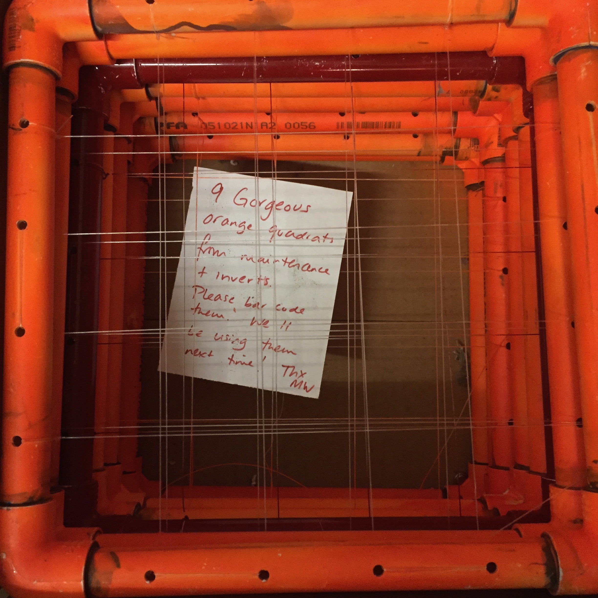
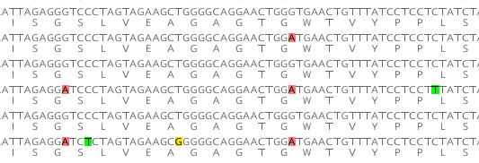
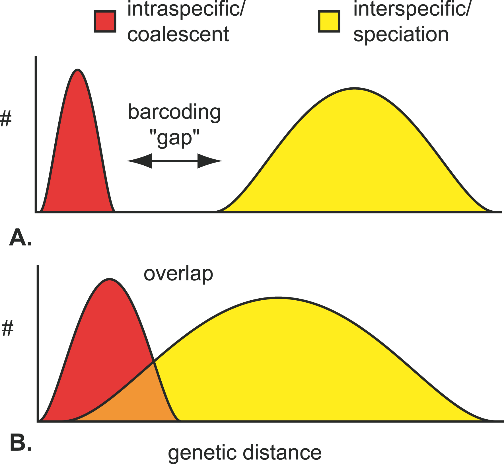
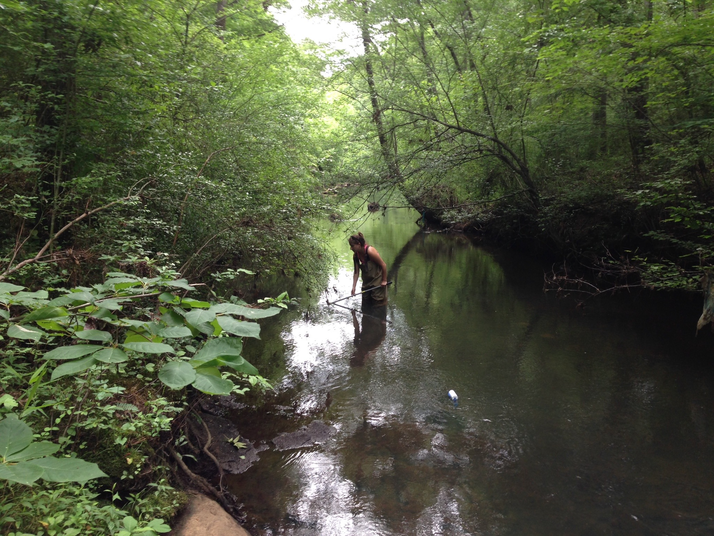
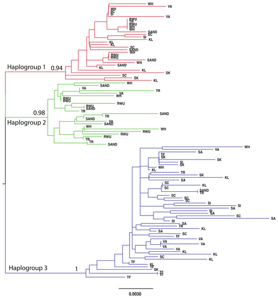
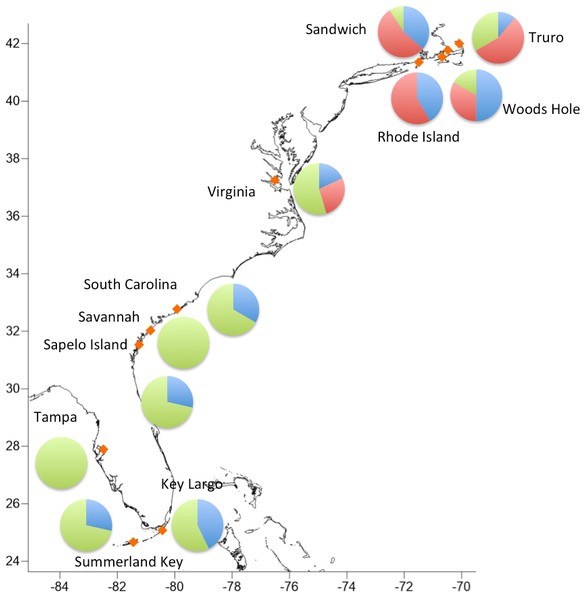
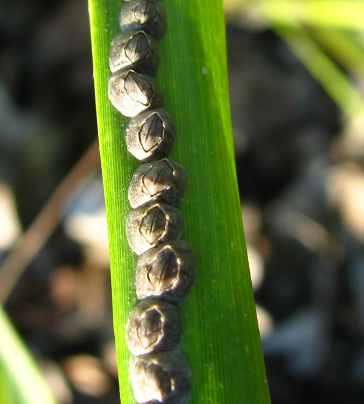
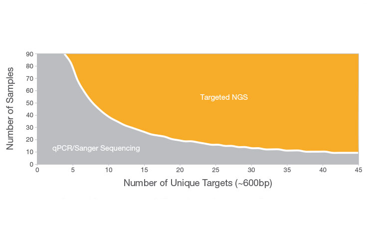

# 2. Sampling the 'simplest' genomic data {#Ch2}

I'm going to start this text in a very different place than I've started teaching this class before; I have tended to start at the beginning (temporally) and work through the history to reach the present. My efforts at re-organizing my class in 2020 led me to see this as a funny choice. For one, it means we may spend some time talking about methods that are currently D.O.A., even if we learned a lot from them at the time. At this point, there is simply no reason for me to re-hash AFLP markers (I won't even define the acronym). Even the most in-vogue methods of `r format(Sys.time(), format="%Y")` will not be as exciting in 5 years. But our efforts to learn this material should be generic to the specific means of obtaining data, anyway. 

Additionally, I've recognized that some applications of molecular data have been treated as distinct, and separated in other texts or in previous versions of my class, even though their basic methodology aligns pretty clearly with understanding some simple basics about DNA sequence data and how it evolves within and among populations of biodiversity. I hope that is clear from this first data-focused chapter, which itself raises some questions about how we observe and quantify patterns of diversity in nature. 



## 2.1. Our sampling effort

If you aren't familiar with a *quadrat*, the photo above (Figure 2.1) includes "9 gorgeous orange quadrats" and you may quickly deduce that these are nothing more than PVC squares with grids installed using heavy fishing line, and the whole thing spray painted orange so they can be easily found in an intertidal marine habitat with sprawling macroalgae and dark rock coves studded with limpets. A *quadrat* is a means to sample spatial diversity that is commonly used by ecologists to estimate the diversity of a larger spatial domain, with the scale varying depending on the system one is looking at, the evenness in that system, and the type of diversity to be counted (and thus extrapolated to say something about the whole ecosystem). 

So, what I often tell my students is that if you wanted to characterize the vegetation of your college campus, and you randomly tossed down a single quadrat of this size (~25cm across), what would you find? Maybe manicured lawn, maybe some flowering plants, maybe the root system of a single tree. You know that wouldn't say much about the vegetation on your campus, so you would want to think about how to gain data from multiple quadrats before you made any characterization - and you would want to think about how randomly they are used (Anne Magurran's *Measuring Biological Diversity* has some great insights into this problem). 

Similarly, a single random anonymous DNA sequence from your species of interest may or may not represent well the genome as a whole, and may or may not be appropriate to answer your question. But first, to keep things simple, lets do exactly that. If you take a small sample of a genome - perhaps a single gene, or locus, that can be easily captured using modern molecular approaches like PCR or metabarcoding ([**BOX B:**](#BoxB) How molecular data are obtained). That means that it is on the order of 100s of nucleotides in length (long enough to capture variation in many instances), and we can *mostly* ignore biological recombination of this fragment (though PCR itself can promote the formation of chimeric, recombinant sequences - Katz et al. 2009)

(*so now you can imagine having some DNA sequences from several individuals - and we are thinking about the variation among those sequences*)

We are assuming that the same *homologous* sequence(s) can be obtained from other individual organisms or samples. In other words, whenever we make comparisons of two DNA sequences, we assume that they have a single common origin and the variation between them represents the mutation events that have happened since that point of common ancestry, whether we are comparing members of the same population or individuals from divergent species. This itself can be difficult; the more we know about genome structure, the more we know that many gene regions are duplicated and lost through time, so that some gene regions will have multiple, *paralogous* copies in the same genome, and counting the mutational events will be wrong if the contrast between molecules is specified incorrectly. 

![**Fig.2.2 - The same PCR primers amplify allelic (homologous) and distinct gene copy variation (paralogous) in fluorescent proteins of the coral *Agaricia*. Determining how to separate this diversity for the typical analytical approaches in the field of molecular ecology is not trivial in such cases. Note the distinct amino acid sequences resulting from the sequence diversity; one copy appears to be non-functional with a 'stop' codon in the middle of the domain. From Meyers, MK 2013 *J. Heredity* doi:10.1093/jhered/est028.**](MEImages/AgarFP.jpg)

The problem of gene duplication can include whole genomes (polyploidy is common in plants, and has even generated new species in frogs) or just parts of a genome, and depending on how recent the evolutionary event was, it may be impossible to isolate parental-contributed diversity from the diversity found across copies. However, there are ways to analyze such data and we will discuss further as these instances come up. *For now we are only focusing on the gene sequences we can recover to represent natural diversity, and how to compare those sequences (not worrying about the combinations of copies within an individual).*

In addition, we assume that the individual nucleotides (A,C,T,G) in these DNA sequences being compared are homologous. This means *aligning* the sequences so that the variation we see in a single position - some sequences have a C, others have a T, for example - represent a single mutational event (more on this assumption later) rather than inadvertently comparing haphazard parts of that gene region. In Figure 2.3, a DNA sequence for a protein-coding region provides an example where it is clear that despite some nucleotide variation, each DNA sequence is coding for the same amino acid sequence. It would be unusual for so much similarity to exist among distinct genomic regions (though biology can throw plenty of improbable curveballs, some of them noted above), and we can evaluate this probabilistically (Altschul et al 1990).

 

Once these steps are complete - DNA sequences obtained from comparable parts of the genome, and aligned so that the mutational events are clear - we can start to make some simple assumptions about what the diversity among sequences means. It may seem bizarre or overwhelming to include this example above, but the more elements from the genome you are using to study your system, the more likely you have to understand that genomic diversity has an incredibly complex hierarchy of inheritance.

## 2.2 Genetic Distances and 'Barcode Gaps'

From the DNA sequences in Figure 2.3, we can start making one of the first and most basic assessments of genetic distance between sequences or between collections of sequences. For example, the comparison between sequence 1 and sequence 2 (counting from the top) shows a single nucleotide difference between them (an A/G transition), out of 63 such site comparisons. If you are unfamiliar with how these data are shown, the nucleotide sequence includes only (A/C/T/G), and below each amino-acid-coding triplet the amino acid single-letter code is shown; in many cases we would compare sequences that are not protein coding (or for which we don't care about the product) and so the amino acid sequence would not be shown. 

From these data, we can estimate the distance *d* based on this proportion of differences between sequences, e.g. *d* = 1/63 = 0.0159. Then, comparing sequence 1 to sequence 3 there are no differences, so *d* = 0; and sequence 1 to sequence 4 represents *d* = 3/63 or 0.0476. You should be able to make similar calculations for all pairs of sequences in Figure 2.3. The R code below shows how to turn those genetic distances into a very basic histogram.

```{r bargap1}
dist1<-c(0.0159,0,0.0476,0,0.0635,0.0159,0.0317,0.0159,0.0476,0.0476,0,0.0635,0.0476,0.0476,0.063)
hist(dist1,breaks=4,col="darkred")
```

Now all of these pairwise distances are shown in a histogram, above, and in this case all of those sequences come from organisms sharing the same Latin binomial, *Chthamalus fragilis* (though later in this unit you will see it is more complicated than that). Imagine comparing these sequences with the sister species, *C. proteus*, by adding just a single additional set of comparisons between the 6 sequences above and a single one from *C. proteus*. The contrast can further be identified in our R histogram by coloring the bars in order; note the change in scale on the x-axis as we add more distantly related sequences. Yes, **R** friends, I know it can be done more efficiently. Bear with me, this section is barely edited since I wrote in April 2020 as my class flipped to online during the beginning of **COVID**, but I want it to be clear where the outputs come from!

```{r bargap2}
dist2<-c(0.0159,0,0.0476,0,0.0635,0.0159,0.0317,0.0159,0.0476,0.0476,0,0.0635,0.0476,0.0476,0.063,0.16,0.17,0.16,0.17,0.17,0.18)
hiscols<-c("darkred","darkred","darkred","darkred","lightblue","lightblue","lightblue","lightblue","lightblue")
hist(dist2,breaks=8,col=hiscols)
#yes I will provide much better code for barcode gap insights very soon - I know better than this
```

Now, we have recapitulated what is called the 'barcode gap', a classic figure below (2.4) from Meyer & Paulay (2005, https://doi.org/10.1371/journal.pbio.0030422). What this is suggesting is that though there is variation within species (in phenotype as well as sequence divergence), in many cases that variation is considerably less than the distinctions from other **species** (*a.k.a.*, distinct populations that are demographically isolated in some significant and usually trait-based way).

 

Why are we exploring this kind of diversity among DNA sequences? Well, our first goal as molecular ecologists may be simply to evaluate the distribution and abundance of diversity in and among sampled habitats. We can use the sequence data itself to identify *what* is found in a habitat, when this is a more effective approach than other forms of identification. For reasons that will become clearer as we learn more about the different modes of inheritance (*natural history!*) of gene regions, the "barcode gap" is most effectively evaluated with genes that (1) exhibit high mutational diversity, (2) are haploid, and (3) are uniparentally inherited; but it will work for any gene that provides sufficient resolution. For this reason, mitochondrial and chloroplast loci are often the first tools used for such surveys.

(note to consider: analysis of data describing the "barcode" variation between species or the metagenetic studies of microbial diversity in different samples of habitats both tend to rely on *haploid*, *low recombination* regions of inherited genomic diversity. All of the same rules apply when we are dealing with *diploid*, whole-genome scaffolds that may have important elements of recombinatory diversity, but we are starting with these simplest genomic elements to get the ground rules set.)

Now, an interesting part of this that we are going to explore in more detail in class: the distinction between species shown above, where there is divergence between the species greater than you find within a species, is entirely driven by *time.* Divergence (*d*) is equal to some factor of the mutation rate $\mu$ multiplied by time, *t*. This is true no matter what kind of divergence between homologous genomic fragments! So, the data in Figure 2.2 includes both *alleles* within a gene copy which vary within a species (and that variation relates to the time since their most recent common ancestor); *species* that carry that gene copy (listed in italics next to each of the tips of the tree, which themselves reflect genomic variation - the species have diverged over time, of course); and gene copies (*paralogs*) that appear to have diverged **before the species did**.

In all cases, time and isolation leads to that genomic variation -- and we won't always know which component of isolation is the cause of two DNA fragments being distinct. Again, we will discuss this more in class, because it is a real brain-twister.

Next, some examples of how this variation among *homologous* genome fragments can be used:

**Example 1. Some aspects of the focal diversity are well characterized.**

If we assume that the species are identifiable (at one life stage or another), and there is clearly greater genomic divergence between different species than between different individuals of the same species (the "barcode gap"), then with a reference library of representative individuals for each species we can use DNA sequencing to identify remaining unknown or hard-to-identify specimens. A great example comes from Katie Bockrath's dissertation work on freshwater mussels (Unionidae, Fig 2.4.5).

 

Though many freshwater biologists will laugh to read this sentence: lets assume that the adult mussels can be clearly identified, sorted into species, and DNA can be sequenced from those individuals. Our real challenge lies with the larvae and the juveniles, which are themselves miniscule (hundreds of $\mu$m). Unionid mussels produce larvae (*glochidia*) that are obligate parasites on fish gills; they must developmentally transform on a fish to mature to the juvenile stage, when they are still quite small but drop off into the sediment to continue maturation.

There are a lot of complexities involved in this life cycle, and knowledge of which species are host-generalists versus specialists, that are beyond the question addressed here. However, Katie wanted to know *which* mussel species are using *which* fish species as hosts, which itself can influence how well individuals move via their host and how sustainable a population may be. In order to do this, fish gills were sampled for glochidia and the tiny (5-10mg) tissue samples collected. To ensure that PCR reactions are specific to the mussel and not the fish, she used her knowledge of the quirky life history of Unionids to target a relatively unique coding region in the mitochondrial control region (FORF; Breton et al.); this means that her PCR would not amplify fish DNA, only mussel DNA.

Because of the 'barcode gap' between the diversity found within a species, e.g. *Toxolasma pullus* and the diversity found in other species (or other genera) like *Elliptio icterina*, Katie was able to assign each tissue sample - as minute as it was, and intermingled with fish gill tissue - to the species that is able to use that particular fish species as a host. In this way, molecular techniques can be used to identify species interactions and the specificity of those interactions - and very similar approaches are used when there is a need to identify parasites or pathogens throughout nature. **It does, however, require that a reference library of data are available and easily searched for a likely match and high sequence similarity with the 'query' sequence.** In some cases, a researcher must collect and generate such a database for local diversity themselves; in other cases, representative diversity is already available at the NCBI sequence/genome database called "GenBank".

### A SHORT MODULE ON THE MATHEMATICS OF BLAST AND AVAILABLE DATA, WHEN IS THE E-VALUE USEFUL AND WHEN YOU NEED OTHER INFORMATION

https://www.ccg.unam.mx/~vinuesa/tlem/pdfs/Bioinformatics_explained_BLAST.pdf

Read the above link; it is very good, but also full of jargon that you may be unfamiliar with. We can unpack this in class. The basic idea is that we are trying to find unbiased ways to pair sequences that we recover from organisms or the environment with reference material in a database. You might think of this as being similar to categorizing a specimen relative to the traits of known species. We are going to use this concept as a starting point for our exploration using the program **Geneious** (see class Resources page).

A major shift in recent years in how environmental samples are analyzed for the presence of particular diversity revolves around the cost of data acquisition. Particularly when dilute resources like river water are being evaluated, it has been cost-effective to design *very* specific PCR primers for a target organism (and target gene region) such as a rare or threatened fish, and use *quantitative PCR* to localize where samples come from that contain positive responses to these assays. A great example would be the 2022 M.S. work by OSE student Jared Bennett (don't have library link yet) focusing on the ability to detect the threatened "robust redhorse" *Moxostoma robustum*; the ability to identify a PCR assay that was highly specific for this species required not only bioinformatic skills but also understanding the dynamics of PCR conditions!

As the cost of sequencing continues to decrease, more and more studies are asking about the presence of focal species' DNA amidst the noise of the DNA from many other organisms in the environment. Though the source of this DNA is still "environmental", *i.e.* derived from water samples or other environmental partitions, it is in most ways no different from microbial 16S analysis in that you have to have a solid reference library (see next section) to compare the sequences generated from a study. Another active area of study is how to minimize false positives (and false negatives) in qPCR approaches as well (BOX A: ENVIRONMENTAL DNA).

So, in the case of the eDNA study above, this is an example of a 'closed reference' library. We know what we want to find, and if we have a good enough match, we consider it *found*. In more complex scenarios, diversity that was not **a priori** known will be missed in such instances, so we must have a more complete reference library. Our search for diversity depends on how we ask the question! The question of "how different is allowable" in such cases becomes very interesting; some studies will use pre-set divergence cutoffs to define species (or, "operational taxonomic units", known as OTUs) and some will include all of the exact sequence variants for analysis.

<style>
div.blue { background-color:#e6f0ff; border-radius: 10px; padding: 40px;}
</style>
<div class = "blue">

## Box A. Environmental DNA {#BoxA}

The exploration of "environmental DNA" in the past decade or so has seen remarkable growth (Cristescu & Hebert 2018, doi.org/10.1146/annurev- ecolsys- 110617-
062306). Essentially, there are two significant components to such work. First, how to effectively collect, concentrate, and isolate DNA from diverse environmental samples including ocean water, soil, rivers, or points of organismal contact. This often means taking highly dilute samples that may include tissue or cells, fecal matter, saliva, blood or gametes that represent the (recent) presence of an organism.

Second, the effort towards collecting, concentrating, and isolating that DNA so that it can be identified has to meticulously avoid the potential for contamination from other point sources, including the equipment that has been used previously, the investigators themselves, etc. The genomic target, regardless of focal species, is often the mitochondrial genome (or another plastid like the chloroplast) because it is present in so many copies per cell, relative to the typical two copies for nuclear loci.

Third, consideration must be given as to whether it is more cost-effective for a particular question to use a 'metabarcode' approach or other high-throughput method for evaluating the diversity of a sample, or a targeted approach that must be effective not only in identifying the presence of a particular species but also in excluding amplification of taxa with similar DNA sequences in the target region. Congeneric or confamilial species are a good example, because the primers used in PCR or qPCR do not have to be perfect matches to have the potential to amplify. Remember that tens of thousands of different metazoans have been amplified and sequenced using one particular pair of primers for the mitochondrial COI region! (Folmer et al. 1994)

One study (Wilcox et al 2013, doi:10.1371/journal.pone.0059520) developed primer/probe sets for qPCR to detect non-native *Salvelinus* amidst congeneric and confamilial species; their work showed a greater effect of finding divergent regions for primer design than for the fluorescent probe, and the mismatches being near the 3' end of the primers tending to add to the specificity. Putting thought and experimentation into early testing of eDNA methods is absolutely critical for avoiding misinterpretation of results. This attention to detail can be quite critical and involves understanding the rate processes and thermodynamics of PCR as well; Odum School student Jared Bennett (MS 2022) was able to develop species-specific primers only by carefully considering both the primer sequence for PCR as well as the temperatures and times for the PCR reaction itself!

Fourth, a sampling strategy has to take into account the life history of the organism as well as other features of its biology. Are there spawning aggregations that affect how the environment would be sampled? Is it a hard-shelled crustacean that may only leave traces in the environment during molting or defecation (Anderson et al 2020)? The shedding of DNA, as well as its persistence in the environment (the 'decay rate') are active fields of study with respect to how temperature, UV exposure, and flow of the environment are all critical to answering such questions. There has also been intriguing work done to ensure the specificity of some eDNA/metabarcoding work to the association with a target organism. In some cases, nearby environments must be sampled to 'subtract out' baseline environmental diversity; in others, targeted swabbing of tissues can be used to avoid that environmental diversity. van Zinnicq Bergmann et al (2021,  https://doi.org/10.1111/1755-0998.13315) were able to assess the diets of juvenile bull sharks by quickly swabbing the fecal residues from inside a shark's cloaca without contamination of surrounding seawater diversity. 

[This paper spends less time talking about how one *actually* manages to swab the cloaca of a shark, likely presenting distinct challenges.]

Finally, the field of 'environmental DNA' is of course about getting those answers in robust ways. What diversity is present - does it match the diversity found using other types of collection protocols or gear? Does it save effort over those other methods, is it more specific? Does the diversity respond to shifts in the environment? Can the rare species be found, or the symbiont diversity identified? These are remarkable times for studying diverse ecological questions, and they (mostly) involve the exact same methods of matching observed DNA sequence data from a sample with prior understanding from known organismal diversity.

**For our reading group this week, we will consider how metabarcoding methods are used to identify the pollen gathered by bees in Bell et al. (2017) doi:10.3732/apps.1600124. This example does not involve the concerns of 'concentrating' target DNA from the environment as it does with inferring the presence of organisms that remain unseen, but is still a useful example.**

</div>


**Example 2. Diversity is (partly) well characterized, and must be sorted from sequence data.**

As the cost of sequencing has dropped, an equally common type of environmental study using molecular data are what may be referred to as 'metabarcoding' studies (distinguishing from 'metagenomic' in which shotgun sequencing of - for example, microbes - is intended to tell us about the functional gene representation in a sample rather than the identities of the microbes, an approach sometimes referred to as *reverse ecology*). This means that environmental samples are stabilized for genomic analysis, and then the sequence region to be compared is amplified from the environmental sample - amplifying much of the diversity found within. This might be a soil sample, a liter of ocean water, or the homogenized tissues fouling a dock. The genomic region chosen has to be considered relative to the diversity being studied, whether microbes or fungi or root hairs or metazoans. Remember: **the natural history of the gene region, as well as the natural history of the organism!**

The distinction with the mussel example is that rather than sequence tissues one at a time (the Sanger sequencing method, see [**BOX 1:**](#Box1)), they are typically not able to be separated and so must instead by sorted out after sequencing many PCR amplicons either using old-fashioned cloning (labor-intensive and expensive, plus requires Sanger sequencing) or high-throughput sequencing (expensive but efficient; requires bioinformatic expertise and effective design of identifying oligonucleotides that can be built into the primers or adapters, see Bayona-Vasquez et al 2019, Hamady et al 2008). Some questions require more conserved parts of the genome - as with using ribosomal regions to barcode life - and some will require much more variable regions to distinguish diversity. The trade-off between regions of the genome that are constrained from varying (for example, do you use the nearly-universal 18S ribosomal region that varies rarely within species? Or the 16S ribosomal region that may pick up cryptic diversity?) and this resolution of diversity (to the species level or to unrecognized diversity, as with many uses of protein-coding genes on metazoan mitochondria) is a good reminder that molecular techniques are analogous to fishing gear. *Different gear (rod and reel, how fine is the net, is an electroshocker backpack being used, are you kick-seining or casting a net) will influence what diversity you capture, as will your skill with that gear.*

Once again, these approaches are most useful for when diversity is very difficult to characterize because of size, abundance, or ability to capture. Bacteria have been a frequent target for this kind of approach because the vast majority of bacteria cannot be easily cultured, but deep sequencing (these days, through PCR amplification and multiplexed sequencing on a high-throughput sequencing machine like an Illumina) of the ribosomal 16S region (or one of the variable short sections within it) will tend to generate a large number of comparable (homologous) sequences that can be categorized based on their *similarity* to a reference library of bacterial species or genera. In this case, of course we may find diversity that has not been previously catalogued, and new diversity is identified in nearly every such study.

 

The questions we may then ask include: how many distinct species in a sample? Is it higher diversity in one treatment or location than the other? Are the relative abundances of species the same in each of my samples, or do they vary in interpretable ways? (Mind you, if you aren't a microbiologist you may have a hard time knowing *why* different OTUs (operational taxonomic units, the sort-of-equivalence to species in bacteria and Archaea) are ecologically relevant, or how they are distinct metabolically or phenotypically. Overall, these questions require numeric or quantifiable measurements and will be addressed in the next unit.

**Example 3. Further partitioning diversity, beyond taxonomy.**

Where we eventually will become fluent in this class is in recognizing that our taxonomy - no matter what group of life you study - often does not reflect the true diversity of life very completely. It is extremely common to find that there are genomic distinctions among different spatial samples of the same species, and that these distinct populations represent variation in physiology, function, or other types of ecological interaction. As we begin to consider how organismal diversity responds to a warming planet, it has been tempting to think that *species* are gradually shifting to more poleward latitudes, for example. However, in many cases it is far more accurate to recognize how distinct *populations* vary in environmental tolerance and their ability to either move, adapt, or acclimate (Kelly et al. 2012). It is these *populations* that are moving, effectively.

The sequence data shown earlier from the barnacle *C. fragilis* are a good example of this. The overall divergence of sequences *within* this species are somewhat larger than typical for a metazoan, though still very distinct from the sister species *C. proteus*. However, if we collect enough DNA sequence data - in this case a common mitochondrial barcode region used in many metazoan studies, the Folmer COI fragment noted in Box 1 - we may see that the genetic distances among those DNA sequences easily group the individuals into 3 evolutionarily distinct lineages (Figure 2.5; Govindarajan et al 2015). In many ways this is only different in the sampling strategy from the microbial work mentioned earlier; we are asking "what is where" through sequencing (in this case, Sanger - individuals sequenced for a single gene are still done most effectively this way), and the sequences may identify new groups that are ecologically relevant or indicate intrinsic diversity in ecophysiology that are not reflected by the name of the species. Microbes on a coral, fungi in the forest, barnacles along a coastline - we know where they are in a general sense, but the specifics can tell us about functional and taxonomic diversity at a finer resolution.

 

  


This gene tree pattern reflects the overall similarity of sequence, though the models for inferring these relationships can be mathematically complex in trying to estimate actual mutational difference among sequences. The gene tree raises many questions, many of which will be addressed further as we gain skills in exploring the variation among sequences under expectations of single, randomly-mating populations in later chapters. However, by plotting WHERE each sequence was found you can start to assess that the diversity is not randomly distributed - the 'red' type of diversity is only found in the northern part of the range (Fig 2.5b). This appears to be an example where some diversity is more likely to be found in certain parts of the distributional (environmental) range of this species - suggesting variation in environmental tolerances or performance. To quantify this variation requires additional approaches, and to explore this hypothesis of local adaptation will require additional experiments.

By the way, if you were really paying attention as we plotted the barcode distances within *Chthamalus* above, you may have noted there was already a barcode gap - it just corresponds to a finer scale than recognized "species"! In the next unit, we will start to explore how ecologists and geneticists have somewhat independently identified similar approaches to measuring and distinguishing the diversity from distinct spatial or environmental samples, and will note where specialized metrics are necessary. 

<style>
div.green { background-color:#99ff99; border-radius: 10px; padding: 40px;}
</style>
<div class = "green">

*For your exercise this week*, we will (a) learn how to use the free software Geneious at a basic level; (b) download DNA sequence data for a group of organisms of your choosing (roughly 8-10 sequences per species for 4-5 related species is a good size); (c) align the sequence data (we will do this in class); (d) we will evaluate the distance matrix in Geneious, and you should be sure that it provides *distances* not *similarities*. These distances can be used to plot a "barcode gap" however you want...

The above code is one way to do it, but you can tell it is clunky and written for a very specific instance of data. A slightly better version of R code (but use Excel, or watercolor, or whatever) is in the Github directory with this 'book' as barcode_basics.Rmd, it will guide you a bit further down the path. 

Anyway, plot your own "barcode gap" histogram and ask how well this model of inter-individual and inter-specific divergence applies to the *taxonomic* diversity of your chosen group of organisms - what are the reasons it might not, and how could this understanding be applied to a question of distribution, abundance, or interactions?

</div>

In class, we will also take some class time to discuss the 'reverse ecology' approach mentioned in e.g. Marmeisse et al (2013), the overall consideration of how molecular ecology fits into natural history as discussed in the Travis 2020 essay, and discuss what spatial variation in genomic diversity means for the function, eco-physiology, and other types of variation in a species that may respond to a change in the environment. 




*Resources cited in this section*
Brown, A. et al (2019).

Hamady M, Walker JJ, Harris JK, Gold NJ, Knight R (2008) Error-correcting barcoded primers for pyrosequencing hundreds of samples in multiplex. Nature Methods 5: 235–237. 10.1038/nmeth.1184

Katz et al (2009)


<style>
div.blue { background-color:#e6f0ff; border-radius: 10px; padding: 40px;}
</style>
<div class = "blue">


## Box B. An aside to explain these data better and how we obtain them. {#BoxB}

This resource could be organized by electrophoresis (mobility, size and charge and cost) versus sequencing (method, informatics, cost). Here I will be brief and I'm working to use online OA resources to clarify. We will note that later it will make sense that the information we can glean from sequencing, even models of thinking about rate and type of mutation, are useful even for electrophoretic markers and vice-versa.

In order to make any inference such as typical in molecular ecology, you have to have information. You have to have *variable* information, in fact. So, the history of this field is in finding ways to recognize that there is so much diversity in every single sample of life, and do it efficiently with available technology. As my colleague Jim Hamrick puts it, it is "high-tech natural history" so we often don't have a lot of funding but we still have big questions!

The trick has been two-fold in our field. At first, we were technology-limited; it was difficult to obtain information on variable markers until the advent of protein electrophoresis in the 1960s, but those offer only a limited view into mutational diversity (and *may* be frequent targets of selection, see Skibinski & Ward 2004, Marden 2013). Our second problem has often been just as significant, which is that improvements in technology are often expensive and lets face it: we are asking questions that don't merit multi-million dollar NIH grants, in general (though the same methods of course have been appropriate for asking questions about **COVID-19**, see work by Trevor Bedford, UGA's Erin Lipp, and others).

What this means is that the questions you want to ask are often influenced by how creatively you can use the available funding to do so. Though in 2022 it is becoming more common to see studies that involve whole-genome resequencing data - thus, there is a complete view of the genome, though some may want additional samples, or would still wish for methylation data, and so on - this is only possible when a well-scaffolded, complete genome is available. For many of us, that is simply not true and will not be true for quite some time (or until you get the $15-20,000 necessary to buy the data to do it yourself, but this can easily take a couple of years; Ruiz-Ramos et al 2020).

To save money, there are methods that focus on *anonymous* regions of the genome, those that focus on *targeted* regions of the genome, and there are distinctions in how the *targeted* data are obtained that tend to vary categorically with the number of regions being evaluated. The "anonymous" methods include what is currently known as genotype-by-sequencing (GBS, and the many flavors of "RAD" protocols that are collected to do this) and other methods that involve shearing the genome into fragments using microbe-derived restriction enzymes that recognize certain "words" in the genome and cleave the DNA in predictable ways. The extremely common enzyme *Eco*RI comes from the bacterium *Eschericia coli* and whenever it encounters a region in double-stranded DNA that has a **GAATTC** motif, it cuts the DNA in a way that leaves the **AATT* as a single-stranded overhanging bit of DNA, for example. What is nice is not only that the genome has been cut, but an easy way to bind adapter sequences is left behind for PCR-based methods.

The *targeted* data rely on prior knowledge about a gene region and its utility for your purposes. For example, probably the most frequently analyzed single gene region in metazoans is the mitochondrial cytochrome oxidase I gene region, for the simple fact that Folmer et al. (1994) published primers that tend to be able to isolate and amplify that gene region reliably in metazoans. We have subsequently figured out ways in which this gene region is particularly useful for molecular ecology, as well as particular drawbacks it has (Wares 2010) in terms of reliably transmitting information about mutational events. As scientists have wanted larger numbers of targeted fragments, the costs of PCR and sequencing either scale up linearly with the number of targets when doing traditional PCR and Sanger sequencing (roughly $1-4 in cost per ~1kb sequence per individual), or larger outlay of cash for enrichment protocols that allow next-generation sequencing to provide sufficient sequencing coverage of all the targeted regions. The cost of the sequencing is one part of the equation (e.g. in 2020 approximately 110,000,000,000 nucleotides can be returned from an Illumina sequencer for a cost of less than 1500 dollars), but how cleverly the underlying experiment is designed strongly affects the cost-efficiency of this approach. 




One type of *targeted* loci that can be analyzed efficiently with electrophoresis, separating fragments by their *size* rather than their actual sequence, include microsatellite markers or "simple sequence repeats" (SSRs). These loci vary based on short DNA repeats (e.g. ATC**ATC**ATC**ATC**...or GT**GT**GT**GT**GT**GT**GT...) that are highly mutable, and thus these loci tend to harbor higher diversity than other types of markers but also come along with distinct challenges, both practical and analytical. The fact that they only require electrophoresis to genotype an individual would seem to save money, but the effort to score these loci *and* the overall cost of multiple PCR reactions and submissions to a genomics center to be run on a capillary electrophoresis sequencer (often at a cost approaching $1 per sample, once costs of cleanup and electrophoresis are included) makes this of marginal benefit (K. Bobier, pers. comm.), and the cost to develop these relatively taxon-specific markers (doing enough sequencing to find the repeat regions whether via enrichment or filtering, primer design and basic testing - often on the order of thousands of dollars for a new series) has probably put them into the historical dustbin except for cases where they already work on your organism.

So, suffice to say there are *so* many ways to collect data representing genomic variation and you have a few variables to work with. *How much money is available for this work? How many individuals should be genotyped, at how many loci, to satisfy your question?* At this point in the book, you maybe don't know. *How many individuals do you genotype to figure out whether broods of barnacle larvae (or seed pods of tropical trees) are fathered by a single individual, or multiple? How many locations do you need to assay to understand your overall system - and how many individuals from each location?* (not to mention the cost and effort of *finding* those individuals, often a considerable effort itself)

This is the challenge in teaching about the markers. They change constantly via technology and the availability of resources; the questions and the statistics used to answer those questions change far less over time, thus we are going to move forward moving with the simplest types of data (and simplest types of analysis) first. The exceptions necessary for dealing with certain types of data - are the data haploid? Or uniparentally inherited? Are the data dominant or codominant? In other words, you will also need to understand the **natural history** of the markers you are studying, as noted by famed paleontologist Geerat Vermeij (2003).

A few other notes as we talk about the 'natural history' of our markers. It has been common to talk about loci that are neutral versus those that are not. Usually, in the context of declaring the data to be neutral because they are mitochondrial (e.g. Avise et al. 1987) or microsatellites, or simply because they have no known relationship to functional or quantitative diversity. What we are really saying is that the data have very little known about this relationship, but that the assumption of neutrality is often a very *very* big assumption (Hahn 2008; Rand, Wares 2010, and so on). The extent to which this type of work is "genetics" means that you have to know how it is inherited (only from maternal? Or is it a freshwater mussel, and the mitochondrion will reflect paternal diversity *when in males*), and you have to know how your technique for capturing it will reflect that diversity - is there potential for null alleles that do not amplify because of variation in primer sites? Will you only capture the presence of an allele, and can not distinguish between homozygotes and heterozygotes? Would you expect the relative abundance of particular genomic sequences to reliably indicate the relative abundance of the organisms they come from in an environmental sample? Why or why not?

So we are going to treat the natural history of loci, and the methods to obtain the data, as opportunities to consider exceptions to the rule rather than a basis to build upon. The best data means that you have sequence data, and a lot of it - and you know what to do with it. Here we go!

</div>
