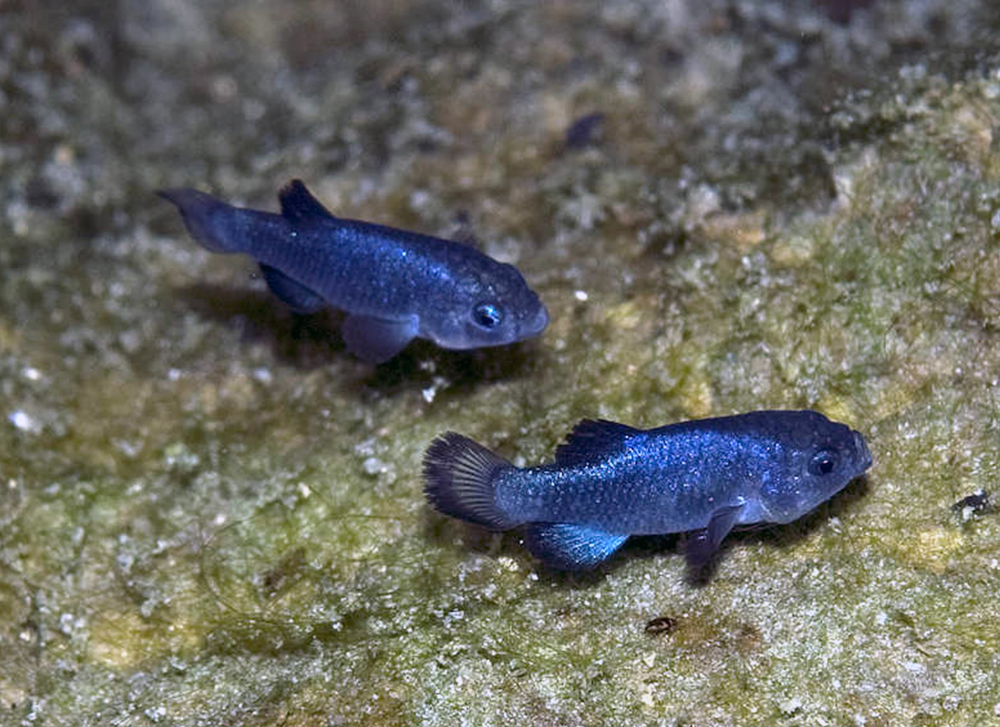

# 3 A bit more biological reality, and how diversity is generated {#Ch3}

One last key set of details is going to be important for us knowing how to ask the right questions using molecular data. So far we have talked about using molecular assays to find genomic variation in individuals and samples of individuals. We haven't really talked about where that variation comes from, and the reason that is important is that almost all of our questions rely on this variation telling us something about *rates of change per unit time*.

## 3.1 How diversity is generated by mutation

Mutations are er*r*rors. Simple as that. When we teach introductory biology, there is a single equation for how photosynthesis converts light and water into glucose and oxygen; but there are any number of ways in which that metabolic pathway sometimes misses a step or hiccups, and that becomes more frequent as the environment changes away from the conditions that a photosynthetic organism is adapted for. So, we recognize that as ocean temperatures increase, photosynthetic dinoflagellates living in corals are more likely to produce tissue-damaging oxygen radicals, and they are ejected by the coral hosts - causing bleaching. https://www.youtube.com/watch?v=_ZfGIKiSwwQ

Similarly, mutations happen when DNA replication has an error, as with 'strand slippage' changing the number of repeats in a microsatellite or adding a G instead of a C as nucleotides are incorporated; or when ultraviolet light or a chemical toxin damages the DNA and cellular repair mechanisms don't catch the change. 

We should recognize that mutations are happening all the time, though not always with evolutionary significance. Many cancers are caused by *somatic* mutations that only affect the diversity in the cell(s) descended from the initial mutation, for example. However, when mutations appear in a cell or tissue that has the capacity to reproduce and make new organisms ("germ line"), those new organisms will carry the mutation that occurred in the previous generation.

How do we know that mutations happen all the time? First of all, a rather famous experiment by Luria and Delbrück showed that bacteria grown from a single cell in a culture medium until there are many millions of cells have a non-zero probability of a mutation affecting their tolerance to antibiotics. If the mutations only appeared *because* of the change in the environment, we would expect a fairly constant rate of response across replicate experiments; the high variance in outcomes mathematically showed that mutations were sometimes happening early in the growth of the culture (so more cells are resistant when plated on antibiotic medium), sometimes late (very few cells are resistant), or not at all. That tells us that mutations are independent from any *response* to the environment; some environments may promote mutagenicity, but the location of mutations that arise are not specific to that environment.

Intriguingly, we can also track mutations happening in long-lived and clonal organisms. A great example would be aspen trees (*Populus tremula*), which grow in massive clones with shared root systems. Distinct clones may be noted during autumn, as leaves turn from green to brilliant gold, because large patches of trees will all turn at the same time - but not synchronously with patches next to them. Sequencing portions of the genome from one edge of a clonal individual and then from a tree at the opposite edge assumes that the clone is expanding outwards from its original propagule (seed), and thus many years have passed since those two sequences came from the same cell. It is typical to find that these trees on opposite sides of the colony are genomically distinct (though still clonal!), and because each tree has its own reproductive tissues the gametes they produce will carry those distinct mutations. Similar approaches have been used to look at mutational diversity in other tree species (https://doi.org/10.1098/rspb.2019.2364 for *Eucalyptus*, Fig 3.1), and have even been able to use the growth form of trees to identify the actual rate per amount of tissue growth or per generation!
<br>


```{r, out.width='90%', fig.align='center', fig.cap='...',echo=FALSE}

```
**Fig.3.1 - From https://royalsocietypublishing.org/doi/10.1098/rspb.2019.2364, showing how the 'phylogenetic' growth of *Eucalyptus* can be taken advantage of for studying somatic mutation rates in these trees and comparing with simpler 'model' organisms like *Arabidopsis*.**


A fascinating recent paper by Olsen, Levitan, and others (https://www.ncbi.nlm.nih.gov/pubmed/30707605 ) looked at this same question in corals in the Caribbean. Corals tend to start their life as either a tiny planula larva, created by the formation of a zygote from spawned eggs and sperm, or as a small chunk of coral that has broken off from a nearby colony. As the colony grows from either starting point, again mutations may happen in individual polyps (each polyp eats, photosynthesizes, and can reproduce, but all share a common gastrovascular connection), and mutational diversity can be found between polyps on either side of the colony. What was really cool about this work (Olsen et al 2018, *Biological Bulletin*) was that they evaluated many coral colonies from 2 species, at different depths *and* different sizes. The two species have different growth forms and rates, so the genetic distance between polyps from the same colony depended on both size and species identity; even more interesting, the mutation rate was higher for shallow-water colonies, suggesting increased exposure to ultraviolet radiation from the sun.

<style>
div.rose { background-color:#ffc4ef; border-radius: 10px; padding: 40px;}
</style>
<div class = "rose">
*The data in the Olsen et al paper came from microsatellite loci. As noted in Box B (Chapter 2), this is a method that depends on isolating and identifying regions in the genome with simple short repeat (SSR) sequences and then targeting them using PCR. The products are scored by their relative migration under electrophoresis, using a size standard that fluoresces a distinct color from the PCR amplicons so that the products can be scored to size. Though a particular allele may have 14 repeats of "AGT" (14 x 3 = 42nt), the PCR amplicon will include flanking regions that extend the fragment length so that there is a space for primers to match for PCR; thus that same allele may actually be a PCR amplicon that is (for example) 120 base pairs in length. The fragment length is generally what is scored, and in the best cases each allele is scored at length intervals that match the repeat element length (so for the example locus, we might see other alleles at 117, 123, 126 and so on). Later in this chapter we will see more about how mutational differences are counted among these fragments, but they offer a highly variable (good) but imperfect view of genome diversity that requires special consideration.*

</div>
<br>

These examples from bacteria, trees, and corals are natural examples of "mutation accumulation" (MA) studies, which can easily be done (with time!) in lab organisms with short generation times, such as *Arabidopsis*, yeasts, phytoplankton, and so on. Often of course in order to do such work you not only need a short-generation organism that is amenable to culturing in the lab, but also the resources to sequence large amounts of the genome since the *location* of the mutations will also be, for the most part, random. To understand how mutation happens in the rest of diversity, biologists have looked at well-known geographic features that separated ancestral populations into two or more descendant populations (my favorite example being the Isthmus of Panama separating the Pacific and Caribbean basins), and can ask similar questions about how many mutations distinguish those populations.

Estimating the mutation rate, $\mu$ , from these long-term isolated populations requires that we make one additional assumption. Since we are only looking at the end-point of many hundreds or thousands of generations of isolation, many mutations will have arisen - and some will disappear quickly, some will stay in the population as segregating diversity, and some will go to 'fixation' (the novel mutation is now present in all members of the population). If we assume that the mutation has absolutely no good or bad qualities with respect to the survival or reproduction of individuals ("fitness"), then whether it increases in frequency each generation or decreases is pure stochastic luck. It depends on the fact that populations are finite in size, and that for unpredictable reasons not all individuals will have the same number of offspring - some zero, some one, some many. Because of this simple fact of variation in reproduction, the frequency of a mutation changes randomly each generation as shown in this simulation of **genetic drift**:

```{r driftsim2,eval=TRUE}
library(learnPopGen)
driftplot<-drift.selection(p0=0.2,Ne=500,w=c(1,1,1),ngen=500,nrep=10)

#this is terrible slow code

```

The plot shown is based on simulating drift, as we have seen before in this class. In this case, the starting frequency was low (0.2) -- but not as low as a new mutation -- and the population size *N* is 500. So that we refresh in our minds how this works, there is also a Shiny app that lets you control these parameters (nb unless otherwise noted, the Shiny popgen apps are by Silas Tittes https://github.com/silastittes/shiny_popgen).

```{r driftshiny}
shinyAppFile("exercises/shiny_popgen-master/Drift/drift_app.R",options=list(width="100%",height=700))
```

<style>
div.green { background-color:#99ff99; border-radius: 10px; padding: 40px;}
</style>
<div class = "green">

**I want you to gain intuition about how *genetic drift* works. It is a key mechanism - based on variation in reproductive success in any real population - that informs us about how long diversity can be maintained in a population. **

Your task with this simulation exercise is to learn about a key understanding about random genetic drift. Remember, at this point in time all diversity we have talked about has no *known* effect on **fitness**. You can see from the app above that you can change population size (*N*), the initial allele frequency (from 0 to 1), how long to run the simulation (in generations); as well as "bottleneck time" and "bottleneck pop. size". Don't worry about these last two, but DO set "bottleneck time" to be greater or equal to "generations" when you change that value.

Test it out by clicking 'GO'. You'll see that it is a simple simulation based on the values you give it. Click 'GO' a few more times, just to see that each time it is producing a different results based on how genetic drift would affect allele frequencies through time.

Now, varying *N*, starting allele frequency, generations, and number of replicates - I'd like for you to set up some simple observational experiments to *quantify* the probability that the allele we are tracking goes to fixation (frequency 100%). Remember, you set the starting frequency *x* of the allele being tracked. Assuming this is a 2-allele situation, the other allele is of course at a frequency of (1-*x*). 

I suggest starting with small population sizes and adjusting the frequency of the allele. Then, see what changes as you increase *N*. Remember that for some conditions you may need to track the simulation through more generations.

Now that you have run those experiments and described your approach and results, write what you predict as the conditions that allow an allele starting at frequency 0.05 (rare) to go to fixation (frequency 1). If you increase *N* to 1000, does the likelihood of fixation change? Or does the time required for fixation change? **Exploring these questions will start to help you see that the frequency of an allele in a population can also tell you about how long it has been in the population**.

I'd like you to try this before you read further. You don't have to turn it in, but if you send a short report to me I can help evaluate how you are thinking and grasping these concepts - same applies throughout the semester. If you think you need help with this, please see the ([**section added by a previous student**](#ShinyEx1)).


</div>
<br>

OK, now close your eyes, imagine a simulation starting at a frequency *f* for 2 alleles (that is, one allele at frequency *f*, the other at frequency (1-*f*)). This is an ancestral population. If that population is, by whatever environmental mechanism, separated into two distinct populations, how often do you think the two locations being sampled will have a different allele present in 100% of individuals?

As you can now recognize, given enough time relative to *N*, there will be plenty of instances in which a polymorphism goes to fixation in one location/replicate, and, relative to the "other" location/replicate would be a **substitution**.This small simulation is not truly realistic in terms of the starting frequency of a new mutation of course. If there are *N* individuals in a population, then a brand new mutation would appear at a frequency of 1/*N* (or really 1/2*N* for a diploid locus); but there would also be many more such opportunities across a whole genome, across many generations. Kimura's "neutral theory" predicts that the probability of a mutation going to fixation is equal to its frequency when observed, so with the simulation above in the figure - given enough time - we would expect 20% of the simulations to go to fixation and become a substitution. With a new mutation, that would be a much lower probability of 1/*N*. However, in each generation you have an opportunity for mutations to happen on all sequences* in the population, in other words *N* times the mutation rate $\mu$. Long story short: **if the mutations are neither advantageous nor disadvantageous** (neutral, not selected for or against), *the rate of substitutions is equal to the rate of mutations*.

<div class = "blue">
*a quick aside on nomenclature: a mutation happens at a particular SINGLE location in a genome, but tracking the pattern of mutations typically involves a region of the genome which has been sequenced or is otherwise being analyzed. to distinguish from ALLELES which are the copies inherited generationally, and the entire CHROMOSOMES that these regions are small portions of, Hahn's (2019) textbook refers to simply "SEQUENCES". at all times, think carefully and communicate carefully about what level of diversity you are trying to describe! (locus, allele, paralog, ortholog, scaffold, and many other technical terms have sometimes overlapping meaning...)
</div>


This means that if we go back to our genetic distances from Chapter 2 - the mean number of mutational differences between sequences from populations that have been separated for a long period of time (*t*) can tell us what $\mu$ is if we have a good idea of what *t* is. This, too, is the simplest model for how we approach this problem and later in the semester we can identify ways to increase the accuracy of this inference.

## 3.1.1 Examples where we think we know *t* for this purpose

Abundant geologic evidence and radiometric dating have shown that volcanic activity formed the narrow land bridge between South America and Central America where now Panama and parts of other nations are found. Prior to this happening, there was relatively free exchange of marine organisms between the Pacific Ocean and the Caribbean Sea. The geologic dating estimates that the land bridge had closed off this passageway around 3 million years ago (mya), sundering those marine populations into demographically distinct Pacific and Caribbean populations [ https://www.science.org/doi/10.1126/sciadv.1600883 ]. At this point in time, each population was likely genomically indistinguishable from the other; but in 3 million years, many new mutations have arisen and gone to fixation in each population, and we assume those mutations and probabilities to be completely independent from one another. 

Mutation is treated as a Poisson-distributed random process, meaning that we treat mutations as independent events in a genome, that the rate is very low but constant for a given time step, and we assume that the rate is low per time step so that only one event happens at a time. https://towardsdatascience.com/the-poisson-distribution-and-poisson-process-explained-4e2cb17d459 This probabilistic assumption can be used to consider how many lightbulbs must be purchased to keep all lights functional on a University campus - and the likely number needed to be replaced in any particular building or room. Importantly, even though the events are stochastic our estimates of the rate $\mu$ still relate the number of events to time.

So, we can look at these separate populations and calculate their overall divergence $d_{xy}$ based on the proportional difference of sequences from the two populations, as in Chapter 2 - and because the mutation rate $\mu$ has applied in **BOTH** populations over the same stretch of time *t*, that genetic distance is equal to 2$\mu$*t*, or $\mu$=$d_{xy}$/2*t*. In this case, a famous early study by Nancy Knowlton looked at populations of snapping shrimp in either basin, assuming *t*=3,000,000 and they estimated $\mu$ for typical mitochondrial protein coding loci to be around 2-3% divergence per million years. This is called "calibrating the molecular clock" and of course is still a very simplistic way of thinking about how mutations will arise and be retained in very different parts of the genome, under different evolutionary mechanisms, but it is a common starting point for these analyses - and tends to fit well when other organisms are evaluated, as long as the same gene region is evaluated.

Similar approaches have been taken in instances where we have good geologic data for the temporary submergence of a land bridge such as the northern portion of Baja California, allowing new movement across that land bridge; when erosion allows the headwaters of one river to "capture" the diversity of another river, effectively moving the fauna and flora of the second river into the first and isolating the two populations afterwards ("river piracy", J. Waters and others); or when knowledge of climatic change through time allows us to know when populations of mice that are now only found on the tops of mountains in the Rockies used to be connected through gene flow in the valleys during cooler climates.


## 3.1.2 How we infer the number of mutations, thinking of whole genomes


```{r, out.width='90%', fig.align='center', fig.cap='...',echo=FALSE}

```
**Fig.3-2. A 'circos' plot of the 22 chromosomes of the *Pisaster* genome, a number validated by old chromosome squash data. More internal circles include aligned data of single-nucleotide polymorphisms from Schiebelhut et al 2018, and differential RNA expression data from several other studies as summarized in Ruiz-Ramos et al. 2020.**


A genome is tremendously complex. Figure 3-2 illustrates the complete genome of the sea star *Pisaster ochraceus*; there are 22 chromosomes (chromosome pairs in a diploid individual), comprising about 400 million DNA nucleotides. Although it is now possible to 're-sequence' the genome to find polymorphic sites, the complications of looking for potential gene rearrangements or inversions; dealing with recombination among sites; and the cost of doing so can be prohibitive and beyond the needs of a study. A lot of the data used in the field of molecular ecology are used because they allow a more efficient or inexpensive analysis that is sufficient for the purposes of the question. 

For example, the circles plotted in the first ring inside the chromosomes represent 100 SNPS (single nucleotide polymorphisms) that exhibited strong frequency shifts after sea star wasting disease killed ~90% of all individuals of this species (Schiebelhut et al 2018 PNAS). The pink radiating bars represent overlap between these markers and RNA-based expression data that suggest similar responses across data sets, even across other species influenced by wasting disease (Ruiz-Ramos et al 2020 Molecular Ecology, where this figure comes from). *How much data, what kind of data, and what sampling strategy is needed to answer your questions?*

Essentially the history of population genetics and molecular ecology follows the history of technical advances allowing us to see genomic diversity with greater breadth and resolution. Each technical advance allows greater consideration of the detail of these data, and so various models are used essentially to link the identity of any two sequences (using the term now *sensu* Hahn 2019 to disambiguate from the two alleles that each individual carries at a locus, whether identical or not) with the time since they shared a common ancestor. As with Hardy-Weinberg equilibrium and the 'match' of different ways of evaluating diversity, when these distinct models generate different estimates of diversity, we can assume that some evolutionary mechanism is involved, as we will soon see through examples.

In an ideal world, we know how many mutational events distinguish two sequences. In this way, we can recognize that mutations may even happen at the same location in a genome if enough time passes, and so people studying molecular evolution or phylogenetics of a group of distantly related organisms will make assumptions about the frequencies of transitions (a pyrimidine changing to another pyrimidine, or purine to purine, as with C->T or A->G mutations), the frequency of nucleotides in the data, constraints on the molecule such as codon models, and more in what are called **finite-sites models**. Having a tremendous amount of data and complex substitution models does not guarantee a lack of rancorous debate over the outcome of such analyses, of course, as with recent discussion of whether ctenophores (https://en.wikipedia.org/wiki/Ctenophora) are the most basal metazoan or not. Those methods are kind of out of the scope of this class and are often called "molecular evolution" or "phylogenetics/phylogenomics" or "molecular systematics", depending on the goal of the analysis.

On more recent time scales however, we can make some simplifying assumptions that work for most of the types of questions we are interested in as ecologists. A widely-used model is the **infinite-sites model**, which assumes that every mutational event occurs at a new location (site, nucleotide) in the genome and thus the number of distinctions between any pair of sequences is an indication of the number of mutations, and that leads us back to inferences of time. This model applies to cases where we are directly observing at least a portion of the actual nucleotide data, whether via traditional Sanger sequencing (a separate reaction for each sequence, individual specimens are handled distinctly, a total cost of perhaps $0.005 per nucleotide per individual per sequence) or high-throughput massively parallel sequencing with bioinformatic approaches to sort out the data after sequencing, where many individuals and loci are obtained at once - with a much higher *minimum* cost to a project, but orders of magnitude improvement on the cost per nucleotide/individual/locus.

 

```{r, out.width='90%', fig.align='center', fig.cap='...',echo=FALSE}

```
**Fig.3-3. Cost per base pair on different DNA sequencing platforms; figure by N. Bayona-Vasquez, 2018 - things changing SO fast though, can now (2020) get 110gigabases of data for <$1500 (e.g. HiSeqX at novogene.com :)  but Sanger sequencing costs have not improved :( ) **

However, until only about 10 years ago, to study multiple loci via actual DNA sequencing (per locus, per individual) was increasingly prohibitive in time and money because of the cost of Sanger sequencing and the effort to get reliable PCR amplicons for highly variable genome regions (Fig 3-3, see **Box 1**, e.g. Wares et al 2009 put a great deal of effort into having data from 5 loci across roughly 50 individual chthamalid barnacles). So, an alternative for finding highly polymorphic loci might be simple-seqeunce repeat (SSR) or "microsatellite" markers, where mutations caused by *in vivo* polymerase error lead to heritable fragment length polymorphisms that are codominant - both alleles can be known for a locus from a single PCR and electrophoretic analysis - and could even be multiplexed for reasonable costs per locus per individual (many studies having 10-20 distinct loci for 10s or 100s of individual organisms). The drawback to microsatellite markers was often in their specificity to a particular species, so great effort went into developing them - and by not evaluating the actual DNA sequence (and length homoplasy being a common problem), mutational differences among alleles have to be estimated with something like a **stepwise mutation model** (SMM; where fragments of similar length are assumed to have a more recent common ancestor than with a fragment of very distinct length) or they are treated as having *unknown* relationships under an **infinite alleles model**.

By the way, if you look up **stepwise mutation model** on Wikipedia [https://en.wikipedia.org/wiki/Stepwise_mutation_model], that article was first created by students in the 2016 version of this class! Students in that year also updated the pages for the ISM and IAM. 

The infinite alleles model (IAM) simply says "these fragments are different" but without knowing whether 1 or 2 or 10 mutational events happened since they descended from a common ancestral fragment of DNA. In other words you either have, or are using, far less information in this case (but it is also a simple model, and not likely to be misled by big deviations in your assumptions). This model works for protein electrophoretic variants (allozymes) and some types of dominant markers as well, and can be used to simplify assessment of sequence variation as well. For example, in Figure 2.2, 6 sequences are shown and there are 4 distinct alleles represented by that diversity. Without counting the number of nucleotide differences, we can still represent the number of distinct alleles under this model; each polymorphic site represents a mutation that has happened in the history of the sample.

So looking back in time, older data *required* simpler models wtih less resolution, but those simpler models can still be used to assess the diversity among a collection of DNA sequence data. As noted above, the mutational diversity in a sample depends on two things: the mutation rate, and the number of individuals reproducing. So, we talk about a population mutation rate $\theta$ that is the product of these two. For example, one estimator of $\theta$ operates under the IAM; Watterson's $\theta$, hereafter (W), is just a count of the number of polymorphic/segregating sites (K) divided by a factor that accounts for the sample size (larger samples will recover more diversity, typically). 

(W) = $\frac{K}{a_n}$ 

where ${a_n}$ is the sum of 1/*i* from *i*=1 to *n*-1 in a sample of *n* sequences. (W) is an estimator of the population mutation rate $\theta$ and a value is obtained from the observed data. But in our barcode data (Fig 2.2), we already talked about another way to estimate diversity among sequences; the average pairwise proportional distance between all sequences in a sample, used at that time to characterize the distribution of how different sequences might be, is equivalent to another estimator of the population mutation rate called **nucleotide diversity**, or $\pi$. 

**remember we are still talking about sequence or marker variation, and not accounting for how it is combined in diploid/polyploid individuals**

The fact we are currently reading about sequence data, or estimating mutations between markers that are *proxies* of sequence data (the length of a microsatellite fragment approximates the knowledge of the actual sequence, for example), means right now we are not actually talking about allele frequencies in the same way as in the drift simulation above. We'll get to that - it turns out that there are reasons why diploid genomes are more complicated, even though you were all taught Hardy-Weinberg in high school probably!

The cool thing about (W) and $\pi$ is simply that they are two related but distinct ways to estimate how mutational diversity should be distributed in a population if we assume a single, **randomly mating** population with no **immigration** from other populations, no **selection** acting on the diversity, and the **mutations** happened before we sampled the diversity. You will see by Chapter 4 that these are pretty interesting constraints for when those two estimators should generate the same estimate of $\theta$. 

First, lets revisit what population size *N* does. Because not every single individual has the same number of offspring - think about the many acorns an oak tree drops, yet on average *all oak trees* only replace themselves at best; some will live a lifetime with no offspring that succeed, others will have many, the average is one in a stable population. 

```{r, out.width='90%', fig.align='center', fig.cap='...',echo=FALSE}

```
**Fig.3-n. A pair of devils hole pupfishes, public domain, georef info etc available at https://en.wikipedia.org/wiki/Devils_Hole_pupfish#/media/File:Cyprinodon_diabolis,_males.jpg **

The same could be said for the very few Devils Hole pupfish; they have a small population size that is absolutely constrained by the extent of their environment and food resources. If we start with an assumption of allele frequency - 2 alleles at equal frequency - how quickly does that allele frequency change? 

```{r oakdevildrift,eval=TRUE} 
#library(learnPopGen)
#oh god I don't see the cache file this takes a LONG time because of first sim; get the cache working
#oakdrift<-drift.selection(p0=0.5,Ne=5000,w=c(1,1,1),ngen=400,nrep=5) #for now not compiling
#devildrift<-drift.selection(p0=0.5,Ne=100,w=c(1,1,1),ngen=400,nrep=5)

#shinyAppFile("/shiny_popgen-master/Drift/drift_app.R",options=list(width="100%",height=600))
# set this for specific params, read back in and plot for them

popoak<-read.csv("exercises/drift-simOak.csv",header=T)
#names(popoak)<-c('V1')
ggplot(data = popoak, aes(x=generation, y=freq)) + geom_line(aes(group=sim,col=sim)) + ylim(0,1) 

#ggplot(data = popoak, aes(x=generation, y=freq)) + geom_path(aes(colour=sim) + scale_y_continuous(limits=c(0,1),breaks=seq(0,1,0.2)))

#ggplot(data = popoak, aes(x=generation, y=freq)) + geom_path(aes(colour=sim) + ylim(c(0,1)))

#popoak2<-read.csv("drift-simOak2.csv",header=T)
#ggplot(data = popoak2, aes(x=generation, y=freq)) + geom_line(aes(colour=sim))

popdev<-read.csv("exercises/drift-simDev.csv",header=T)
ggplot(data = popdev, aes(x=generation, y=freq)) + geom_line(aes(group=sim,col=sim)) + ylim(0,1)

```

You'll note a very different amount of change in the oak tree (top) versus the pupfish (bottom). The point is, the top one has a very large (effective) population size, the bottom one has a very small one. How we get to the (effective) part comes later. But do you see the clear distinction? In a large population, random change happens slowly and doesn't lose diversity quickly; in a small population, change happens fast and diversity is lost. We will eventually be able to use this relationship to look at turnover in allele frequency between distinct temporal samples from a population and try to estimate what the (effective) population size actually is; the parentheses are there because this is hard for all sorts of reasons, but I hope you can already see it is of ecological interest. One thing you will come across later is that  because the rate of fixation is faster in small populations, we can see that the overall rate that heterozygosity is lost at a locus is ~1/*N* per generation, which is why small inbred populations are of management concern.

So, in finite populations, you will see changes in allele frequency from generation to generation, and likely it will not - on its own - create more change than you'd expect from your modest sampling effort of genotypes to be able to predict allele frequencies. Again, this will come into play as we try to work backwards from allele frequency shifts to (effective) population size.

## 3.1.3 Now looking backwards

Anyway, that is what happens as time moves forward from a set of *assumptions* (the allele frequency, the effective population size). Typically, what we want to do is take **observed** data and ask *how they came to be that way* - though predicting the future is ultimately our goal (Bay et al 2018), we have to first figure out what we can learn from our reconstruction of the past.

Kingman (1982) is a definitive starting point for understanding the equivalent model to drift, but moving back in time from the data we can currently observe. What are those data? In this case, we are assuming sequence data from a fragment that is large enough to have multiple sites of mutation (of different ages, thus leading to interesting patterns) and it is *at least mostly* not recombining within the history of the sample, which is why there are useful patterns in the data. We can deal, and will deal, with recombination as well. This is the problem with models, all of them are wrong because there are always more complexities in a natural system - but some are useful (https://en.wikipedia.org/wiki/All_models_are_wrong). 

This "coalescent" model works with a similar but more explicit assumption of how each generation is related to the previous. What is known as the **Wright-Fisher** model applies to discrete generations; things can be dealt with, but are somewhat more complex, with overlapping generations (Charlesworth; Turner et al 2002; Hahn 2019). It is pretty much drift in reverse: if effective population size is small, it doesnt' take long for the diversity to *coalesce*, to be descended from a single common ancestral allele or lineage.

So, lets talk about the Wright-Fisher model. This means that you have a population size *N* and in the previous generation each of those *N* individuals were descended from *randomly* chosen ancestors of population size *N*. The "random" means that with probability 1/*N*, 2 individuals have a common ancestor for each generation back in time (and a probability 1-that, that any 2 do not). There are fewer good R simulations for this process but this one I like:


```{r minicoalescent} 
shinyAppFile("exercises/shiny_popgen-master/Coalescence/discrete_time_app.R",options=list(width="100%",height=600))
```
## Fig 3.n+1. above simulation is a bit like the mark-recapture evaluation of population size using multilocus genotypes discussed in the Luikart et al paper we read (see end of chapter for ref): you are making estimations about the population based on the proportion of that population you sample. The more of the population you sample -- in this case, all in the current generation --  of course many siblings and cousins and so on.

A more useful/realistic version of this Shiny app has been recently coded/updated, all of these so far come from Dr. Silas Tittes by the way. This next one recognizes that we don't sample *n* individuals from a population of size *N* where *n*=*N*, we are assuming that our sample is a relatively tiny proportion of all diversity that is out there. 

```{r minicoal2}
shinyAppFile("exercises/13023_shiny_popgen-master/Coalescence/discrete_time_app.R",options=list(width="100%",height=600))

```
## Fig 3.n+2. so, our Wright-Fisher model then extends to ask about how n relates to N, effectively. We are sampling n things, but Nc (census size) is likely much larger and so the question is about how that “choosing the parent” process described above works when the parental generation is so much larger than what we sample. It means that the expected time to coalescent events is telling us about effective population size (Ne) in the same way that drift simulations tell us about that same weird parameter.


The simulations are most useful if you mess around and see how they behave. If you set n=10 and generations =20 on the first panel, you can run this simulation several times and will see very different outcomes. This is a dramatically oversimplified version of looking at how coalescent theory works, because in this case the sample size *n* is identical to the population size *N*, so there are many rapid coalescent events - but of course as you increase *n* to its maximum (in this visualization) of 100, you cannot see the events as clearly. It is true that in very small populations (for example the Florida panthers in the late 1980s) all individuals sampled will have very recent common ancestors (both the biological and casual use of term "inbreeding"). But the dynamics of coalescent theory have broad implications for studying genomic diversity in populations of any magnitude. 

Then, if you look at the next panel down, you are seeing the dynamics of coalescence among the *n* samples you choose from a site/location/population relative to a larger population size, which of course extends the familial relationship much farther back in time. That's all the coalescent theory is doing, is modeling this temporal and probabilistic relationship of all individuals relative to *Ne*.

```{r bettercoalescent} 
#install.packages("coalesceR", repos="http://R-Forge.R-project.org") did not work right, try again
#library(coalesceR)
#coalescent.plot(n=10,ngen=20)
#get package names
#pckgs <- c("tidyverse", "shiny", "wesanderson")

#determine if packages are installed already
#miss <- pckgs[!pckgs %in% installed.packages()]

#install missing packages
#if(length(miss)) install.packages(miss, dependencies = TRUE)
# going to try shiny_popgen but not sure how to include in Rmd yet...

shinyAppFile("exercises/13023_shiny_popgen-master/Coalescence/SilasFeb4.R",options=list(width="100%",height=600))


```
## Then this 3rd simulation is telling us about expected diversity on these genealogies given mutational diversity that scales with effective population size - so time is in units of Ne in a much deeper and continuous recognition of how these sampled lineages COULD be related to one another.

The Shiny app for coalescent simulation in the above panel is more technically useful, because you can set the number of sequences sampled *n* as well as $\theta$, which you will remember is the product of the population size *N* and $\mu$ (and a scalar related to the number of gene copies). You see that because *N* is much larger than *n*, the *coalescence* of two sequences happens a much longer time in the past (and time itself is measured relative to $\theta$, so it is not absolute in units of generations or years). *Again, set up the parameters so that you can see that a large number of highly variable genealogies are consistent with this process, and mutations are randomly (Poisson distributed by time) placed on the tree*. Together, these generate the patterns of mutational polynmorphism that we expect when we use (W) and $\pi$ to estimate $\theta$. Where this will get far more interesting, again, is when the basic assumptions of that single population model are incorrect (Chapter 4).

## 3.2 How diversity is generated by recombination and sexual reproduction

So why have we been working our way through short fragments of haploid DNA, and talking about quadrats, and now we are talking about whole genomes? Why isn't a single sample from the genome enough -- isn't that distinct from sampling the plant diversity of campus or the zooplankton from a single 1 liter jar taken from a wetland at Savannah River Site?


```{r, out.width='50%', fig.align='center', fig.cap='...',echo=FALSE}

```
**Fig.3-4. A tiny "microcrustacean" zooplankton *Chydorus sphaericus* that is found in freshwater wetlands in the Americas, photo from http://cfb.unh.edu/cfbkey/html/Organisms/CCladocera/FChydoridae/GChydorus/Chydorus_sphaericus/chydorussphaericus.html **

**Recombination** is the key here. This is when, during sexual production of gametes and formation of a zygote, portions of the two homologous (parental) chromosomes are swapped so that variation from those two chromosomes can end up next to each other (or linked variation on one chromosome may get separated). It can be fairly complicated, and can lead to very interesting patterns, but a basic representation of it is shown below along with a useful link if you want to learn more.


```{r, out.width='90%', fig.align='center', fig.cap='...',echo=FALSE}

```
**Fig.3-5. A simple view of recombination between homologous chromosomes, not only is this a mechanism that adds overall diversity to genomes but it means that parts of a chromosome will have a distinct evolutionary/coalescent/mutational history than other parts of a chromosome, as shown at right. https://www.khanacademy.org/science/biology/classical-genetics/chromosomal-basis-of-genetics/a/linkage-mapping **


I'm leaving this section short because you didn't sign up for a genetics class :) Recombination complicates things in some ways, but it also helps us narrow the possible explanations for the data we see. Mathematically, it is complicated because it changes our bifurcating 'trees' expressing the coalescent history of a sample of whole chromosomes into a graph, where different portions of the DNA sequence *actually have different histories*. To the extent we recognize this, however, it means that distinct loci - whether SNPs obtained by RADseq (**BOX 1**), or allozymes (protein electrophoretic alleles), or sequences derived from targeted PCR fragments - are statistically independent views of the process of evolution in a population or set of populations, some of them influenced by effects on fitness or mate choice but most of them acting as independent observations of the process of genealogical descent and mutation (drift, coalescence). We can home in on a more accurate understanding of the history of a population when we have multiple loci.


## 3.3 The what-is-a-species problem

The fact I've brought up recombination means we have to recognize that most of the diversity we study is diploid (there are mechanisms by which haploid microbes and mitochondria, etc. also recombine diversity, however). It's a fascinating transition because having two copies of each gene can tend to mask the negative consequences of an allele on one copy, or they can interact in evolutionarily interesting ways (Grosberg and Strathmann, "One Cell Two Cell Red Cell Blue Cell", *TREE* 1998 doi: 10.1016/S0169-5347(97)01313-X.) This is where the fuzzy side of molecular ecology lies, because sometimes the diversity we are mapping across space and time will itself interact in interesting ways.

Earlier we mentioned "inbreeding", which refers to closely related alleles (from closely related individuals) and may cause *inbreeding depression*, when those alleles combine to create a low-fitness phenotype. Remember, fitness is measured by survival and fecundity. Later in the book we will talk about conservation and management approaches based in molecular ecology methods and how they focus on adding diversity to populations and avoiding mating among related individuals. 

There are plenty of reasons to categorize organisms and groups of organisms as 'distinct' (Chapter 4), and we now see that as more time *t* passes, portions of the genome become more distinct through mutation - this is what we are seeing in the barcode analyses of divergence, which is often also called *reciprocal monophyly*. This refers to all individuals in one group/population/species being 'fixed' for an allele that is distinct from the one in the other group/population/species. When we study these divergent alleles using the models we have discussed, we will see eventually (in Chapter 5) just how they show that they *cannot* come from a single interbreeding population, and eventually we start talking about those populations being something entirely different: species.

When divergent chromosomes interact, the distinct mutations that have arisen may no longer interact well - they may code for proteins that don't fit right, or change the timing of flowering or spawning (*phenology*) such that the combination creates offspring that have trouble surviving or reproducing. These interactions among very distant genomes are called *outbreeding depression*, again with a decrease in fitness. In fact, the greater the divergence between two genomes, or two populations, at this point it becomes more and more likely that such interactions will happen (Fig 3-6, from Hudson & Coyne 2002; Louis Plough's work I may bring up again...)


```{r, out.width='90%', fig.align='center', fig.cap='...',echo=FALSE}

```
**Fig.3-6. The variable nature of how long it takes for gene regions in 2 populations to have completely distinct diversity. The more loci being evaluated, the longer it takes for all of them to reach this status (in phylogenetic terms known as "reciprocal monophyly"). A mitochondrial locus is haploid and maternally inherited, so it has an effective *N* that is 1/4 that of a nuclear locus**


The figure above shows that with enough time, larger and larger portions of the genome will be distinct and that adds to the likelihood of outbreeding depression. The fact that crosses between two such populations have lower fitness is associated with speciation under what is known as the "biological species concept" (Mayr), but in our field we are more often diagnosing likely species based on genealogical or phylogenetic criteria, which are just as valid (de Queiroz 2007). The trick with drawing any hard and fast rule about "species" is that often there are counterpredictions, as when alleles that cause outbreeding depression (lower survival or reproduction) vary among populations of the same apparent species and can even move between different apparent species when they do successfully hybridize (Sweigart et al 2007,  https://doi.org/10.1111/j.1558-5646.2007.00011.x). Divergence can also be significant simply because of differences in phenology (flowering, spawning, etc) times among populations, regardless of the fitness consequences of occasional crosses, or simple isolation - for many species we just don't know what happens when they re-encounter one another.

A really fantastic example of this comes from Battey et al 2018, with one of the most gorgeous figures you will ever see in the field (Fig 3-7). This shows us how genomic diversity varies significantly among isolated populations of painted buntings on the east coast of North America versus those in central North America, with distinct migratory pathways and reproductive isolation based on where they return each year (note from UGA colleague Richard Chandler: many neotropical migrants return each year within 50m of where they were the previous year). 


```{r, out.width='90%', fig.align='center', fig.cap='...',echo=FALSE}

```
**Fig.3-7. Using single nucleotide polymorphisms (over 3600 of them!) Battey et al 2018 showed that the diversity separates the painted bunting *Passerina ciris* into 2 very distinct lineages and 3 evolutionarily distinct lineages based on the diversity among the sites shown. In later chapters we will talka bout the genetic as well as Euclidean models that let us separate samples of diversity this way. This is important because it not only highlights where there may be additional "species" within a single Latin binomial, but that there are ecological and management decisions to be made about how these distinct lineages migrate and overwinter. **

<style>
div.rose { background-color:#ffc4ef; border-radius: 10px; padding: 40px;}
</style>
<div class = "rose">
These data come from "genotype by sequencing" approaches, e.g RADseq or other methods (**BOX 1**). This means that individual single nucleotide polymorphisms (SNPs), analytically determined to be unlinked thanks to recombination, contribute to these patterns. However, as noted earlier *each individual SNP is only bi-allelic* and so contributes VERY little information about how these data fit a demographic or historical model that could be investigated with coalescent methods. The panel at the bottom (the bar graph) is actually generated by diploid genotype models discussed in the next chapter. The data involved are currently state-of-the-art and are beneficial in being so numerous (remember the advantage of independent views of evolutionary history thanks to recombination) but for many tests that we will consider later do not have sufficient information. The way that we will start to look at these unlinked SNPs will involve a more sophisticated set of summary statistics (site frequency spectra, genetic inheritance models, etc.) of DNA polymorphisms - more on this later (**Chapter 5**).
</div>


This is our big overview of how genomic data are used to explore the diversity of populations, and as you will soon see - mostly, the deviations from the *null models* that we assume. The next chapter will discuss how diversity within and among samples is evaluated and how using genomic data gives us an opportunity to establish these models so that we can see how mutational diversity can tell us about isolation among demes, changes in population size, selection, and nonrandom mating. 

The diversity we are looking at starts to 'feed back' into generating functionally distinct things, in different habitats and environments, as it interacts with both environment and other alleles in the same organism - fitness consequences are a significant part of what sets the distribution and abundance of organisms. We will explore how small amounts of data are used to *predict* the isolation and status of distinct samples, but more data and experiments are often needed to identify outbreeding depression or other evolutionary effects (Hickerson et al 2006). As in Chapter 2, we are often starting from a question of whether or not it is *important* to characterize populations or locations as being distinct enough to merit further consideration.
<br>

**As an aside: it seems like I keep pointing the reader to information that is yet to come. I'm not sure if that is a weakness in the organization, or if it is recognizing that sometimes you need to be shown *why* you will want to know those details, and to set up a little bit of hunger for more. In the end, this may be the deciding factor in whether this text is useful for future classes or not, and I will appreciate your input. Personally, I like repetition and building-on-ideas; nothing in biology seems to be separate from other elements.**
<br>
<br>

<br>

Your reading for next week is to help us start to think about why some populations carry more mutational diversity than others - and it is often not described well by how many individuals there are. The "effective" population size I've alluded to describes how the population diversity *behaves* based on life history traits like male:female mating ratios, variation in reproductive success, and the history of a population, and becomes an important consideration in management and conservation as well as understanding the behavior of mutational diversity in a sample. So for next week read: Luikart et al (2010) *Conservation Genetics* **11**:355-373, linked on our class website. 
<br>
