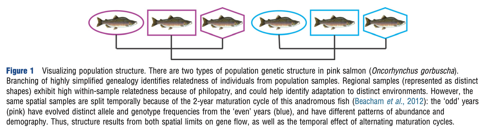
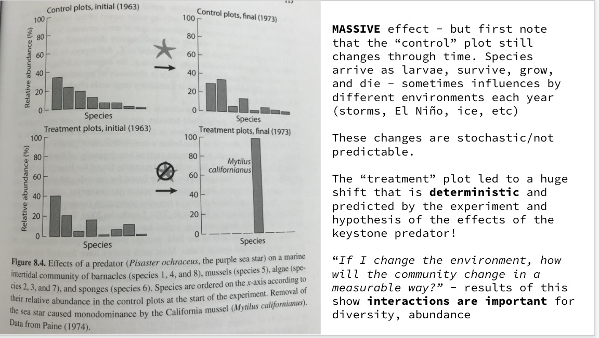
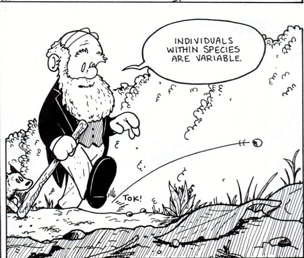
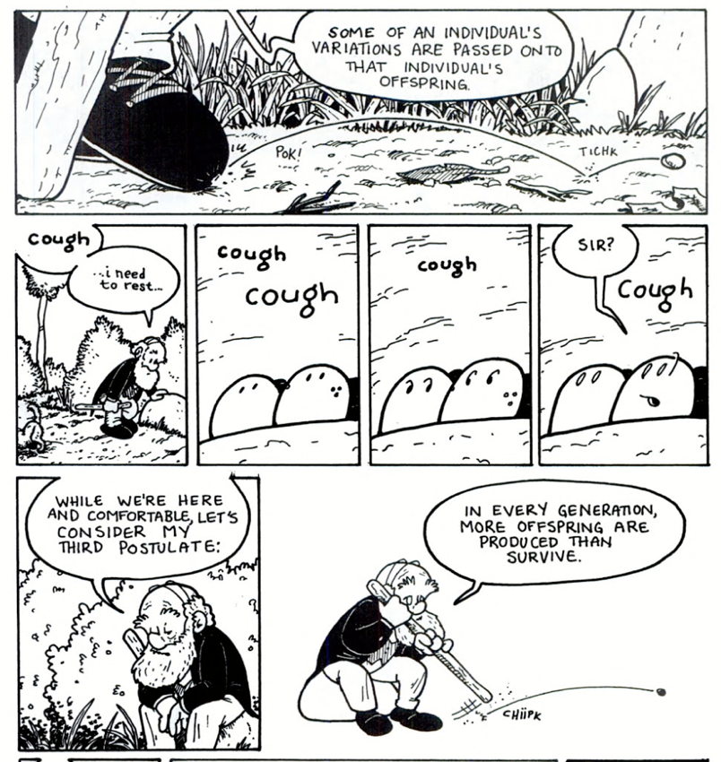
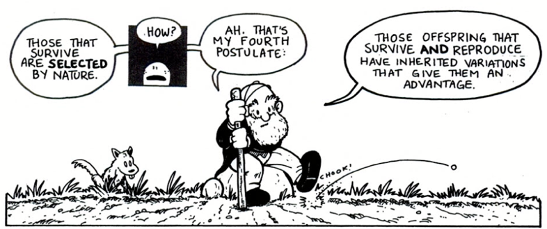
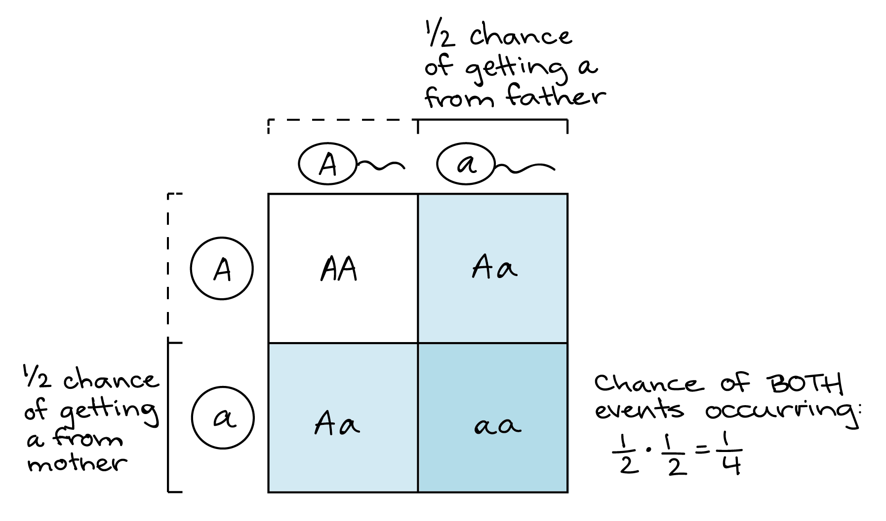
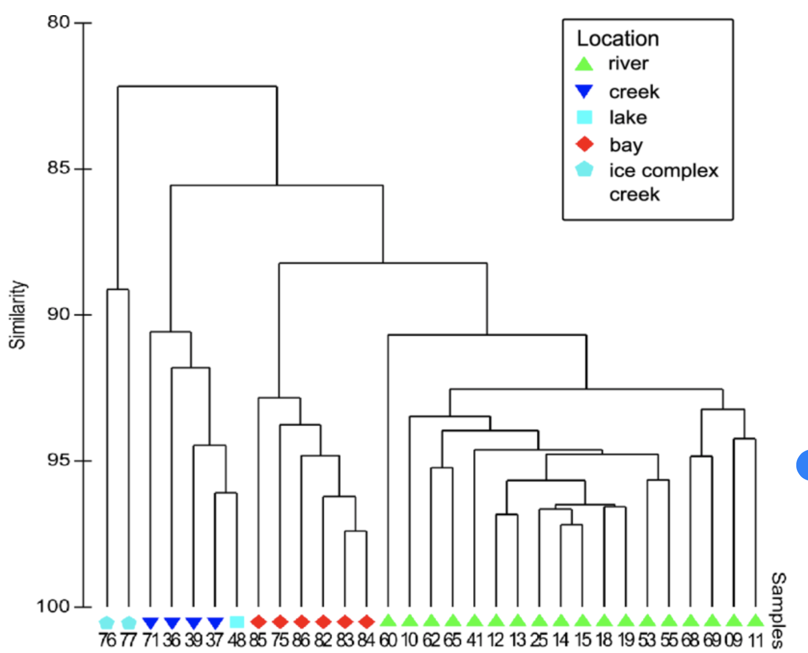
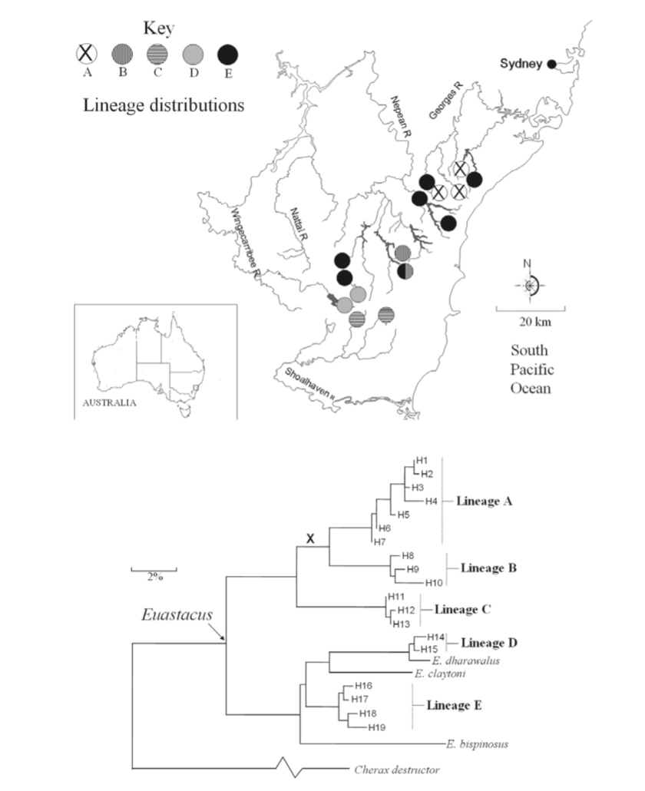

# 4. Alpha diversity, beta diversity, and dozens of competing statistics and variations. {#Ch4}

Here we won't try to exhaustively work our way through metrics, but try to establish the *reasons they exist* and lay the groundwork for refinements to be included as the data we are evaluating get more complicated.

## Box C.1. Additional advances with R

For now, your job is to read and follow directions in Part I of the "population genetics and genomics in R" tutorial written by the developers of the R package 'poppr': https://grunwaldlab.github.io/Population_Genetics_in_R/Getting_ready_to_use_R.html [ref] This will help you install several other useful packages that we will be using more and more as the semester progresses. *This won't be a graded assignment, but by doing this it prepares you for later assignments that will be.*

# 4.05 Diversity in and among individuals

I'm adding this late - thus the odd numbering - because I realized I hadn't addressed one peculiarity of sampling diversity. **It is harder to compare individuals than it is to compare samples of individuals.** One of the key reasons for this is that the diversity we are dealing with is often diploid (or worse). That means that a heterozygous variant in one individual can be difficult to categorize in terms of how distinct it is from the genotype of another individual, especially another heterozygous individual. Which pairs of haplotypes are contrasted? Methods like Bowcock's (1994) "proportion of shared alleles" and other methods have been attempted to obtain *genetic distances* among individuals when codominant markers are used, but they involve abstractions of the data that aren't very satisfactory (Robinson et al 2013). Recent approaches have tried using Hill numbers (more on them in this chapter) [ https://www.nature.com/articles/s41598-020-62362-8 ] to make hierarchical contrasts between individuals with respect to the patterns and frequency of polymorphism variation among them; I'll leave it for now to say it gets complicated and this is often why we characterize diversity for samples or populations as our primary tool. 

## 4.1 Diversity in a single sample.

First of all, lets try to be clear with how we use language about diversity. There are many words that get used and abused persistently, most notable being **'population'** used to refer to a *location* or *sample* that is being evaluated. Sometimes you may hear a population referred to as "individuals of the same species that are in the same place" but you can immediately see that the scale of "same place" is not defined, and we've already discussed that the definition of a species is not trivial either! A problem with that casual usage of the word 'population' is that two locations may end up showing no difference in diversity, which - without other data to the contrary - may suggest they are both part of the same population in an evolutionary (or even ecological) sense. 

So, for now lets consider that we are sampling the environment for the diversity we find. This **sample** may be spatial - are there distinct algae, or algal genomic diversity, across a transect of the California coast from north to south? (yes: the feather boa kelp *Egregia* exhibits a significant shift in morphology, and likely in the animals living among its fronds) Or, the sample may compare different times: is there a distinct set of molecular markers associated with pink salmon running in odd years and even years? (yes, again; Fig 4-1) Finally of course, we may look at samples before and after some experimental treatment, as with the SSWD-based selection event that changed the genotypic diversity of sea stars on the California coast (Schiebelhut et al 2018).

```{r, out.width='90%', fig.align='center', fig.cap='...',echo=FALSE}

```
**Fig.4-1. Molecular data are used to provide evidence that salmon from different rivers, and from different annual runs (odd years and even years), represent distinct populations of the same species. The phylogeny shown represents the divergence among populations, but populations are defined both by time and location. Figure from Wares (2016). **


Your sample may be a set of *quadrats*, or a belt transect (following a set line through the ecosystem with a set width, e.g. Barry et al. 1994 *Science*), or a catch-per-unit-effort approach; it may involve a haphazard collection of tissues from barnacles on a dock and the molecular diversity they harbor. It may be 10cc of soil, or the gut lining of a bird of interest. In each case, we can think about how to categorize this sample of diversity: how many different categories of things, and what is their relative abundance?

### 4.1.1 How many things and their relative abundances when there is not a model

What do I mean by 'model'? Remember a *model* is just a way in which we can make predictions about some parameter of a natural system; for example, how many species of cladocerans should you be able to find in a particular wetland in the Savannah River Site? Marcus Zokan, while at the Odum School of Ecology getting his PhD, individually identified over 480,000 cladocerans, copepods, and arthropod zooplankton in many of the wetlands in this site to see how periodicity, tree cover, pollution history, and other factors influenced levels and patterns of diversity in this hyperdiverse region (there are dozens of species found in any single wetland!). However, the context dependency of this kind of work makes it difficult to know how to predict the diversity of a distinct taxon, in a distinct ecosystem. 

Nevertheless, we need ways to compare such systems - and many of these metrics will apply in some way even when we have equilibrium models to work with. For example, any given quantity of a particular species in a community can be used to indicate its *relative abundance* or proportion in that community, with all such proportions of *counted* species adding up to 1 (see Fig. 2-5 for an example of microbial diversity, identified using 16S molecular barcoding). So, observed frequencies must add to 1, but we recognize that we may have missed counting some species as well (e.g. Chao estimators that rely on the frequency of 'singleton' observations to predict how many species were present but not observed; Maurer & McGill). Once we have these relative abundances, we can ask how evenly distributed they are. 'Evenness' refers to how similar their abundances are.

Simpson's (1949) *D*= $\sum_{i} p_{i}^{2}$ is a measure of species diversity that describes the 'dominance' of certain species by measuring the likelihood that two random individuals from a sample belong to the same species. More commonly used would be the index of diversity estimated as 1-*D* which is instead the probability that two random individuals are distinct from one another; thus the greater the number 1-*D*, the more diversity and evenness there is.


```{r, out.width='50%', fig.align='center', fig.cap='...',echo=FALSE}


```
**Fig.4-1.5. Part of my BIOL 1104 teaching, figure from Vellend (2016). When we talk about dominance patterns in a community, a great example is the dominance of blue mussels (Mytilus) following predator removal in this Pacific Northwest rocky intertidal ecosystem. The number of species present (rather, being counted) has not changed but the evenness is much lower, which leads to a lower "inverse Simpson" value.**


I emphasize this here because as we move forward you will see this latter quantity 1-*D* represented again as the amount of genomic heterozygosity observed or expected in a system. Certainly the evenness (lack of 'dominance') in the system influences our ability to detect diversity and is another major component of variation among observed systems. 

Simpson's *D* is just one measure in a family of statistics known as Hill numbers (and lets not get into how many times *D* is used as a statistic in both ecology and population genomic fields!!), where the exponent of *ln*-summed frequencies increases the emphasis on common diversity over rare diversity in metrics as the exponent increases. We will return to these later as we discuss the 'effective' number of alleles, or fathers, or other elements of an ecological or evolutionary system. Of note, however, is that the definition above for the variance attributable to within-species variability, 1-*D*, is identical to "gene diversity" or heterozygosity as we evaluate genomic markers (Nei 1987).

Additionally, many of the approaches used to look at evenness relative to richness (like Fisher's $\alpha$) will return as we look at the *frequency spectrum for polymorphic sites* in genomic data relative to an underlying model of expected *lack* of evenness; these are also a big part of Hubbell's (2001) neutral theory of biodiversity, which also borrowed from population genetics the compound parameter $\theta$, a variable and interesting character who will make their appearance frequently in this book as we continue into genomic diversity. *See, this paragraph alone merits an hour or many more of discussion but there just isn't the time to get into how cool this association between community ecology and population genetics can be!* The point being, there is a long and rich history in both ecology and genetic studies of evaluating patterns of diversity to better understand the underlying processes - and in many cases, they intentionally (or not) borrowed the mathematics from the other field.

### 4.1.2 With molecular markers, what kind of a model can we include?

We have already noted two basic models for describing the diversity found in a sample: (W) and $\pi$ are *estimators* that rely on distinct sets of assumptions (the "*infinite alleles model*" which assumes that every mutation generates a novel allelic variant underlies **W** and the "*infinite sites model*" assumes every mutation happens at a different part of the gene region, so that there are not multiple events at the same location - the assumption underlying $\pi$) to represent the population mutation rate, $\theta$. In a single randomly mating population, when the diversity represents no fitness advantage or disadvantage, these estimators *should be* equivalent. When they are not, it suggests a deviation from our set of assumptions - we will return to this as a means of testing hypotheses.

Another focus can be considered now that we are more comfortable with diploid genomes and looking at distinct markers - whether those are variable nucleotide positions in a sequence, the aggregation of variation among sequences, or simplified markers that summarize genomic variation as variation in fragment length (microsatellites or restriction-digest based markers) or pattern of electrophoretic migration (allozymes). 

Now, we are dealing with an *equilibrium model*, where we can make predictions about future generations to the extent that our assumptions are not violated. That's the bonus we get with studying heritable data. In the purely ecological case, the diversity at a site is governed by the environment alone and what diversity can either arise or arrive in that location. In the evolutionary instance, the diversity at a site is driven by both environmental variation and the genomic diversity that *has been there* and *can persist there*. And that lets us set up some simple predictions about what the most basic model of persistence of diversity would look like. 

1. The diversity you start with persists into the next time step (generation); you don't gain anything new and nothing changes into a different type of diversity (assumption: **no mutations**). 
2. The diversity you are studying isn't augmented by diversity coming in from somewhere else, which would have similar effects to new mutations (assumption: **no migration**).
3. The diversity you are studying, each example, has no special advantage in the environment other than the fact that the species you sample it from happens to be able to live there (**no selective advantage to the diversity *at the locus or level of diversity being considered****).
4. The choices that organisms make in terms of sexual reproduction are unrelated to the diversity *at the locus or level of diversity being considered*.

#### please note I've just listed the assumptions for Hardy-Weinberg equilibrium :)

Often, you'll see one additional evolutionary assumption, that the population is practically infinite in size. Since that is never true, and genetic drift alone will effectively never lead to deviations from predictions of this model, I'm going to jettison that right here. As noted before and in class, we will actually rely on drift in some cases as a means of estimating effective population sizes.

That's it. You know already that some or most of those assumptions won't be true, and that is why we know that evolution happens. Every single generation in every single organism on the planet, whether they photosynthesize or excrete or absorb - these are the mechanisms of evolution. Mutation, the movement of biodiversity, fitness advantages that are heritable, variation in reproductive success that cannot otherwise be predicted, and non-random mating. That's it. It will always happen. So how do we detect that it is happening?


```{r, out.width='50%', fig.align='center', fig.cap='...',echo=FALSE}



```
**Fig.4-2. Frames from Jay Hosler's *Sandwalk Adventures* about the testable assumptions of natural selection. In later chapters we will talk about how to infer the action of selection from molecular data, but in many cases separate experiments or other types of data are needed to confirm this mechanism.**


Answer: **A null hypothesis**. We simply assume that we have multiple ways that we can evaluate the diversity in a sample, and those *multiple ways should agree* or else one of the underlying assumptions is wrong. To figure out those assumptions, we have to remind each other about how genetic diversity is inherited via DNA and cellular mechanisms associated with persistence and replication of that DNA. For now, lets just focus on two things: how many copies of each homologous gene region, and how are they inherited? 

*how about we now note that it would be weird if a single nucleotide tended to be homozygous within individuals despite segregating in the population - so move FROM THE SEQ DATA TO THE ALLELE DATA*

1. Most gene regions (nuclear genes in sexually reproducing eukaryotes; most autosomal regions; in general single copy loci fit this ideal the best) are diploid; an individual inherits one copy of the region from mom, one from dad.

2. Some are haploid, meaning there is only one copy inherited; this is often but not always true with animal mitochondria inherited maternally, similarly with chloroplasts in photosynthesizing organisms. Some 'nuclear' exceptions include the heterogametic chromosome in organisms with clear chromosomal sexual dimorphism, but not all organisms (or even most) have genomically determined sex - many are environmentally determined or heavily modified by the environment. All we really care about here is copy number and who it descends from!

Knowing this, we can start from the point of knowing that there is variation in almost any natural population. For every individual genomic fragment, the amount of variation that gets *introduced* to that locus is the copy number of chromosomes that can be involved in reproduction times twice the mutation rate $\mu$. Constraints on the function of a genomic region may quickly eliminate some new mutations (or quickly allow them to evolve to higher frequency), but this gives us an estimator $\theta$ that reflects these inputs as sequence diversity, as we saw in the previous chapter.

<style>
div.rose { background-color:#ffc4ef; border-radius: 10px; padding: 40px;}
</style>
<div class = "rose">

*Dr. Wares, what you just said is super confusing. Explain it better.*

OK, what it means is that for most of the genome, which is diploid/autosomal, then $\theta$=4*N*$\mu$, because there are two copies of each gene potentially contributing mutational diversity, and the expectation for divergence between those copies is twice the mutation rate for the same reason as estimating $\mu$ from time of divergence and the genetic distance between them.

If you are looking at a haploid, maternally-inherited marker (generally, mitochondrial data), then $\theta$=2*N*$\mu$ **except** now *N* is only the (effective) population size of females in the population, so it tends to work out to $\theta$=2*N(f)*$\mu$ or for a species with equal sex ratio =*N*$\mu$. This becomes more important when we are trying later to back-calculate what *N* is given our estimates of diversity and mutation rate.

That may not help, but it will make more sense as we see more examples. Oh, or:

## just remember that the effective population size of a mitochondrial gene is 1/4 that of a diploid nuclear (autosomal) gene 

</div>


So, each of these distinct sequences (distinct in actual sequence, or size, or electrophoresis pattern, right?) that gets sampled is an *allele* with frequency $\ p_{i}$, with all frequencies summing to 1. At diploid, biparentally-inherited gene regions, we thus have a simple expectation for how these alleles are recombined through random sexual reproduction to generate *genotypes*. We expect a proportion of individuals $\sum_{i} p_{i}^{2}$ to be homozygous, meaning both alleles have the same identity, and 1-($\sum_{i} p_{i}^{2}$) to be the proportion of individuals that carry two distinguishable alleles. We can directly observe allele frequencies by collecting genomic data, and these frequencies lead to a prediction of how they will be observed in genotypes. That's it. That's the model. It will hold as long as our 5 assumptions are true.

```{r, out.width='90%', fig.align='center', fig.cap='...',echo=FALSE}

```
**Fig.4-3. The standard 'Punnett square' illustrates how the random generation of haploid gametes by both mother and father should give equal probability of including either of the two alleles from these parents. This is an example where there are only 2 distinct alleles in the population among the 4 parental contribution possibilities. For more information on this visualization, https://www.khanacademy.org/science/high-school-biology/hs-classical-genetics/hs-introduction-to-heredity/a/probabilities-in-genetics**

For example, no population is infinite in size, but our sample from a population is also quite finite (and much smaller than the total population size), so our sampling error is accounted for in statistical tests of whether the *observed* and *expected* heterozygosity (or the frequencies of any particular genotype) are the same. However, non-random mating, selection, and migration (or isolation) will influence this diversity in ways that our tests can indicate, and then we have to figure out why this basic model -- often called Hardy-Weinberg equilibrium for the co-describers of this relationship -- has been violated.

*This is why knowing (W) and $\pi$ come as distinct measurements of $\theta$ that also rely on that mutational diversity being not selection, not migration, random mating - because this also gives us a chance to look at those types of data to see when one of those have been violated (tests of selection, variation in Ne, multiple populations).*

*Though we aren't talking about allele frequencies in the same way as we were previously in assessing Hardy-Weinberg dynamics, it is the same in that we have an underlying model for how mutational diversity should be distributed in a population if we assume a single, randomly mating population with no immigrants from other populations, no selection acting on the diversity, and the mutations happened before we sampled the diversity. Do those sound like familiar constraints?*

There are all sorts of direct parallels between understanding the diversity of an ecosystem and the genomic diversity of the same system, beyond the similar mathematics (Vellend 2006, *Ecology*). Vellend (2016) has actually collapsed all community models of species abundance distributions and types of interactions in the language of evolutionary genetics, with plenty of interesting precedent studies. Randall Hughes (2004, PNAS) showed that the genotypic diversity of experimental *Zostera* patches positively predicted patch resilience to grazing, likely because of complementary ecosystem effects among genotypic clones. **So, our ability to think simultaneously as an ecologist and a population geneticist will serve us well in this field.**

## 4.2 Diversity compared across samples. 

### Finally. I know, it has been a lot of time talking about only one sample of diversity.

When there are multiple samples, we often want to know if they are statistically distinguishable. Do they have the same types of diversity, in the same relative abundance? If so, then it is likely that the environment does not vary between the two, and that movement and reproduction between individuals from the multiple regions prevents random changes in diversity from leading to different frequencies - whether we are talking about species (Hubbell 2001) or genomic data.

Some very basic methods to evaluate compositional differences among sites are reviewed in Anne Magurran's book ("Measuring Biological Diversity", ISBN 9780632056330) and include the Bray-Curtis (1957) measure of compositional similarity, scaling from 0 when samples have no diversity in common to 100 (or 1.0) when identical in composition. You'll see in Figure 4-4 an example of this, and note that the similarities are portrayed using a tree clustering algorithm *that is actually showing you how DIFFERENT the samples are*. There are many other community composition metrics with strengths for particular types of data and studies, again more on those can be found in Magurran (2003). 

```{r, out.width='90%', fig.align='center', fig.cap='...',echo=FALSE}

```
**Fig.4-4. An example of isotopic similarity in waters sampled from diverse glacial regions, illustrated with a Bray-Curtis distance plot. from Dubinenkov, Ivan & Flerus, R. & Schmitt-Kopplin, Ph & Kattner, G. & Koch, Boris. (2014). Origin-specific molecular signatures of dissolved organic matter in the Lena Delta. Biogeochemistry. 123. 1-14. 10.1007/s10533-014-0049-0.*

The fact that these compositional differences can be shown using a *distance tree* indicates one way in which we can evaluate the compositional similarity of distinct samples when we have molecular data as well. Phylogenetic diversity can be calculated simply when you have aligned sequence data and can estimate the genetic distances between sequences, as in Chapter 2. Again, these genetic distances involve different ways of estimating the number of mutations between individual samples, and so depending on the type of data the models (finite sites models, and so on) can reflect complex problems of mutations happening in the same site, or being biased towards certain types of mutations. For now however we can simply think of the metrics we used in Chapter 3, the proportion of *dis*similar nucleotides among our sequences. These dissimilarities can be used to generate gene trees or phylogenies summarizing the diversity within and across samples, and this represents the *phylogenetic diversity* of our samples.


```{r, out.width='90%', fig.align='center', fig.cap='...',echo=FALSE}

```
**Fig.4-5. From Faith and Baker (2006) Evolutionary Bioinformatics Online. The phylogenetic relationship of crayfish found in different rivers of New South Wales, Australia. The phylogenetic pattern from Baker et al derived using the gene sequence, cytochrome c oxidase I gene (COI). Lineage A is a phylogenetic “sister” to lineage B. Given expected loss of biodiversity at localities containing lineage B, PD analysis assigns the localities containing lineage A higher priority, because the overall PD losses if both lineages were to be lost now would be high in reflecting also the loss of a shared, deeper, branch (marked X).**


One simple example of why phylogenetic diversity may matter for making conservation or management decisions is shown in Fig 4-5. Knowing that locations carry distinct diversity is robust and visually determined in this example, but often it will be more complicated to tell the diversity apart from different sites, as with the microbial 16S diversity shown in **Figure 2.5**. However, the *branch lengths* in a phylogeny (the proportion of mutations inferred to be on a single branch of the gene tree) can be used to tell us about how much shared diversity there is between two or more samples. The metric 'phylogenetic diversity' or PD is actually measured by summing the branch lengths of a sample. If distinct samples have very distinct diversity - as in the Bray-Curtis plot above - then the PD of the combined "total" samples is much higher than the PD of each individual sample. This is statistically tested using permutation.

As with many of the metrics used in molecular ecology, there are not standard parametric statistical tests that allow us to evaluate the variation in diversity among sites. So permutational tests randomize the relationship of observed data with the identity of the samples, for example randomizing the order of labels at the tips of the tree. In this way, the PD of each individual sample relative to the combined samples can be assessed again, and in a "random" or "null" hypothesis we would expect there to not be very much difference between the samples. In this way we can ask if the PD of two samples is significantly different from one another. 

Because there are often many sequences that are identical or binned together under a single identity in large sequence samples such as microbial ecology data, the PD will be different if we consider only the presence/absence of a particular sequence in a sample, or if we consider the relative abundance. These two ways of looking at phylogenetic diversity are calculated under what are called "Unifrac" distances between samples, either unweighted (only presence/absence) or weighted (considers relative abundance). [ https://en.wikipedia.org/wiki/UniFrac ]

## 4.2.1 reciprocal monophyly and "unifrac"

When we discussed the 'what-is-a-species' problem in the last chapter we were dealing with *reciprocal monophyly*. Simply put, this is when the phylogenetic inference of data from two populations indicates that each has a *most recent common ancestor* that is distinct from the *most recent common ancestor* of the other. So, if we have a set of data from two species and there is no cross-over of species identity and there are two clear groupings, that means that at least one nucleotide position is a diagnostic trait for one species versus the other - often more, and we typically require more than one to define species of course.

When we are dealing with phylogenetic diversity but there are many species involved, we may want to know about community composition and how it varies from one ecosystem or treatment to another. In this case, similar logic is used; how much of each grouping shares the same branch lengths versus *unique fractions* of the branches in that phylogenetic inference? The "uni-frac" methods https://en.wikipedia.org/wiki/UniFrac were thus derived to generate a quantitative estimate of how distinct two sampled communities are -- and again, derive simply from these methods of genomic *distance* and our ability to measure those distances through sequence data.

(for a more comprehensive exploration of microbial ecology or any form of metabarcode approach to explore communities using Unifrac measures, here is another great tutorial that we may choose to work through to gain experience: https://mibwurrepo.github.io/Microbial-bioinformatics-introductory-course-Material-2018/beta-diversity-metrics.html)

I'll also note here that these methods differ if you use an approach that is guided by a reference library of available sequence data for that taxon (e.g. 16S for bacteria, or 28S for dinoflagellates, etc.) than if your study focuses on "allele specific variants" (ASVs) which allows for the fact that many such studies are capturing diversity that has never been sequenced before; ASV methods do not bin sequences based on their proximal distance to a known type, but retain all variation - recognizing that we don't know how *functionally, ecologically, or taxonomically* distinct alleles may represent.

So, based on the sequence data alone - representing distinct samples in time and space - we can evaluate how distinct those samples are using genomic distances as in Chapter 2. Now that we have evaluated the complexity of genomes and how genomic diversity is recombined into each new individual (Chapter 3), we can also think about how that diversity is contained within individuals as well as within and among samples. 

### A 1st Primer on Fst

Almost all measures of differentiation of populations in a hierarchical framework are based on asking about the difference between overall diversity and mean diversity at a lower hierarchical scale (*individuals* are in a *sample* or *site*, there may be multiple *samples* in a *region* that may be defined by environment or governance or whatever, and all samples together are the *total* diversity observed), normalized by the overall diversity to produce a metric ranging (typically) from 0 to 1 (Wares 2016). Commonly (but often inaccurately) referred to as 'F-statistics' and derived from Wright's inbreeding coefficient *F* (1-($H_o$/$H_e$), 

<style>
div.rose { background-color:#ffc4ef; border-radius: 10px; padding: 40px;}
</style>
<div class = "rose">
1. what is $H_o$? This is the observed heterozygosity of the sample. For now, its OK to just think in the A / a world, what frequency are individuals heterozygous?

2. What is $H_e$? 

Well, what did you *expect*? Based on the standard assumptions of Hardy-Weinberg, we may expect higher or lower heterozygosity than we see **based on the allele frequencies** and their combinations into genotypes (remember for allele frequency *p* we expect a homozygous genotype for that allele at frequency $$p^2$$); either can trigger interesting hypotheses.
</div>
</br>

*itself* is a contrast between observed and expected heterozygosity. The variations in how this is calculated, and how it is referred to, depend on the type of genomic data and the underlying model of how we assess the relationships among alleles, partly summarized here: https://www.molecularecologist.com/2011/03/should-i-use-fst-gst-or-d-2/ and partly in the Wares (2016) reference that you'll read right about now.

The basic idea of these F-statistics is that the diversity is described in hierarchical levels: again, individuals in a sampled location, samples in a region, regions in the overall (total) distribution, for example. And, in one way or another they are asking about the proportional amount of genetic variation in a lower level of the hierarchy relative to a higher level. For example, if allele frequencies are exactly the same in two locations, then the amount and type of diversity in both locations are the same, and the diversity can all be found in the site/sample level as much as in the overall (total) sample. 

We will get more involved with these statistics soon and the appropriate usage, for now you should try seeing how distinct allele frequencies (at a single, bi-allelic marker) in two locations lead to different $F_{ST}$ for the samples (here, F is appropriate for evaluating a single, bi-allelic marker; 'S' is for sample, and 'T' is for the total diversity; the metric $F_{ST}$ therefore tells us about the extent to which the diversity in each sample is only a subset of the total diversity, or *relatively more inbred*).

```{r firstlookfst} 
shinyAppFile("exercises/shiny_popgen-master/FST/fst_app.R",options=list(width="130%",height=500))
```


<style>
div.blue { background-color:#e6f0ff; border-radius: 10px; padding: 40px;}
</style>
<div class = "blue">
**Take a quick note that if you repeat this simulation 10 times, for example, which would be the "truth" based on sampling *n* individuals across 10 loci that *actually* carry those distinct allele frequencies, you will see a lot of variance in results especially when *n* is small. Which value: $H_S$, $H_T$, or $F_{ST}$, is most stable, and how does it change as the allele frequencies vary? Which value tends to be most stochastic? If you were writing a research proposal, what sample of individuals would be best given the cost of collecting specimens and obtaining genomic markers?**

We are also going to get some hands-on experience with this class of divergence metric using this exercise developed by brilliant colleague Dr. Katie Lotterhos: https://docs.google.com/document/d/1u0tSy5OgepJoFeZ_cHUEemCfQC79dAMIOZsJExDYGEo/edit#heading=h.clt2mf5prpxl 

</div>

In this example, Fst is calculated directly using the ratio of $H_S$ (the observed heterozygosity in each sample, averaged) to $H_T$ (the observed heterozygosity in all samples combined). Other metrics for $"X"_{ST}$ as noted above depend on the marker used and the model used to summarize that mutational diversity, but to briefly think again about coalescent theory, it effectively comes back to the mean coalescent diversity $\theta$ within each sample relative to the overall $\theta$, which if you squinch your eyes closed and think really hard, you will see is highly related to the phylogenetic diversity we talkeed about earlier in this chapter. It's all related, and all basically boils down to what proportion of genomic variation is partitioned within and among different samples and groups of samples!

A fairly important element of these metrics, as mentioned previously, is that none of them are based on a standard distribution in probability theory; they rely on contingencies of how long a species or allele has been in a population which can influence its frequency, as well as the stochastic effects of generational variance in reproductive success and other evolutionary effects. As well as the variation caused by sampling - repeat that simulation in the last panel a few times without changing the actual frequencies of alleles, and see what happens with small samples and the consistency of estimates on Fst! 

So while there are many attempts to standardize these diversity metrics as something to compare across distinct studies (e.g. Jost 2008), our ultimate question relies on how the diversity compared across locations deviates from a null distribution generated by permutation; as such, almost all tests are nonparametric and consideration must be given to the distinction between statistical effect (e.g. p-values) and the biological effect of different diversity. Readers are strongly urged to read e.g. https://franklin.uga.edu/news/stories/2019/statistical-significance-reaches-its-limits, and Gerrodette (2011), to clarify the distinction between these effect sizes and how to evaluate the true significance of patterns that we see in nature.

**Example**

One distinct type of "F-statistic" involves utilizing the sequence diversity itself and the number of differences between sequences. These DNA sequences *may* be analyzed as alleles with their own distinct frequencies, but a problem with that approach is that sequence diversity can be very high in large datasets, and so many haplotypes or alleles will have very low frequencies - and thus sampling error is a problem. In addition, doing so throws away the information we have about how those sequenced alleles are related to one another via mutational history. So, it is common to analyze them using these sequence differences as a component of variation within and among samples.

This is at some level not dissimilar from "PD" approaches, but it uses the same hierarchical framework of thinking about spatial *samples* from different *regions* among the *total* diversity in the study that we see in F-st type approaches. Going back to Figure 2.5 that shows the statistically robust sequence variation in the barnacle *Chthamalus fragilis* and the distinct spatial distribution of these mitochondrial sequence groups, Govindarajan et al (2015, doi 10.7717/peerj.926) calculated $\phi$ST among samples on the coast (they mistakenly labeled Table 2 as "population pairwise Fst values", these are NOT Fst -- but the correlation among these different measures is quite high and for ease of communicating you will often see people call the different measures "Fst" when another measure was used). As expected from the strong spatial variation in the relative abundance of distinct mitochondrial types, there are relatively high (0.15-0.50) values of $\phi$ST between samples from New England and samples from the southeastern US. The framework for these statistics is called "Analysis of Molecular Variance" (Excoffier et al 1992) and provides the percentage of variation attributed to "within populations" (86.4%) and "among populations" (13.6%) which gives us another sense of how much the regional samples vary.

## 4.3 Sampling diversity

Back when Dr. Wares was barely out of graduate school, he overheard a debate among more senior colleagues about how to sample for the patterns and analyses we have been learning about. Imagine you can only afford to sample 100 individuals, in terms of the cost of obtaining marker data of whatever type. Lets imagine a simple 1-dimensional array where the organism is distributed, like a coastal marine organism. Would you be better off sampling 2 locations with 50 individuals? 5 locations with 20 individuals? 10 with 10? 20 with 5? 100 with ONE individual??

Naturally, it depends on the question you are addressing. 

1. for coalescent stuff, there are diminishing returns with sample sizes above 10-20 individuals to represent a *population*. Wakeley. There are also diminishing returns on sequence data to sample more than about 10-20 loci (Hickerson). Expand on this.

2. if you think about methods that rely on the variation in allele frequencies, of course your estimate of frequency improves with a higher sample size. For a long time, a rule of thumb was to sample 20-30 individuals from a site because the estimated frequency could then be resolved to the nearest 1/*n*; a small sample would mean imprecise frequency estimates. However, in recent years with methods that enable genotyping at very large numbers of loci, it has been considered that having so many loci enables a certain precision in estimating divergence metrics even if each individual locus has lower precision with a smaller sample size. 

3. of course, the question may require a sufficient number of *locations* or *samples* to understand how diversity is hierarchically or continuously distributed. Clearly sampling 2 locations only lets you ask if those 2 locations are distinct, with little understanding of how that genomic diversity is distributed elsewhere across the spatial distribution of an organism. In recent years there has been work done on asking *how few individuals* from a single site are useful for balancing an interpretation of variation from sample to sample with an interpretation of variation across a complex landscape.

At some point we will likely read Prunier et al 2013 "Optimizing the trade-off between spatial and genetic sampling efforts in patchy populations: towards a better assessment of functional connectivity using an individual-based sampling scheme" ***Molecular Ecology doi: 10.1111/mec.12499*** what do you think - can we think of why there are advantages to lean towards one type of sampling or another for a particular project?


## Box C.2 Additional work with R

***Experiential*** lets take a look at POPPR tutorial PartII.1-5, through "genotypic evenness, richness, and diversity" and the information on particular loci and types of data will be explored in this next chapter. Use the practice data they provide so that you have the ability to run such data, as we start discussing what they mean for our ability to infer demography, movement, and evolution in natural populations. **Totally voluntary for 2020 students!**

## 4.4 Summary

Now we have the basic building blocks for analysis of genomic data in molecular ecology: how much diversity is there in a sample, and how distinct is one sample from another? A key element of how to use these metrics, however, lies in the questions we ask about movement, mating, and variation in fitness - the realities of biology that will affect the fit of genomic data to our 'null' expectations. In this chapter we will talk about the scale at which individuals move among sampling locations, and how that leads to distinctions that can be quantified as "populations" that have some demographic and evolutionary independence from one another - and perhaps distinct interactions with the environment or with other organisms in their ecosystems.
