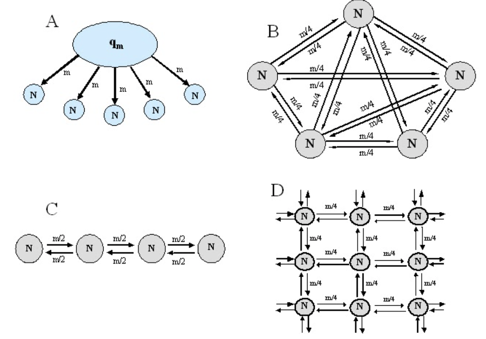
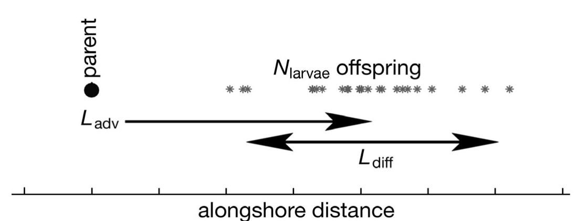
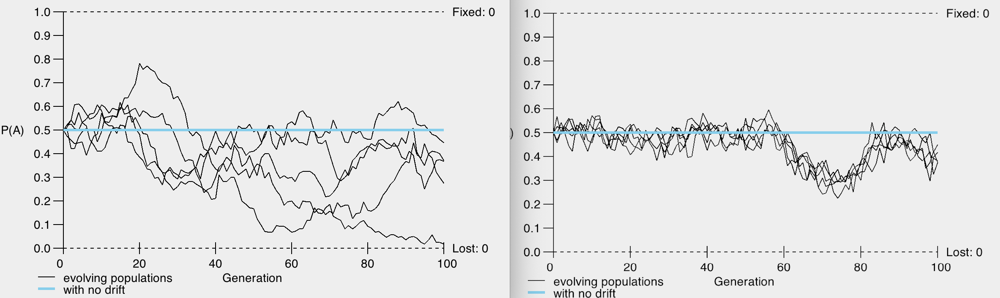
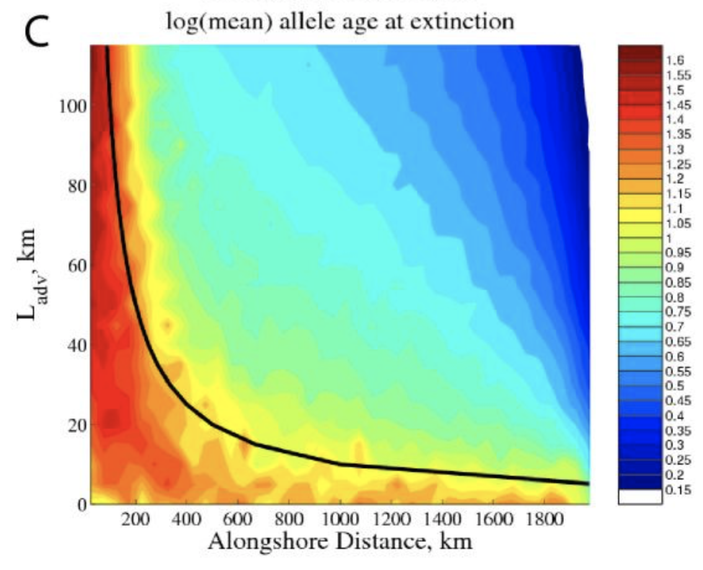
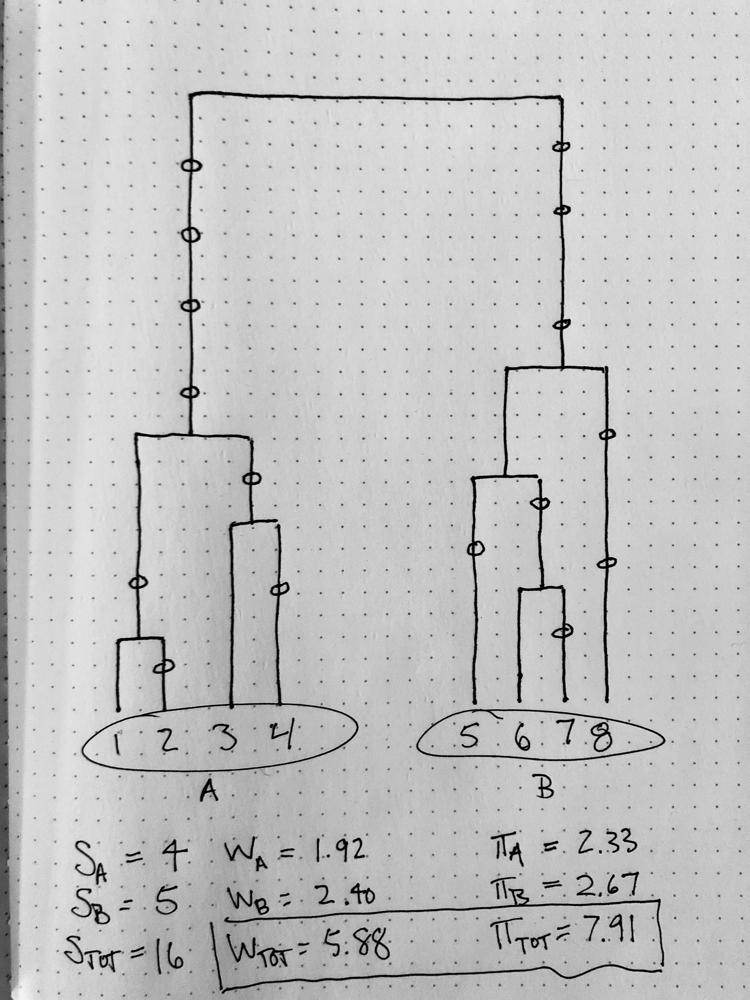
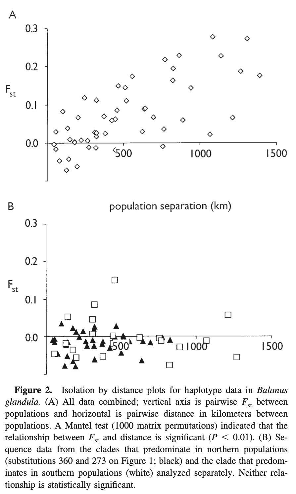
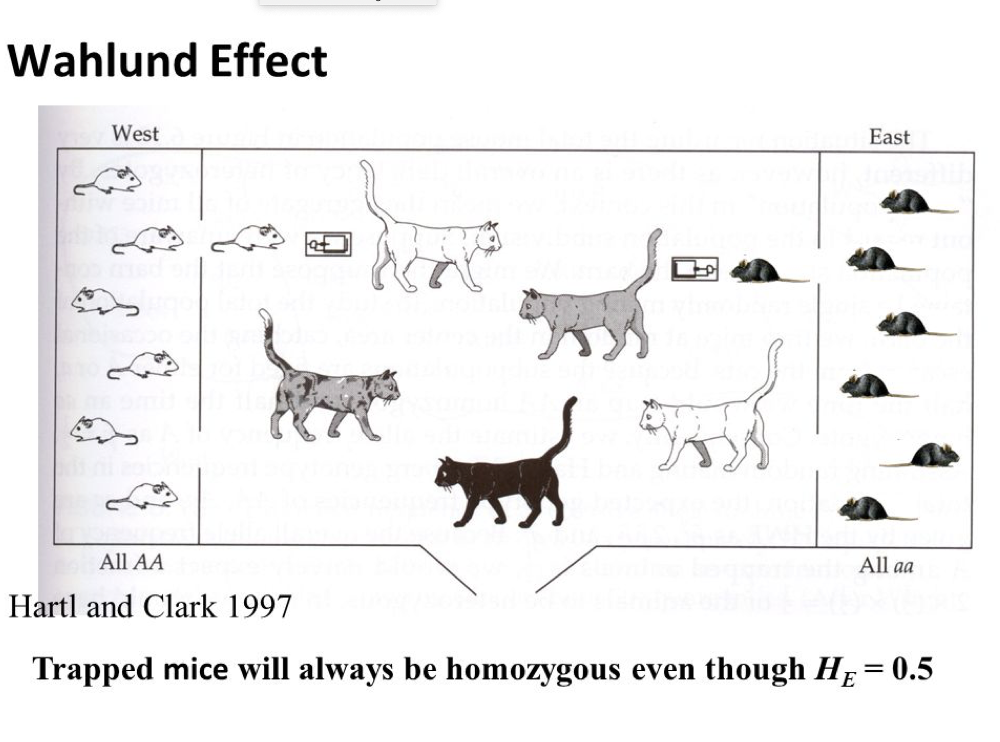
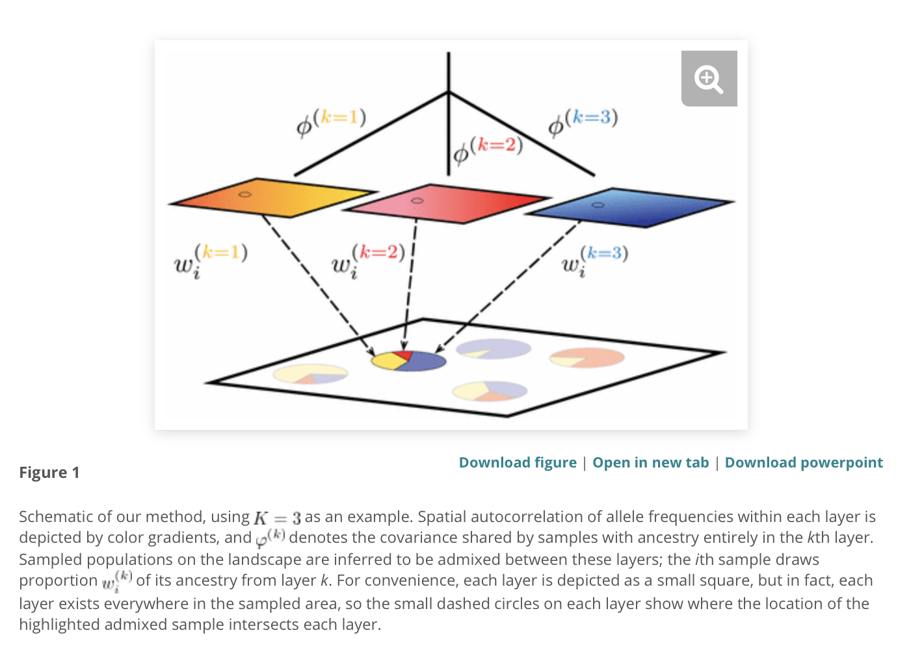

# 5 We call them populations as a way to simplify 'where things are' {#Ch5}

## 5.1 Population models and movement basics

The figure below (5.1) shows some very basic schemes for how individuals might be thought to move from location to location in a regional study. Very few natural systems will fit these schemes well, but they can be a starting point for thinking about overall movement of organisms, their offspring, or their propagules between generations. They capture these basics of movement in several ways. First, a "mainland-island" model was developed in the field of biogeography (Macarthur & Wilson) to consider the probabilities of diversity from a large mainland ecosystem moving to or invading a smaller offshore habitat, with probabilities of movement being dependent on distance from the mainland, size of the island, and so on. This model is useful for considering source-sink dynamics in population genetics (Robinson et al 2013 *Molecular Ecology*). An "island" model assumes all the habitats are of similar size with similar or equal probabilities of individuals moving among each site, while "stepping-stone" models assume migration only happens between neighboring sites. So, early studies assuming the "island" model might only report a single $F_ST$ value for the entire collection of samples; clearly we learned that this rarely matches the understanding we get when each pair of samples is evaluated for their pattern of isolation.


```{r, out.width='90%', fig.align='center', fig.cap='...',echo=FALSE}

```
**Fig.5-1. Basic - and mostly oversimplified - models of movement among 'demes' or presumed demographically distinct samples. A) Mainland-island model, also related to source-sink diversity questions. B) Infinite island, allowing for equal probabilities of migration to any site in the region. C and D) stepping-stone models, allowing for a particular rate of migration to the nearest location on the grid. Figure from apsnet.org/edcenter/disimpactmngmnt/topc/PopGenetics/Pages/GeneGenotypeFlow.aspx**
 
Each of these cases are simplified versions of 'real' dispersal of offspring or juveniles because it is rarely biologically plausible that offspring are prevented from moving more than one 'step' in a habitat matrix, however it may become less probable the further they go. This is called a 'dispersal kernel' and reflects the probability that offspring land and mature ("recruit") very close to their parent (perhaps gravity-dispersed seeds), or further away with typically diminishing probability with distance. Often these distributions are *leptokurtic* meaning most of the probability is closer to 0 dispersal distance than you would expect from a *normal* distribution, however there is a non-zero probability of dispersal to great distances. For example, dandelions have a wind-dispersed seed that is thought to have high dispersal potential; however roughly 99% of all seeds land within 10m of their parental flower. The remaining 1% convince many, many people to spray their lawns with herbicides for fear of little flowers emerging.

In a way, this reflects one of the concerns that can happen with analysis of microsatellite data using a stepwise-mutation model (SMM), which might assume that the number of short sequence repeats increases or decreases by a single repeat to reflect the mutation process distinguishing alleles. Yet, polymerase error also has a probability of skipping (or adding) two repeats, or three or more, in a single mutational event. Thus more complex models allow for this probabilistic distribution of changes as well, but makes interpretation of temporal separation between allele sequences more challenging. In the limit of not knowing how mutations arise in such markers, the IAM may be a more robust way to analyse microsatellites.

We may also find that dispersal is not equally likely in all directions in a habitat matrix. In the next chapter we will talk about this in terms of landscapes and variation in dispersal potential, but a simpler way to think about is just biased dispersal in one direction. This might be caused by wind moving seeds or pollen (Kling & Ackerly 2021, doi:10.1073/pnas.2017317118); water flow moving fish eggs downstream before they hatch (Aló & Turner 2004, *Hybognathus amarus*), or ocean currents tending to displace the larvae of an oyster 'downstream' along a coast (Fig 5-2).

```{r, out.width='90%', fig.align='center', fig.cap='...',echo=FALSE}

```
**Fig.5-2 from Pringle & Wares 2007, MEPS. One can imagine that offspring disperse in ways that lead to a high variance in where they mature (whether a seed, a larva, a juvenile) and how far that is from their parent. This figure shows what that pattern looks like if there is also a bias in the direction of dispersal caused by wind or downstream flow in rivers or ocean currents.**

Importantly, when there is dispersal from one location to another, this is one of the components of ecology that can change gene or allele frequencies away from our equilibrium or null assumptions discussed in previous chapters. As a very simple example, Hardy-Weinberg expectations for genotypes are based on allele frequencies in the previous generation. If an immigrant arrives from a distinct location, it may change those allele frequencies or even add novel genomic diversity to the sample being analyzed. Broadly speaking, the higher the movement of individuals from site to site, the more similar their allele frequencies and genomic diversity will be (Fig 5-3). This can also be viewed across space and time in a different way (Fig 5-4A) where distinct diversity (by whatever marker type or sequencing) is viewed at different locations across a region, and through time there is low dispersal among sites and drift otherwise maintaining the dominant genomic diversity within that region. In (5-4B) you see an example where asymmetric movement across the ecosystem can quickly homogenize genomic diversity.

```{r, out.width='90%', fig.align='center', fig.cap='...',echo=FALSE}

```
**Fig.5-3. On the left, simulation of 5 distinct locations starting at the same allele frequency and each being fully independent, with only drift operating (population size 100). On the right, the same 5 distinct locations with the same population size, but with high dispersal from site to site, homogenizing the allele frequencies among locations.**


```{r, out.width='90%', fig.align='center', fig.cap='...',echo=FALSE}
knitr::include_graphics('MEImages/wp08_1.jpg')
```
**Fig.5-4 from Wares & Pringle 2008. (A) if there is no bias in dispersal, and different diversity is found in different parts of the organismal range, then through time drift and random dispersal from site to site will change the pattern somewhat but movement is relatively slow relative to drift. (B) if there is a bias in dispersal, then many migrants will arrive from upstream habitats and that diversity will begin to dominate a larger portion of the organismal range.**

What this all means gets very complicated with respect to how we estimate and evaluate *effective* population size (Caballero & Wang, Whitlock, others). The relationship of different *demes* (used as an ecological proxy for "population", suggesting that they are demographically independent... but that is a hypothesis we are testing with molecular data!) can lead to much higher genomic diversity in a species if there is low migration among sites (because each site will have different mutational diversity 'fixed' by drift and other mechanisms) than if they are linked by high dispersal among locations, and diversity may be substantially lower than you expect if there is asymmetric or source-sink dispersal among sites, e.g. one subregion provides almost all the persistent diversity for the entire distribution (Fig 5-5).


```{r, out.width='90%', fig.align='center', fig.cap='...',echo=FALSE}

```
**Fig.5-5. from Wares & Pringle 2008. Asymmetric dispersal actually means that new mutational diversity only persists according to neutral drift expectations at the upstream edge of an asymmetric migration scenario; new diversity that originates downstream is lost faster than we would expect because of immigrants arriving from upstream to change the diversity.**

Ultimately our goal in using molecular data to understand *how organisms move* will help us better understand how life history variation has consequences for evolution and adaptation. As noted above, how organisms move affects how genomic diversity is distributed through a species' range, and even how much genomic diversity there is to respond to environmental challenges. Within the context of this set of questions then, we first may want to ask about whether diversity is distributed *continuously* or *hierarchically* across this spatial range.

## 5.2 dispersal as an equilibrium model, limits to dispersal as violations of that model

When Dr. Wares was in graduate school, a brilliant but intimidating faculty mentor once pointed out to him that the genomic diversity captured through sequencing or genotyping at different locations may show that each location is distinct from one another, but we can ask whether or not that difference in diversity is consistent with an *equilibrium* between mutation, drift, and migration capability alone. This is related to the stepping-stone models of movement noted above, and is often called *isolation by distance* or IBD (Wright, 1943). This is for now distinct from a *hierarchical* model where there are distinct 'sets' of populations dependent on their spatial arrangement.

First of all, if movement among sites (I hate to use migration, which technically refers to the cyclic movement of birds and insects and fish etc. seasonally or following resources - we are really talking about dispersal and gene flow here) is very high, then as noted above all of the sites will have similar genomic diversity and allele frequencies, and our measures of differentiation such as $F_{ST}$ will be close to zero - effectively they all operate as a single *population* across that scale.

If, however, movement is not sufficient to homogenize the genomic diversity among sites, then drift leads to different allele frequencies and we know from last chapter that this leads to measurable deviation from Hardy-Weinberg when all sites are considered together; that is, total heterozygosity is much higher than expected given the diversity found at sites within the total sample. Or, in the sense of coalescent theory and our sequence-based models, we have higher $\theta$ when estimated from all sampled diversity than when estimated from diversity at individual sites, *and* the distribution of that mutational diversity will lead to (W) and $\pi$ not being equivalent estimates of $\theta$!

```{r, out.width='90%', fig.align='center', fig.cap='...',echo=FALSE}

```
**Fig.5-6. what you do when you are working from home... this coalescent gene tree shows the true ("known") genealogical relationship among 8 DNA sequences, and the small ovals represent mutational events on that tree. First of all, recognize that mutational data will not always distinguish all sequences, this is a non-random illustration! Second calculations are given for Watterson's $\theta$ and $\pi$ considering that sequences 1-4 were sampled from location A and sequences 5-8 from location B. As noted in Chapter 3, we expect that (W) and $\pi$ should lead to similar numerical estimates of $\theta$. Within each site, the low sample size means there is high variation expected, so statistically those numbers are perhaps not different, but the deviation overall is much higher when all data are considered together. If the difference ($\pi$ - (W)) >> 1, it may suggest that the diversity comes from demographically independent sites (among other explanations that we will return to in a later chapter).**

So... one way or the other you can calculate an $F_{ST}$ analog (even with the sequence data, where we can calculate as ($\pi$(tot) - $\pi$(average site diversity)/$\pi$(tot), or (7.91-2.5)/7.91 = 0.68) among sample locations. Good job! Now, if there is an *equilibrium* explanation for the diversity overall, meaning that drift towards distinct allele frequencies or distinct diversity is limited by movement among sites, then we expect the influence of movement on genomic diversity to be less for sites that are spatially further apart. Sites that are close to each other would be more homogeneous than sites that are distant, and so there will be a linear relationship between our genomic distance and our spatial distance. 

If this is true, there will be a non-zero positive correlation between pairwise genomic distance measures and pairwise spatial distance (because of non-independence among these many data points, i.e. the distance by railway from Washington DC to San Francisco is not independent of the distance of either of those cities to Chicago, this correlation must be tested permutationally with a Mantel test). The slope of this correlation has been used in some cases to estimate the likely mean dispersal of offspring, e.g. (Kinlan & Gaines).

However, a good fit to a model has to be evaluated carefully. After all, if there is very different diversity on opposite sides of a geographic or environmental boundary, it may appear that nearby sites *in general* have similar diversity and distant sites have dissimilar diversity. An example from the barnacle *Balanus glandula* shows that there are two major mitochondrial lineages, one dominating in the northern part of the range and the other dominating in the southern part of the range (Wares & Skoczen 2019), with a strong transition along the central California coast. If $\phi$st values are calculated among many locations, the overall pattern *looks like* isolation by distance, but if we evaluate an IBD pattern *within* each of those primary lineages, the pattern disappears - showing something more environmentally determined is happening and it is not about dispersal-drift equilibrium (Figure 5-7).

```{r, out.width='90%', fig.align='center', fig.cap='...',echo=FALSE}

```
**Fig.5-7. First of all, note again how the authors indicate the genetic distance as 'Fst' but it is most certainly $\phi$st, and yes I'm making fun of my own paper. More importantly, the apparent IBD pattern in the top panel should still hold up in the bottom panel IF the overall distribution of genomic diversity is simply an equilibrium between dispersal and drift; because it does not we recognize there is hierarchical structure that appears to be driven by changing marine environment.**

When some element of the external environment imposes some "structure" on the diversity across the range - perhaps a river prevents movement across it, or a mountain range, or an environmental discontinuity of some sort that limits movement or requires different diversity to match the environment (e.g. selection), we consider this *hierarchical* population structure. This literally means that being on one side or the other of that environmental discontinuity allows you to make a prediction about the kind of diversity you find there. Of course, not until you analyze further to diagnose this type of structure!

<style>
div.rose { background-color:#ffc4ef; border-radius: 10px; padding: 40px;}
</style>
<div class = "rose">

A word on sampling...we have indirectly considered the sample size of individuals from a site; you know that more individuals leads to a more accurate estimate of allele frequency and $F_{ST}$-type statistics. We have discussed that each single gene region is like a single quadrat to estimate diversity, and in particular because of genomic recombination there is a strength in inferring the history of individuals from several samples by using multiple loci. So *how many locations should you sample to understand the range of an organism*? It depends on your question of course.

Some questions define their spatial sampling very readily: the plants on serpentine soils *vs.* those on non-serpentine soils (Mo Stanton, Jess Wilcox-Wright, and more); the snapping shrimp on either side of the Isthmus of Panama (Knowlton). But when you are trying to determine something of broader, descriptive value about an organism it is not always clear how to sample. If you sample the eastern and western distributional boundaries, are the northern and southern of equal interest relative to your question? How densely in the middle of the range? How important is it that their habitat is discontinuous, as in rivers or rocky outcrops at the southern end of the Appalachians?

What is important to recognize about the number of sites sampled is that it provides resolution into the nature of hierarchy and dispersal that affect the distribution of genomic diversity and the potential for adaptation. Sampling completely and continuously is not possible and is actually mathematically complicated (Wilkins & Wakeley 2002, but see Prunier et al 2013 doi 10.1111/mec.1499), but recognizing that more spatial samples enable the distinction between equilibrium and hierarchical models in a number of ways means this is another element in determining the cost - in labor and funding - of a project like this.

</div>

When there are enough spatial samples for the statistics to tell us something interesting, we can further consider the spatial hierarchy of our samples. Individuals are sampled at locations (sites, samples, subpopulations, but stick with **s**!) which are within distinct **regions** across the landscape, and all the regional samples together are our **total** sample from an organism. One would think that it would be common to use the subscripts **s**, **r**, and **t** for these levels for $F_{ST}$ type statistics, but for reasons I have not had explained to me - and I've looked, but not hard - the regional level (comprising one or more sampled locations) is often symbolized with a **C**. 

*Collection?*
*Confederacy?*
*Campsite?*
*Concatenation?*

I'm serious. Some programs (e.g. **Arlequin**) will refer to this with the subscript *R*, but in general you will see an $F_{CT}$ statistic reported; when the value $F_{SC}$ is close to zero it means there is little "structure" or inbreeding associated with the samples *within* regions and so those regions do an adequate job of summarizing that there is hierarchical structure; as $F_{SC}$ deviates from zero, it suggests more regions may need to be delimited as there is structure among samples within one or more of the regional collections.

For some organisms, there may be an excess of homozygosity at each locus because of life history strategy like self-fertilization and this is diagnosed in part by a non-zero $F_{IS}$ which refers to inbreeding at the level of the individual relative to the sample. Other hierarchical levels can be defined if sampling is sufficient enough to ask about additional ways in which diversity is partitioned across a system; the key here is that with this approach, your partitions (regions, samples, etc) are in part chosen or defined by the researcher - they are hypotheses to be tested (particularly regional groups of samples).

## 5.3 letting the data tell you how individuals 'belong' to distinct populations

So when we define a spatial model, we are asking about how our genomic data 'fit' that model; if there are two or more regions that have limited movement between them, we expect to see a high value of $F_{CT}$ overall as well as some high values of $F_{ST}$ (for comparisons of sites on either side of those environmental or geographic boundaries) and some low values of $F_{ST}$ (for pairwise comparisons among sites within the same region, for example). These approaches may miss, however, the true pattern of movement and introgression among sites because considerable genomic and genotypic variation may be found within the same spatial or temporal sample.

In recent years, it has been of value to instead ask how individual multi-locus genotypes themselves can be assigned to evolutionarily distinct populations. There are both model-based and non-model based approaches for this. In the first instance, our *model* for a population would be Hardy-Weinberg Equilibrium. We know what to predict about genotype frequencies given the observed allele frequencies; when this doesn't fit our prediction - for example, if there is an excess of homozygous genotypes - one good explanation would be that those genotypes belong to distinct *populations* (here in the evolutionary sense, not the same as the sample location necessarily). 

A simple version of this is called the *Wahlund effect* - imagine two very closely related (so you cannot visually distinguish them, in this example) but not interbreeding snails that have different spatial ranges but a small area of overlap. You know now that because the time they have been diverged from a common ancestor allows allele frequencies to change via drift (as well as other mechanisms), that each snail species would likely have different genotype frequencies when studying the same gene regions. This will tend to lead to higher levels of the homozygous genotypes of high-frequency alleles in each population to appear in the sample location, and thus a $\chi$-square test will reject the Hardy-Weinberg equilibrium and we must ponder why (Fig. 5-8). 

```{r, out.width='90%', fig.align='center', fig.cap='...',echo=FALSE}

```
**Fig.5-8 from http://courses.washington.edu/gs453/lectures/lec11.pdf. An artificial example of a Wahlund effect - where the mice are captured, they are all either *AA* or *aa* genotypes.**

So we can see that if we just knew which of the two populations to assign each individual into, we would see there are two distinct populations and each of those *does* satisfy our HWE model! This is the logic underlying an approach (and popular software program) called **Structure** (Pritchard et al 2000, *Genetics*) analysis. The biologist studying a sample of genotype data proposes a number of actual evolutionary populations (*K*). The analysis uses a complicated resampling method of the genotypes to attempt to fit each individual multilocus genotype into one of the *K* possible populations. In the snail and mice examples above, *K*=2. Of course, *K*=1 means that your data are a good HWE fit without any additional inferred population structure. A typical analysis using the **Structure** approach would inquire about values of *K* from 1 to the # of sample locations, and would find the optimal value of *K* based on serially improving the fit of the data to HWE in each of the *K* populations; if *K*+1 does not greatly improve that statistical fit, then we can use the *K* with the greatest improvement over *K*-1 as a probable explanation of our data (this is known as the 'Evanno method' from Evanno et al. (200x).)

A great example of this comes from the painted bunting data we already looked at in Chapter 2 (Fig 5-9). The authors collected a large number (1000s) of single-nucleotide polymorphism (SNP) data using reduced-representation genomic sequencing via restriction-assisted digest (RAD) approaches; this means each individual SNP retained (and identified using complex bioinformatics, from many millions of individual DNA sequences recovered) is likely very far from others on the same chromosome, or on different chromosomes, so many of them are unlinked and would be independent bi-allelic assessments of genomic (and genotypic) diversity. Each SNP can be queried for whether it is homozygous or heterozygous within each individual and across all individuals, and the allele frequency calculated - predicting what we *expect* the genotype frequencies to be under HWE. Across many loci, this gives a tremendous amount of information for assessing the deviation from HWE, and how that deviation is reduced by increasing *K* iteratively. 

```{r, out.width='90%', fig.align='center', fig.cap='...',echo=FALSE}
knitr::include_graphics('MEImages/Battey1.jpg')
```
**Fig.5-9 figure from Battey et al (2017) with population structure analysis on painted buntings. Here, the best fit to the multilocus SNP data collected by the authors is shown as *K*=3 and ilustrated with the bar plots where each individuals probable assignment to each of the 3 populations is illustrated by distinct colors. This allows for both the uncertainty of assignment because of polymorphisms that are maintained in multiple distinct populations, as well as the potential for recent introgression (successful mating of individuals from distinct populations of origin).**

Of course, some life histories - such as predominant selfing in some plants - mean that we don't expect HWE even in a single evolutionary population! In this case, the *Structure* method will not be an appropriate analysis, and even at best we have to remember that analytical approaches to determining *K* are basically generating a hypothesis, not testing one. Often, a biologist will have their own prior information about distinct populations or regional groupings, and both the intuition of the biologist as well as the outcome of such an analysis must be carefully considered.

A method for assigning genotypes to distinct groupings that does not rely on HWE involves calculating 'principal components' from the data, basically identifying the overall degree to which multilocus genotypes consistently differ from one another. I won't pretend this is mathematically easy (here is a relatively straightforward explanation: https://builtin.com/data-science/step-step-explanation-principal-component-analysis), but the goal is to reduce a high-dimension data set (each locus is its own dimension, eg. the frequency of allele *A* along an axis) to the two or three composite dimensions that explain the most variance among those many data. This is a purely mathematical transformation with no model (like HWE) leading to expectations. There are still decisions to be made about how many groupings of data there are after the principal components analysis, and this is done with what is called 'discriminant analysis' and a popular approach is called DAPC - discriminant analysis of principal components (Jombart et al 2008, Jombart et al 2010). You can see an example of this in the lower left panel of Figure 5-9, and when the two approaches agree - all the better for trusting the outcome!

The details of how *Structure* is run, how to do *DAPC*, [and/or *LEA*, *ConStruct*] and how to feel good about the answers that emerge from these, are beyond our current scope. The Battey et al paper above is an example of how these tools are used very well, and reading the Pritchard (2000) and Jombart et al (2008, 2010) papers are of course an important start in using and interpreting these inference tools. Just remember, they are good at making objective decisions on what the data appear to tell us, but think of this as a hypothesis that needs more thought, more support, and possibly more data.

What is the big picture, the modern view, of all of this? You may have noticed a distinction between isolation-by-distance and hierarchical patterns of genomic diversity, and of course those are not entirely exclusive.Even when using methods like *Structure* or DAPC as above, there are situations in which increasing the number of populations *K* keeps improving the fit of the data to the model -- that starts to suggest *isolation by distance*. And even in situations that suggest *isolation by distance*, you may find that there are hierarchical patterns hidden within, as in Figure 5-7. (That instance in the barnacle *Balanus glandula* appears to be maintained by natural selection as well as larval dispersal; Galindo et al 2010, Wares & Skoczen 2019). So, can we cope with evaluting a more complex model? As with all such cases, a more complex model does require more information to test it, but these are being developed.

In recent years, approaches have combined an understanding that there is both the possibility of evolutionarily divergent lineages (perhaps because of transient allopatry, or adaptation, or other mechanisms) that are *also* distributed across a landscape in a way that is influenced by the drift-dispersal equilibrium. As such, we need to be able to allow for the fact that isolation by distance exists so that we can more clearly recognize the distinct evolutionary lineages within a set of samples, or a species, or whatever the focus may be. New approaches like the program **ConStruct** (Bradburd et al 2018; Fig 5-10) are starting to build this additional realism into our analysis. 

```{r, out.width='90%', fig.align='center', fig.cap='...',echo=FALSE}

```
**Fig.5-10 figure from Bradburd et al 2018 https://doi.org/10.1534/genetics.118.301333 showing a combined approach to evaluating hierachical genomic structure - caused by a number of evolutionary mechanisms - that still allows for the fact that diversity moves across a landscape at a rate limited by natural history. Here, *K*=3 is shown, and the lineages are distinct but the distributions of allelic and genotypic diversity that those lineages include allow for isolation by distance across samples.**

## Box C.3 Additional work with R

***Experiential*** lets take a look at POPPR tutorial PartII.6-10, through "discriminant analysis of principal components" and the information on particular loci and types of data will be explored in this next chapter. Use the practice data they provide so that you have the ability to run such data, as we start discussing what they mean for our ability to infer demography, movement, and evolution in natural populations. 

## 5.4 Why all this complexity?

We want to understand how genomic diversity is distributed across a landscape because it tells us a lot about how natural history variation - types of dispersal (even polymorphism in dispersal type! Zakas & Wares 2012), mating, competition and conflict, or even disequilibrium patterns caused by responses of populations after glaciation, introduction, or other environmental changes - can be more fully characterized. The better we understand this distribution of diversity because of shifts in available habitat and movement, the better we will be able to understand how different parts of a genome respond to the environment through adaptation (later chapter), and so gain a more complete understanding of why diversity in genomes, in populations, in species, in communities -- is distributed on this planet the way it is (Eo et al 2008).

**before next chapter we will read Bradburd & Ralph 2019 so we can really start thinking about "realistic" reconstruction of historical ecology using molecular markers. THIS IS NECESSARY TO SET UP TRUE LANDSCAPE AND DEME DISCUSSION**
