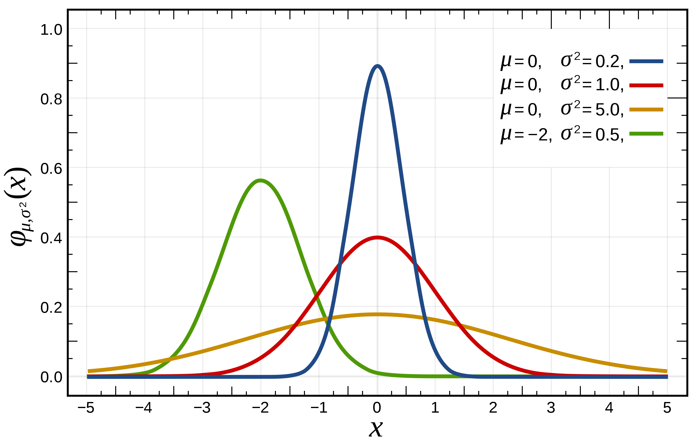

# 6.1 Approaching reality, at least the "neutral" version of it... {#Ch6}

```{r, out.width='90%', fig.align='center', fig.cap='...',echo=FALSE}

```

One of the most important contributions molecular data have made to ecology is in the interpretation of movement and isolation among populations. Questions about movement and isolation tell us about the potential for metapopulation structure, cryptic diversity, the mechanisms that assist or limit movement for an organism of a given life history, the extent to which movement is symmetric or not, the likelihood of propagule diversity reaching new habitats, and more. 

In the past decade it has become common to discuss this under the term "landscape genetics", though as discussed previously it might be more appropriate to say "landscape genomics" - and of course there are variants for 'seascape', 'riverscape' (Davis et al 2018, doi.org/10.1002/wat2.1269), and more. **How do the structural and directional elements of a studied area influence the movement of diversity?**

As the scale of time gets greater, the same questions tend towards identifying broad divisions on a landscape, and the divergence of populations may become great enough that temporal estimates of divergence can be incorporated - these are the tools of what has been known as 'phylogeography' (Avise 2000), though that field originated in the application of phylogenetic, rather than population genetic, principles to understand hidden patterns of diversity. The approach outlined here, using population genetic approaches, allows a whole range of subtlety and model evaluation that is important for dissecting ecologically relevant movement and isolation.

We might start by revisiting Figure 5-7, illustrating *isolation by distance* in the barnacle *Balanus glandula*. Remember that we are asking, broadly, how organisms disperse across an area. Some organisms can be tagged or tracked, but for many organisms it is more efficient - or only possible - to *infer* patterns of movement from the molecular/mathematical relationships we have worked with so far. A barnacle is a great example for this, because the adults cannot move at all (they cement themselves to the substrate) but their offspring are typically going to spend weeks drifting in the ocean and feeding before they are competent to settle, and so we can ask about how those larvae disperse while recognizing that the ocean itself strongly influences this dispersal. 

Here we will take a step away from this text and explore some data directly, to get a better feel for how the analyses involved in molecular ecology are more often a set of inquiries about how readily different hypotheses can be distinguished. There is no '*push one button and get the answer*' approach because the organisms, their genomic structure and diversity, and the landscapes/seascapes they are found in are unique to every such study.

## Box C.4 Additional work with R

**The document "BalanusPopGen.Rmd" is in the same directory as the textbook markdown file. Your assignment for next class is to work through the first assignment in that file (up through the pink box!).**

A brief discussion on "best practices" and "best principles". Code is being provided in the documents for this class... BY NO MEANS should you assume this to be the best code, it is code that has worked for particular functions, *well enough*. It is easy to mistake an example in a class as the exemplar for the method. The rate that data availability, computation power, code efficiency, and novel analytical and presentation approaches evolve means that I have to remind you now, that the examples I'm providing is not something to follow for your own work, but may help you frame out what you need and what you know is not sufficient.

## 6.2 The first questions

After you have evaluated the data - thinking about the goals of the data as well as expectations under neutrality and random mating - a first question to ask is about how the data fit equilibrium models. In chapter 3 we thought about mutations arising, and genetic drift operating relative to the *effective* population size. In chapter 4 we considered statistics that measure the deviations from what we would expect if all individuals were sampled from a single randomly-mating population. In chapter 5 we thought about the models of movement of individuals across a landscape/seascape/riverscape/etc.

So, a first approach to take with real data is often about exploration of the data in terms of deviating from the simplest model: *panmixia*, or an inability to reject the null hypothesis that *location* provides no additional information about the diversity sampled at that location.

## 6.2.1 GENE FLOW (MOVEMENT) and DRIFT IN EQUILIBRIUM

Now that we are coming back to these topics from our short break, remember that:

* migration is a term better used for seasonal or cyclic movement. *e.g.*, neotropical bird, or whale, migration
* movement is my ***m*** term for dispersal, rather than "migration", we are talking about genes moving, and...
* those genes have to persist through survival or introgression of that diversity for the movement to be picked up as *gene flow*

I'm not sure if I can code this correctly on the fly to appear in the textbook - we will use a more complex drift simulator written by CJ Battey (*https://github.com/cjbattey/driftR*). Though it is a Shiny app, I will provide the code for you to run it by copying the text below into the R Console, and running each line. Actually, if you hit the "play" button at upper right corner of the code chunk below (when viewing this document in RStudio), it will run and work just fine...I will work out how to make this in-line but for now this should be fine :)


```{r driftR, echo=TRUE, eval=FALSE} 
pkgs <- c("plyr","reshape","ggplot2","magrittr","viridis","shiny")
dl_pkgs <- subset(pkgs,!pkgs %in% rownames(installed.packages()))
if(length(dl_pkgs)!=0){
  for(i in dl_pkgs) install.packages(i)
}
library(shiny)
runGitHub(username="cjbattey",repo="driftR")
```

<style>
div.green { background-color:#99ff99; border-radius: 10px; padding: 40px;}
</style>
<div class = "green">

So, here is your exercise to get our heads working again on all these components - drift, movement, and diversity - coming together: 

1. Replace the default paired frequencies 0.1, 0.9 with a **single** starting allele *A* frequency.
2. Leave mutation rate at 0 for now. 
3. Set all *fitness* values for each genotype to 1
4. Set the migration rate to 0.
5. Set the number of populations to 2.

Now you have basically the same drift simulation as before, but it is also calculating the Fst between the simulated populations for you. If you now set the number of populations to MORE than 2, assume an *island model* of movement in these simulations. 

NOW, varying population size ($N_e$) and migration rate ***m*** only for 2 populations, what are the conditions under which the resultant $F_{ST}$ is **<0.1** consistently? use the Shiny app above for generating $F_{ST}$ given random population samples for 2 populations with the end allele frequencies in your simulation. How is *time* involved, how is $N_e$ involved?

And, of course, be sure to recognize that if you repeat this pure simulation analysis many times, how often are the answers dependent on which simulation, and what sample size, and so on? Remember: these results are *purely neutral* in terms of how drift is changing diversity over time. That means quite stochastic! *You are of course welcome to start thinking about how selection and other factors alter these findings!*

</div>

How we explore the data to begin with typically depends on the type of data, of course. A study that returns DNA sequence data might explore with basic questions of whether *location* provides information about diversity using a metric like Hudson's Snn or PhiST, in each case there is a prior assumption being made that *location* ("site") has potential to be informative about evolutionary populations. These metrics as declared above are asking about overall deviation from *panmixia*. Snn is asking if the genetic similarity between pairs of sequences is related to the location (same location or not), and has a null expectation of 1/*n* where there are *n* locations sampled. Of course, your sampling scheme may make such an expectation of little value but the goal of such a metric is simply to maximize the value of DNA sequence diversity (many variable sites) given a small sample size. Similarly, Xst metrics overall may tell us if there is deviation from Xst=0 but don't tell us much about patterns in the data that can be explored hierarchically or continuously.

Continuing with sequence data, then, it may make sense to evaluate all pairs of locations sampled to generate a matrix that describes the deviation from null/panmixia in all possible ways. Examining such a matrix often begins to tell us a lot about where there are subtleties or larger patterns that will need to be considered. Of course, data that is allelic - microsatellites, SNPs, or similar - that can be considered with pairwise Xst approaches (the X depends on the model, which often depends on the marker, you will recall) will also apply here. 

Looking again at the **BalanusPopGen.Rmd** assignment, the code chunk following your data assignment generates pairwise **F**st for the SNP data being evaluated. (Why Fst?) Take a look at these results and ask yourself these questions:

1. are all or most values close to zero, indicating panmixia?
2. if 1 is not true (and recognizing the populations are listed in latitudinal order), is the deviation from 0 gradual? Or is there the potential for hierarchical population structure among these data?

So that you take the time to do this, and think about the questions, I'm going to make it harder to scan ahead in the text by adding this photo of a pangolin:

```{r, out.width='90%', fig.align='center', fig.cap='...',echo=FALSE}

```
**Fig.6-1 a beautiful pangolin. Photo credit: International Fund for Animal Welfare.**

So, you should have thoughts right now about how cool pangolins are and that we should be doing more to protect them, but you may have also recognized that the data we are considering for *Balanus* are pretty clearly rejecting panmixia among all sampled locations, and that there is a pretty obvious jump in Fst values between the top half of the samples and the lower half in the matrix. At this point, you have already recognized something important about landscape and seascape genomics: even when an organism has the potential for very broad dispersal each generation, we are often surprised to learn about the underlying environment from these data because they show that many species exhibit population structure in places that *have no obvious barriers to dispersal* (Palumbi 1992).

Since we have multilocus data, we can also ask whether or not there is a clear hierarchy or structure to the data without using a prior assumption about sample locations being equivalent to populations. Remember that two sample locations could each contain two very different sets of genotypes, and if the two types of organisms are at the same frequency the Xst value would be ZERO! (Which metric would tell you to pay more attention?)

So, to explore these data without making assumptions about the membership of individuals to particular evolutionary populations, we might ask whether the data tell us about their 'fit' to distinct groupings. In Chapter 5, we discussed using the deviation from HWE as a genetic model that allows some types of optimization of data across *K* 'populations'. Specifically, Figure 5-9 illustrates a chart at the bottom using this sort of analysis, often called a "structure plot" generically referring to the program **Structure** (Pritchard et al 2000). To the upper left of that plot is a principal components analysis (PCA) of the same data, showing a concordant result of *K=3* populations that are distinguishable. The PCA approach does not use a genetic model but an approach that separates data points along axes that summarize a tremendous amount of variation in the data...

https://en.wikipedia.org/wiki/Principal_component_analysis

Basically, we use it to reduce the number of dimensions of a data set to try and identify clear patterns from being able to visualize a plot of the data in those reduced dimensions (typically, 2). In recent years, population genomics has taken advantage of combining this approach with discriminant analysis (Jombart et al 2010), which helps us optimize not just the visualization but also the most appropriate numer of groups of data points in that visualization. This is called 'discriminant analysis of principal components' or DAPC.

We aren't going to get deep into the weeds with this method; additional exploration and definitely reading the paper(s) by Jombart are needed to become proficient at this. But in the *BalanusPopGen.Rmd* file, lets now explore the data using this approach to understand what it can tell us and how sensitive the results are to our assumptions. Look in the code chunk called 'dapc1' and what you will need to do is actually get a little bit interactive with the data and this exploration of how many clusters are in the data. It has two steps: choosing how many of the principal components to keep for finding clusters (the more, the more information you have - not sure I'm the right guy to ask about whether it is bad to include more), and then using that information to identify the Bayesian Information Criterion value for how that information fits a large number of data clusters. The lowest BIC value is assumed to be the best fit. Try this now!

*n.b.: obviously not including enough information may make it difficult to adequately distinguish the population structure; why not use all information? https://adegenet.r-forge.r-project.org/files/tutorial-dapc.pdf (section 4.1) explains this in terms of model-fitting, effectively - as with almost all statistical model fitting - we would like to use as few parameters as possible to describe an adequate model. Again, the finer points are beyond the scope of what we are dealing with, but play around with these parameters to start getting a sense of what it means.*

Now that you have done this, how many evolutionarily distinct or effective groups do you think exist in *B. glandula*? You have likely convinced yourself - to the extent you feel comfortable interpreting these data already - that there are 2, perhaps 3 populations in this set of individual genotypes. The code in **BalanusPopGen.Rmd**, chunk *dapc1* then goes on to provide a 2-dimensional way to plot this output for two discriminant axes and then for one, because most of the information is in a single dimension that corresponds (in this case!) with latitude along the coast. When you look at these plots, do you imagine there may be more population hierarchical structure than just "two populations"? That's fair.

I'll just add that we don't want to let statistics take over our field :) Sometimes, you will have biological priors - information you know about phenotype, or behavior, or function, that drive the question and maybe guide you when there is ambiguity between different possible analytical options. Sometimes, you may know that the only useful answer is whether there is any hierarchical structure at all, or none - in the case of limited management for example. The balance of objective analytical outcomes and informed decisions about what to do with those outcomes is a hallmark of becoming a good biologist!

So, lets take one additional look at how the data could be clustered in a non-genetic model. A recently developed approach "sparse non-negative matrix factorization", see http://membres-timc.imag.fr/Olivier.Francois/snmf/index.htm for more details on this, provides very efficient estimation of ancestry coefficients (how much of an individual appears to be derived from population *n* of *K*) for highly multilocus data. Again, the code is in **BalanusPopGen.Rmd** for you to work through, and this is our last exercise for this section. Just for now, run the code in chunk 'snmf' and don't worry too much about the code, lets think about what it tells us about the different results for K=2 or K=3.

(Why not always use the HWE-based model in the program Structure? Well - is your organism tetraploid? Clonal? Selfing? Mixed mating? There are all sorts of biological realities that can make the assumption of HWE itself untenable!)

When you run that code chunk you will get 4 plots. The first is a lot like the BIC plot - where the cross-entropy is minimized is a good idea of the 'best' model of population evolutionary hierarchical structure. When I run it, K=2 is where the cross-entropy is minimized. I also show results for K=3, which may be argued for, and K=5... where you will start to see some chaos in interpretation that, at a minimum, will be hard for you (or me, a barnacle expert) to explain. Play around with that last line, what happens with higher values of K? What does K=4 look like? What do you think makes most sense, given what you have seen from earlier preliminary analyses?

Now, think back to earlier chapters and ask yourself: **"could there be hierarchical structure, *as well as* isolation-by-distance, across a set of individuals collected from diverse locations?"**

```{r, out.width='90%', fig.align='center', fig.cap='...',echo=FALSE}

```
**Fig.6-2 a beautiful pangolin. Photo credit: International Fund for Animal Welfare.**

Because you probably hadn't really given much thought to pangolins before today, but now you think "what other crazy biology might be out there, and how might these data help us understand how they move and interact, breed and grow?"

With this we will conclude this part of working with the *Balanus* data, and will come back to it again in later chapters of this text. You can start to think about additional questions: where do the populations start to separate, and by what process? Is it an ancient pattern reinforced by current environment, or is the species being pulled apart by active adaptation? 

## 6.3 Additional time, additional realism

### 6.3.1 Additional time

It is worth noting that the example data that we worked through during this unit represents a relatively ancient separation of populations (roughly 500kya) that are not re-mixing for reasons we will get into in a later unit. The origins of landscape genomics are rooted in a time when there were fewer data available, and the questions being asked tended to be more about lineage isolation and cryptic diversity originating in geological events. The field of 'phylogeography' (Avise 2000) utilized methods from phylogenetics or molecular evolution to infer ancient isolation events that were profoundly informative about the processes of diversification. With increasing abilities to collect multilocus data, the questions being asked are more subtle questions of movement and behavioral interactions.

Even in deeper divergence scenarios, the lessons of population genetics and coalescent theory are relevant. The signature that one population has diverged into two that do not interact reproductively - over whatever scale they are collected at - will show up as a Wahlund effect, as $\pi$ being greater where they overlap than when they are separated. The lessons we learned earlier about estimation of the mutation rate µ from known divergences of populations are a key insight for interpreting the more subtle patterns that are possible with more diversity being sampled across the genome. In fact, even our interpretations of divergence require knowledge of the population genetic signatures of single populations.

The larger a population is - that would be the census size N - all else being equal, we may expect that the effective population size Ne is larger. There are a variety of reasons that is not as straightforward as we would think, and we will get to that later in the class. But certainly if Ne is larger for one species than another, that is *in part* diagnosed by the additional diversity of that population, and interpreted as diversity that has accrued over a longer number of generations since it all had a Most Recent Common Ancestor. Larger effective populations harbor older diversity than smaller ones!

```{r, out.width='90%', fig.align='center', fig.cap='...',echo=FALSE}

```
**Fig.6-3 is Figure 1 from Scott Edwards & Peter Beerli, Evolution, 54(6), 2000, pp. 1839–1854.**

What does that mean for interpreting the divergence of populations, at any temporal scale? Lets look at a now-classic paper by Scott Edwards and Peter Beerli. In their 2000 *Evolution* paper, (Figure 6-3) they predicated our estimates of when two populations diverged from one another on recognizing that a large ancestral population would have a large theta, and so the TMRCA for that ancestral population has to be accounted for in considering the time of divergence given data from those two populations. 

***But we don't know much about ancestral populations, do we Dr. Wares?***

Well. No. Remember a lot of what we do in the field of molecular ecology is a form of inference - we are extending what we can see with what can be understood from genomic diversity. Try not to go crazy and tell too-detailed a story, and you will be OK. In this case, although there are more computationally intensive ways to get at more complex models for this (later sections), one of the simplest models - and often quite effective - is to assume that the daughter populations (the two populations being evaluated for their divergence time) have similar demographics as their ancestral population. 

How would we investigate this? Remember we aren't working with counts of individuals, but diversity as it is represented from a population of a given (changing) size, with a particular mutation rate, on a locus with a particular ploidy and inheritance mode. SO, $\theta$ (or an estimator, $\pi$) is evaluated from each population, and we make a simplifying assumption and average the two. If your populations are of wildly different sizes, you will probably want to read on to more complicated ways to ask this question. 

What this gives us is a classic equation representing *net nucleotide divergence*,

$d_{A}$=$d_{xy}$-[($d_{x}$+$d_{y}$/2)

What does that tell you? The mean divergence of alleles compared across populations, minus the mean divergence (read: diversity, e.g. $\pi$) within populations (representing a *model* of what the ancestral population looked like demographically). That sets the actual divergence time, $\tau$, at a timepoint a bit more recent than the divergence between populations alone would estimate.

Now, take a hypothetical. Two species of fish live in a large river; erosion and other geologic change in a nearby watershed 'captures' the upstream portion of the first river, moving those upstream populations into the second river and ending gene flow between the (now) two populations. This is not an uncommon process - sometimes it happens very quickly as with the shift of glacial melt rivers, sometimes very slowly as with the Casiquiare River in Venezuela that currently connects the Orinoco and Amazon. But a good example for our hypothetical above would be the 'capture' of the Tallulah and Chattooga Rivers in NE Georgia from the Chattahoochee basin into the Savannah basin which has led to the isolation of distinct aquatic species.

In our case, the two species of fish vary dramatically in $N_{e}$, one quite large, one quite small. The geologic event happens at the same time, which one will exhibit the greater $d_{river1,river2}$? Why? And yet the divergence time $\tau$ is equal, and we will assume the mutation rate $\mu$ at loci we look at is equal, and so you can extent that logic to recognize that for the two very different species, in this case $d_{A}$ will be equal. 

This is what Edwards & Beerli (2000) were focused on, less the esoteric elements of population genetics - though they have both done extraordinary work in this realm - and more asking whether all of the pairs of eastern and western sister species of birds, like yellow-shafted and red-shafted flickers, diverged based on the same prehistoric/geologic event or not. Mike Hickerson and colleagues have extended this population genetics inquiry into being able to ask for multiple pairs of taxa separated by particular boundaries whether or not there was a single, or multiple, events leading to divergence and speciation - relying on our understanding of how populations of a given $\theta$ respond to processes that separate them into multiple daughter populations with limited gene flow.

A large component of what was known as 'phylogeography', then, is now about using multiple species and assumptions of relatively similar values for $\mu$ to reconstruct ancient events of isolation. In this way we learn more about paleoenvironments and their influence on patterns of biodiversity at multiple scales. *We'll next read a good paper on this to get a sense of how population genetics are important in this way!*

## 6.3.2 Additional realism (parameters)

In earlier sections, samples have been seen along a gradient of 'quite similar' (e.g. Xst ~ 0) to 'not similar' (e.g. Xst >> 0, K>1, etc.). Along with these distinctions, there is also the potential that the mechanism by which two or more locations have a given (dis)similarity measure is more complicated than random/stochastic diffusion or distance-based movement.

1. dispersal kernels

Put simply, a *dispersal kernel* is just an expectation of movement. Basically it is the posterior distribution function we presume for an organism's movement from where it was born (or zygote formed). Naïvely we might assume that a red-winged blackbird would have relatively high likelihood of being observed 1km from its nest site a year later; a modest likelihood of being observed 10km from its nest site a year later; a low likelihood of being observed 100km from its nest site. The shape of that distribution is of course hard to determine for most organisms.

Many times the function by which we compare these distributions are really about simple manipulation of the variance of the distribution around the mean. If we think of a "standard normal", Gaussian distribution, the mean displacement/dispersal of an individual is 0 (equal likelihood in any direction), with variance of one unit. The below figure also shows examples where the distribution is much 'narrower' or *leptokurtic* - something that might fit an organism that has poor dispersal in general but may be assisted in movement (algal mats, animal fur, etc.) as well as an example where the dispersal is greater than expected from the origin point.

```{r, out.width='90%', fig.align='center', fig.cap='...',echo=FALSE}

```
**Fig.6-4 from the Wikipedia entry for "normal distribution"**

Additionally, the green line in Fig 6-4 represents a case where the distribution is *displaced* from the origin (the 0 point). We have to remember that some organisms are dispersing via wind, rivers, ocean currents, and are more likely to move in some directions than others. What gets really intriguing about this is it starts to indicate where diversity originates, and whether the distributions of organisms include 'sink' populations that are either not demographically viable or that tend to host diversity that originates from another 'source'.

Obviously, gene flow homogenizes diversity. So, asymmetric gene flow works the same way, except that the diversity in the recipient population tends to be replaced by diversity from the source. This not only influences a measure like $X_{st}$ to be lower, but means a smaller portion of the spatial range is effectively contributing diversity to the overall range. Lets think about asymmetric gene flow using the term *advection*. In other words, some force - wind, currents - is displacing offspring in one direction from the mother. If that force is 0, then we return to a more random/diffusion model for how individuals disperse, and if that force is >>0, it will tend to dominate what happens to offspring or propagules. Figure 6-5 illustrates this.

```{r, out.width='90%', fig.align='center', fig.cap='...',echo=FALSE}

```
**Fig.6-5 from Wares & Pringle (2008)**

So in the upper panel of 6-5, offspring disperse equally in either direction a short distance from the previous generation (the "short distance" is mediated by the dispersal kernel). In the lower panel, there is a deterministic force of advection moving offspring, on average, to the right. You can see that what ends up happening is not just homogenization - we might expect diversity from all regions to be represented in that case at the end of the time series - but homogenization and lower diversity, with only the 'upstream' diversity being represented. This was dealt with in Chapter 5, but now we think about it as strongly influencing our measures of diversity *and* divergence.

So, what would this *look like* with molecular data? The example shown above is sort of an idealized situation to consider metapopulation dynamics - where each location/habitat has a certain probability of going extinct and being replaced/recolonized from another location. A classic metapopulation model is of course an oversimplification of this process, which we will deal with more in the next unit, but diversity at one location being regularly replaced by diversity from another is an example of this, and in coastal populations the network of sites is effectively one-dimensional, so it is easy to think about. Overall however the dynamics of metapopulations can be complex (Pannell & Charlesworth 2000; doi 10.1098/rstb.2000.0740); as mentioned above, it means that measures like $F_{st}$ cannot be trusted to accurately reflect the pattern of gene flow and diversity in a system. Overall isolation by distance patterns are flattened (Pringle, TBD), diversity tends to be reduced (Wares & PRingle). 

Thus, some biologists go to the extra effort to find consilience between patterns of divergence and the likely *source* region for that divergence (Ewers-Saucedo et al. 2016), or use parent-offspring analysis (dealt with more later in the text) to note the typical displacement of offspring in the system (Peery et  al 2015, Wethey/Hilbish papers on hindcasting). There are also computational approaches including "Markov Chain Monte Carlo" (MCMC) approaches that allow parameterization of values such as $\theta$ and migration rates from DNA sequence polymorphism data (e.g. Beerli's MIGRATE package); with proper design of such an analysis one can infer whether there are higher likelihoods for models that involve multiple migration parameters (eg different parameters in different parts of the system, or asymmetric migration) than if there is a single parameter explaining all such patterns (Zakas et al 2009). At this point (writing well ahead of teaching this unit), I'm thinking it is a good time to have us read one of these papers rather than me try to re-describe it all, so:

**Paper TBD to read for next week:**

Finally, we can think about additional dimensions or factors separating our sampled locations. In chapter 5 we considered *isolation by distance* where divergence metrics scale with the Euclidean distance between sample locations, typically tested nonparametrically using a Mantel test because, at a minimum, the spatial distances among sites are not independent from one another - they are a function of the landscape itself. That landscape however also has rivers, mountains and elevational gradients, and land use factors that themselves may limit movement/dispersal. 

In recent decades, approaches with the moniker "isolation by resistance" have added some realism to these questions about the mechanisms of isolation among sampled locations. For example, Eo et al (cite) evaluated pairwise population differentiation among southeastern U.S. populations of quail. The Euclidean distance among pairs of sites on the same side of the Appalachians may reflect the ability of quail to disperse, but when contrasts are made between sites on opposite sides of elevational plateus and mountains, the physical distance a quail must fly becomes considerably longer as they choose not to fly above certain elevations. Similar work has been done considering well-characterized marine current patterns near Santa Barbara and how those currents drive the pairwise divergence of populations of marine whelks (White et al 2010, doi: 10.1098/rspb.2009.2214).

## 6.4 Summary

Between chapter 5 and chapter 6 we read the review by Bradburd & Ralph (2019). The idea is that we are trying to see that as data improves, our models can improve. When there are only a handful of markers, we have a certain power to distinguish models of equilibrium or hierarchical, maybe variation in gene flow among sites. As the amount of data - markers, locations, individuals - increases... well, we start getting at movement and how it is integrated across generations in the genomes of propagules and parents. Movement is a really difficult part of ecology. Some of our colleagues use tags, or collars, or remote sensing to learn about organismal movement. We are getting closer to these efforts with molecular data in terms of the resolution and sensitivity. But movement is a really difficult part of ecology, and because of that it is a difficult part of evolutionary biology, and vice-versa.

Here we have gone into just the shallow end of the pool in terms of trying to represent the reality of movement. It requires really understanding the biology - development, dispersal mechanisms, interactions with the abiotic - to formulate good hypotheses and models about movement and see how genomic data help us reconstruct this. Without genomic data it might have been difficult to understand that anoles move, directionally, among Caribbean islands via hurricanes (Calsbeek et al 2003)! And movement is not always effective in terms of gene flow. Remember some models are useful, all are wrong. In the intent to find the *description* or model of movement - like vectors, with directions and magnitudes - our ability to generate complex models can reflect a lot about general patterns in nature through seeing how the environment forces diversity to move in certain ways. Wares et al (2001) recognized that the intraspecific diversity of a species will often reflect the environmental dynamics that lead to broader, community-level transitions. 

## Box C.5 Additional work with R

To practice with having substantial amounts of data - similar to our experience with the *B. glandula* data - we can now finish the exploration of "Part III" of the POPPR tutorial.

https://grunwaldlab.github.io/Population_Genetics_in_R/ 
