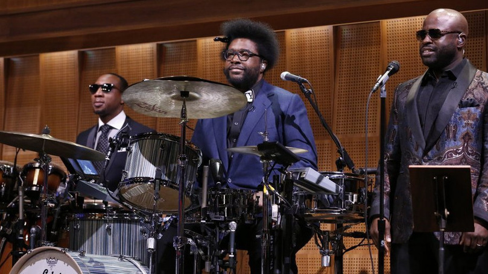
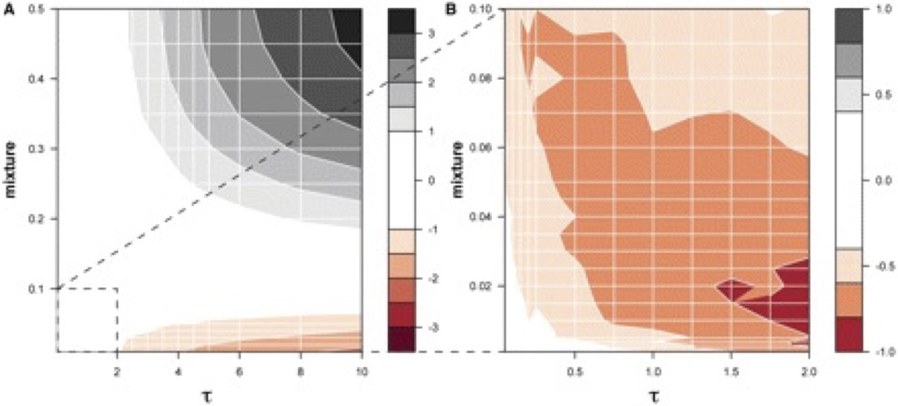
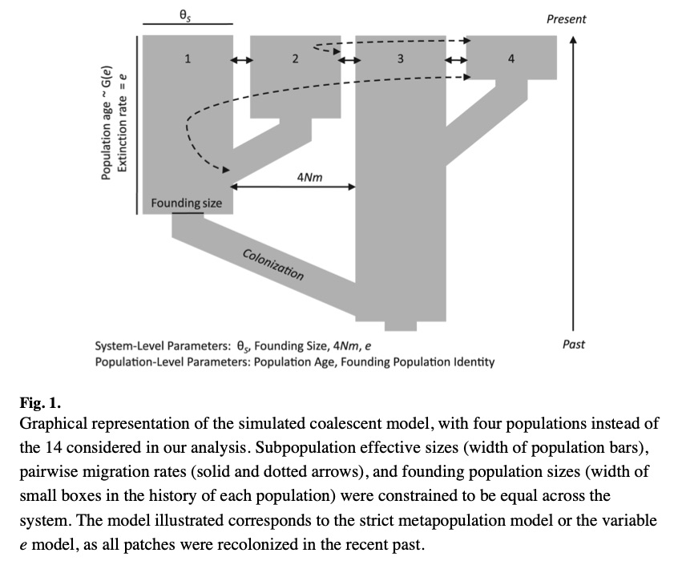
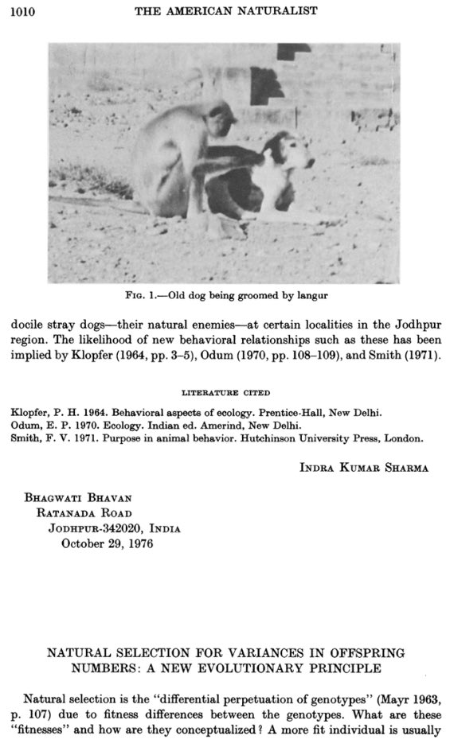
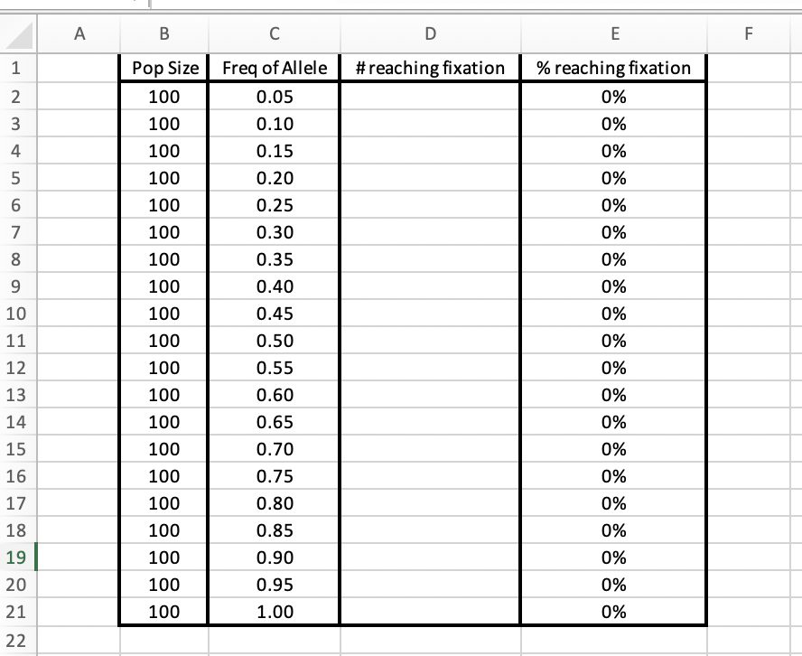
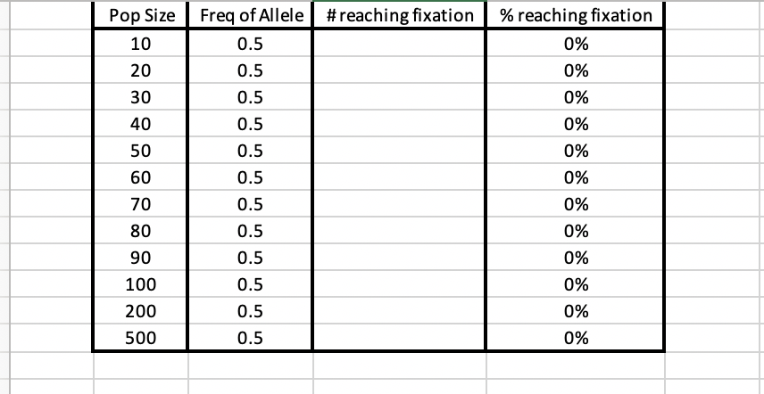

# 7. The relationship of alleles and inference of the history of populations {#Ch7}

```{r, out.width='90%', fig.align='center', fig.cap='...',echo=FALSE}
knitr::include_graphics('MEImages/humpback.jpg')
```
**Fig.7-1, a humpback whale (Megaptera novaengliae)**

As noted before, a lot of the work done in the field of molecular ecology is inference; indirect evaluation of biological realities using mathematical models that approximate some useful elements of how diversity is inherited. In 2003, Joe Roman and Steve Palumbi published a fascinating - and for some, controversial - paper that used genomic sequence data to estimate the likely number of whales before massive efforts at whale harvest had reduced their numbers so dramatically. The idea is that the overall diversity found in an organism builds up over time, with more mutational diversity arising in large population sizes because there are more mutational events when there are more reproductive events, and larger populations lose less diversity each generation to drift. As well, even if the population decreases in size much of the genomic diversity lost will be rare alleles; the overall coalescent dynamics of the common alleles will stay the same and so measures of heterozygosity, e.g. $\pi$, will not change quickly at all (which is why caution should be used in asking questions about human impacts on natural populations and the diversity they retain when recently impacted, e.g. Millette et al 2020).

So, Roman & Palumbi were able to get tissue samples from 3 species of Atlantic whales and sequence mitochondrial DNA from those specimens, estimating diversity in each species, with $\pi$ serving as an estimator of $\theta$=2${fN_e}$$\mu$ where *f* signifies that, because it is a mitochondrial gene that is haploid and maternally inherited, the diversity only reflects the female effective population size. From this diversity, they used estimates of $\mu$ based on the fossil record and sequence divergence among whales to back-calculate f${N_e}$. This value was moderated by generation time and sex ratio, and the authors estimated possible historical population sizes numbering 240k humpback, 360k fin whales, and 265k minke whales - indicating that current numbers are far below the levels established for whaling guidelines that use historical assumptions as a basis. Of course, these estimates depend on understanding $\mu$ well, and rely on diversity arising and being retained through neutral dynamics. These are some of the factors we will consider in this chapter.

## 7.1 Do the data fit the assumptions?

Of course, there are multiple ways to estimate $\theta$. One might use $\pi$ or Watterson's estimator, or even subsets of the site frequency spectrum such as the number of singleton mutations, ${\eta_1}$. With a normalizing factor, we can evaluate the assumption that the difference between two estimators (each with slightly different model underlying) should be negligible, e.g. [ $\pi$ - ${\theta_W}$ ] ~ 0 suggests that the data come from a population of sequences that are evolving under the assumptions of *neutrality* and *population size stability*.

Why would these assumptions change those estimators? Remember that the assumptions lead to the frequency of an allele being related to its age; an allele (or mutation at a site) cannot be relatively common without also having been around for a while if drift is the only mechanism of frequency change. We might also note that if mutations arise at a certain rate but - because of purifying selection or similar mechanisms - never achieve higher frequencies, then we might find an excess of mutations to be rare and thus contribute less to $\pi$ than to ${\theta_W}$ and thus the difference of these two would be substantially different from zero. A population that is growing, similarly, would have a higher retention rate for new alleles (as there is by definition increasing numbers and increasing opportunities for new mutations to arise) and would again have an excess of rare alleles when sampled.

A key to interpreting these values, however, is understanding the context of the 'natural history' of the marker region itself as well as how it is sampled. A perfect case example of these factors involves a very commonly-studied gene region, mitochondrial cytochrome oxidase I. The reason this region is studied so much is because it is relatively easy to amplify from almost any metazoan (Folmer et al. 1994; Geller et al.), and it tends to harbor a lot of diversity making it ideal for DNA barcoding studies. However, David Rand (2001, *ARES* 32:415-448) has pointed out that it is actually under fairly extraordinary selection, which is in part why it is so reliable for PCR amplification: the amino acid sequence changes very very slowly, and in almost any data set the variant sites will be at the 3rd codon position where those mutations do not affect the structure of the protein. 

Any single study of COI diversity in an organism might suggest that the assumptions of neutrality and/or population stability have been violated; the purifying selection tends towards maintaining a large number of low-frequency polymorphisms relative to the total number of polymorphisms. For a long time, the erroneous assumption (Avise et al 1987) that the mitochondrial genome was largely evolving under neutrality suggested to people that they were observing the effects of population expansion, which would generate a similarly negative value for the statistic "Tajima's D" (which is $\pi$ - ${\theta_W}$, divided by a normalizing correction and thus should be close to zero if assumptions are met). However, Wares (2010, https://doi.org/10.1111/j.1558-5646.2009.00870.x) performed a synthetic analysis of ~1000 such metazoan datasets and found an overall mean across all these individual studies of ${D_T}$ = -0.391, with nearly 1/5th of the individual datasets being significantly different from zero (statistical tests rely on simulations of data of the same size with the same number of segregating sites to establish a null distribution, as the statistic is not distributed according to any particular statistical family). The fact that we know purifying and fluctuating patterns of selection can do this, in particular to a gene region that is important in the oxidative phosphorylation pathway, means that we have to assume a non-zero "null" for such a gene region -- and most of the inferences of population growth based on this gene region should be treated with a lot of caution!

Similarly, the fact that this gene region is used for barcoding and separating closely related taxa from one another means that the dataset being examined should consider the potential for how inadvertent sampling of cryptic species - e.g. diversity arises independently in the populations and mechanisms of drift, selection, etc. operate independently - can affect these statistics. For this, we might go back to thinking about the Wahlund effect. What happens if you were to sample DNA sequence data from two sister species of dragonfly, lets say 10 sequences from each species? For now lets assume that reciprocal monophyly was a criterion involved in asserting that they are two species. Draw a phylogeny of this data set, 10 tips for each species, reciprocally monophyletic clades. Now, haphazardly put 'mutations' (hashmarks, smiley faces, stars, whatever) along the branches of your tree. Don't think too much. Humans are terrible at intentionally being Poisson processes, but that is the assumed model for mutations along branches, e.g. a longer branch means more time has passed and so there should be more mutations.

*a little tree-drawing music, please....*

```{r, out.width='90%', fig.align='center', fig.cap='...',echo=FALSE}

```
**Fig.7-2, The Roots - because understanding reciprocal monophyly means you understand the roots of the tree...**

OK, now under the *infinite alleles model*, we assume that every one of those mutations happened to create a new variant. You'll remember this as Watterson's ${\theta_W}$ (yeah, I subscripted again so we stay consistent.... it is really Watterson's estimator of theta, it gets confusing sometimes). So, you calculate that (look back to Chapter 4) as 
${\theta_W}$ = *K*/${a_n}$ 

where *K* is the number of segregating sites and ${a_n}$ is the sum from *i*=1 to *n* of (1/*i*), in other words it is sample-size dependent. Now, you spend the time to calculate $\pi$ among all of your 20 sequences by counting the differences among *every* pair of sequences, remember? So do that, and take the average within each species of imaginary dragonfly as well as across all 20 sequences. Note that you have to assume the *infinite sites model* now, so you can just count from tip to tip how different each sequence is. This is a pain, right? You think it would be better if an R package just did the calculation for you? **Good.**

Want to think more about Tajima's D? It is super important to understand this stat in molecular ecology, so take a look at https://en.wikipedia.org/wiki/Tajima%27s_D because now you have the values necessary to calculate this statistic, and yes at this point you would really want an automatic program to do the calculation for you... but the *key* is, if you take the difference between your estimate of $\pi$ and your estimate of ${\theta_W}$, what is that value? Is it close to zero? Is it positive, negative? *Think about why it is positive or negative and start to gain a search image for data that are unusual; why are yours unusual (or not)?*

## 7.2 How else to carve up the data?

Now we have a better sense of evaluating how these metrics work basically. Importantly you should see that the gene or gene regions being studied may be important, and how the data are sampled are important. 

```{r, out.width='90%', fig.align='center', fig.cap='...',echo=FALSE}

```
**Fig.7-3, from Ewers & Wares 2012. Surfaces of Tajima's D values calculated from coalescent simulation of demographic histories representing an admixture of populations. In each panel, the horizontal axis represents $\tau$, divergence time of two populations measured in coalescent time-units proportional to the effective population size. The vertical axes represent the degree of admixture of the two populations, ranging from 0 (only a single nonstructured population is present) to 0.5 (the two populations are equally represented in a data set). In (A), the complete range of admixture is allowed and $\tau$ ranges from 0 to 10. In (B), admixture up to 10% for populations that have diverged up to $\tau$=2 is represented, with a different scale representing the pattern of Tajima's D. In (B), only negative values are observed.**

Many other similar tests of neutrality (and demographic change) have been proposed, taking advantage of other ways to slice up the data. As an example that may be very useful, imagine that you have SNP data across a gene region that are unphased - you do not know if the A/G polymorphism, and the C/T polymorphism, represent haplotypes of A..C and G..T, or A..T and G..C, right? In which case, $\pi$ is a bit removed from its original calculation! In this case, Fu and Li's D/D* statistics compare ${\theta_W}$ with ${\eta_1}$, the mutations that only happen on a tip branch and are only represented ONCE in the data. The distinction between D and D*, by the way, is if you happen to have an outgroup sequence to root the polarity of the mutation, e.g. which one is ancestral and which one is young.

These diverse tests of neutrality all tend to be correlated, of course, across a data set since many of the underlying stats are not independent from each other (for example, the sum of all ${\eta_i}$) among sequences is ${\theta_W}$ and it is an easy calculation to get to $\pi$). Different stats have different relative statistical power for distinguishing demographic from selective hypotheses (Fu and Li 1997), but at their core they still rely on you understanding what you are calculating, understanding the 'natural history' of the gene region(s), and understanding that there are always alternative explanations. 

The point being to understand your data before you make an inference, and before you make mistaken assumptions. I've been there. Try to avoid it.

## 7.3 how to use these stats in more detailed ways?

One of the reasons for thinking about all of the different ways that a dataset can be represented as *summary statistics* is of course it is difficult to maintain or analyze teh full representation of data when there are 10s or 100s of individuals, and 1000s or millions of nucleotides (or fragment sizes, and so on). 

The other thing that gets important about being able to summarize such complex data is that it allows us to determine what possible hypotheses to *reject* as we consider what genealogical and environmental history created those data. This is why our ability to simulate data assuming diverse population histories, using coalescent theory and related generational models as discussed earlier, becomes so important. What is the *likelihood* of observing a certain pattern given a particular history? For example, Kreitman and Hudson (1991; Genetics 127:565-582) simulate neutral processes with a particular level of $\theta$ across a region in the *D. melanogaster* genome where there is a duplication of the *Adh* gene. Their simulation data clearly show that there is far too much polymorphism in the region around a known amino acid polymorphism to be explained by neutral dynamics; it is better explained in this case by balancing selection.

That is a fairly simple evolutionary question; what about complex evolutionary ecology, how can that be incorporated in a useful way? Well, using more summary statistics and massive computational effort to simulate distinct possible (and sometimes nested) histories to determine whether there is enough information to reject one of those histories as being likely. John Robinson asked about metapopulations; strictly, a Levins model for a metapopulation is that each habitat for a species has a probability of extinction (that is the same across all habitats in the area), and a probability of recolonization from elsewhere in the domain (the same probability for all such sites). Of course that is an overly simplified model, but there are often so many complexities to consider. Robinson et al (2013) were curious whether a documented 'metapopulation' of the cladoceran *Daphnia magna* could be evaluated for whether they fit a strict metapopulation model, or whether there were some sites (e.g. deeper or larger pools of water) that were more likely to persist and thus more likely to seed other habitats with propagules. In other words, more closely fitting a 'source-sink' model as described by Pulliam.

To do this, Robinson collected data from 14 microsatellite loci. So, in this case, the *stepwise mutation model* (have we dealt with that? yes, see chapters 3 and 5 though brief in each case - a previous iteration of this class wrote the initial entry on Wikipedia: https://en.wikipedia.org/wiki/Stepwise_mutation_model ; oddly there was also not yet an entry for the *infinite sites model* at that time and this was in 2016...I can see the initial edits made by my most recent lab graduate, Dr. Karen Bobier!) was used to assume that two alleles of similar length are more likely closely related than two alleles that differ more in length. In other words, an allele with 7 nucleotide motif repeats is perhaps only one mutational event away from an allele with 8 repeats, and more mutational steps away from an allele that has 12 such repeats. Using that model, a variety of summary statistics could be calculated from the observed data - in this case, total number of alleles in the data set (K), mean and range across loci of variance in repeat number ${\sigma^2_A}$, mean and range of pairwise difference in repeat number $\tau$, mean $F_{ST}$ and $F_{IS}$, and locus quantiles for some of these statistics. These were compared to coalescent simulations following the "Approximate Bayesian Computation" approach.

In the "Approximate Bayesian Computation" (ABC) approach, each parameter has a range of possible values used for the simulations. Each simulation generates its own set of summary statistics, and those that are within a certain mathematical/Euclidean distance from the observed *actual* values are kept. In this way, it is Bayesian because the posterior distribution of likely histories is generated from their fit to observed data.

Robinson et al. were able to show that - as may sound reasonable after the fact - there are persistent source populations that tend to drive much of the diversity in the rest of the system, similar to the asymmetric dispersal problems considered earlier in the text. Such work is complex but as multilocus data become easier and less expensive to collect, the detail of discrimination among hypotheses becomes far greater.

```{r, out.width='90%', fig.align='center', fig.cap='...',echo=FALSE}

```
**Fig.7-4, from Robinson et al. 2013**

## 7.4 landscape and ecology

Once we really start thinking about the distribution of how individuals are sampled, of course it becomes more and more of a question how their distribution is non-random across the landscape and their movement is non-random across the landscape, regardless of their dispersal potential. Dispersal is also a trait of the individual and may be heritable or sex-determined.

*(Here review Cancellare et al 2021: https://peerj.com/articles/11498/)* and this seems to set up talk about ConStruct which was briefly introduce in Ch5 so now bring it back in terms of understanding isolation can have multiple components...


the fancy places Hickerson has gone to estimate co-divergence and more NOte you dealt w EDWARDS AND BEERLI EARLIER, skyline plots and more, mixed hierarchical/IBD models and more, but really we will get into such things in chapter 9 so this is the wrap-up on ch7... I would think combine CHAPS 8 and 9 into one so you more quickly get to RNA/methylation questions, quant gen, behavioral (combining 2 ideas there)

### note edits in order below could be argued you BRIEFLY deal with what is listed as 8/8contd down there to finish up 7, and take a week to read CURRENT literature so that we start thinking about it in terms of process moving forwards rather than 'what has been done', it is about null hypoth and what exceeds that and how you test that. lets move faster towards the other fun stuff.

### 7.4.1 evaluating selection once you know how things are demographically linked, and how change in pop size is linked
Ch7 evaluating selection ONCE YOU KNOW HOW THINHS MOVE
the idea being that if most of the genome says X and a subset says Y they might be under different rules, how do we infer this subset - and what is the likelihood we are right without doing an actual linkage study?

you might want to wrap up Balanus here to show that it appears to be demographic and held by environment, rather than outliers driving some type of selection. they are "species-like".

### 7.4.2 contind. Complicated versions of all fo this

Rachael Bay, Gideon Bradford, cool new stuff
Mol ecol text treat invasions and domesticated in a linkage disequilibrium framework
somewhere in here work in my favorite single page of AmNat ever because we have to understand how fitness and randomness and means and variances all work together in homogenizing genomic and phenotypic diversity - thats all of it in a nutshell

expand by reading papers at this point....

```{r, out.width='90%', fig.align='center', fig.cap='...',echo=FALSE}

```
**Fig.7-5, my favorite single page of The American Naturalist, ever. The article I wanted was John Gillespie thinking about the problem of natural variation in reproductive success, in terms of population mean fitness, and invoking Jensens Inequality and making me learn how to teach that in early versions of this class. But having a cool behavioral article that shows langurs grooming dogs on the streets of India and citing Gene Odum and Peter Klopfer on the leading page, well - it always makes that photocopied article in my files take me back to how much I've learned since I came across it!**

## finish Balanus, and/or POPPR, rest of semester is writing focused, proposal-focused...read some papers to represent finishing this stuff and see the latest/greatest, or have them give 5 minute lightning talks , continue through chap 8, on papers they find of interest

# 8 phenotype. {#Ch8}

HUH what if you put this earlier, and then move current ch8 back because it involves having more prior information and or more data, really... the questions revolve around that. Hell, given your expertise lets deal with phenotypic variation and heritability in one chapter, so that is my quant gen and point vigorously at folks who can do that better than this can do!

I'd say this is good place to bring in the *Thymallus* paper by Koskinen et al - 25 generations of zero migration, all start from same presumably panmictic sample of local grayling diversity. How do traits and alleles change over time, and what does this tell us about selection?

we start getting into students finding papers that influence how they think and their questions and they give 3-5 minute overviews with one key visual. so the semester becomes more student-driven with their data presentations and paper presentations.

## 8.1 RNA and methylation as components of adaptation

Mendelson comes in here as a marker

RNAseq variation as a tool for how orgs respond, take some time with tis...

buyt also note that setting up these experiments has to be VERY careful - which tissues, what time of day or season, and how to deal with variation in environment? 
https://royalsocietypublishing.org/doi/abs/10.1098/rspb.2020.2968 notes that many lab experiments may poorly capture how organisms respond to variation in the environment so think carefully with your experiment!

## 8.2  pop gen x quant gen
Shiny app for this! we ran through the other stuff to set up our understanding of how true quantitative traits will be very difficult to determine from molecular markers alone. That Daphnia paper, Vilas, genome size, whole genomes and quantity of individuals....

```{r firstlookquant} 
shinyAppFile("exercises/shiny_popgen-master/Quant-Gen/additive_alleles_app.R",options=list(width="90%",height=500))
```

## 8.3 conservation, phenotype, species, protection, traits vs neutral diversity

good time to include DOI: 10.1111/eva.12687 to discuss
particular loci and their effects on the 'extended phenotype'

*the point of conservation si the phenotype - the chemical products, the appearance, the value we place on simply seeing it. so, that's where i've put this part.* We should be mindful of what we are conserving beyond e.g. unique haplotypes of course.

applications to conservation and climate change, what *decisions* can be made based on these types of data?  The reason I taught OTS course in ConservatioN AND BIODIVERSITY geneticd” is that I feel the idea of conservation is addressing our failures; the biodiversity genetics, the molecular ecology - is about finding there is still more to learn from.... https://link.springer.com/chapter/10.1007/13836_2020_72

come back to the painted bunting - what is special to us? Lets realize that all of these are amazing birds. So what is the value of each lineage - and what is the cost of exploring and documenting this? how do we maximize the ecological value of our work for future generations? hippy-dippy but sure.

maybe the Hoban stuff and how metadiversity is used in conservation at highest levels  https://doi.org/10.1101/2020.08.28.254672.

# 9 kinship, parentage (Hill humbers, discrimination and assignment) {#Ch9}
## 9.1 more behavior and interaction eg voles and mating, diversity and disease

Mendelson and others come in here as behavior and kinship and everything come back together on the species question and altruism and so much more

Mating and behavior - collective as well as individual. I'd imagine talking about Mendelson's work, as well as about the recent work on salmonid errant river returns (communal behaviors) as the last vestiges of occasional gene flow among systems. Also turtle barnacles of course, and more on Hill numbers again.

and how this takes us to the beginning, that the natural history is what is important to know, that we are trying to fill in gaps. don't get a big ego - its mostly just paying close attention to recipes as complicated as toll house cookies, but repeatedly and with attention to detail and purpose of each component. This will be a case-studies section taht includes
 
 Ewers-Saucedo et al
 
 dolphins
 
 seagrasses
 
 whatever

# 10. data never fail to surprise. {#Ch10}

looking for patterns that surprise you is part of the job. Tajima's D in Noto. unexplained dominance of a few libraries in a Balanus RAD run. what i try to train my students to do is recognize the patterns *in absence of analysis* because the analysis is usually only what you are looking for. what happens when your FORFs are different lengths? why did Noto "appear" to have a different north south pattern in the tree? how do you recognize what to do without doing every analysis? of course part of that is about experimental design and knowing what you intend to look for, but again: I wouldn't have looked for that TajD pattern. it struck me because of the many TajD's I'd looked at before for that locus. so we come back to studying the natural history of genomic data, and trying to get a sense for it.

What is key is learning how to recognize patterns that are emergent - that indicate more thought needs to go into understanding the analysis. Taj D work that I did is an example. "Seeing" a pattern in *Echinaster* takes practice and a recognition of how to look for it (quick rundown on Snn and statistical power, as examples of many different things we haven't gotten to yet - and yet all Snn really is a metric of phylogenetic diversity/net divergence for classes within species)

develop skepticism and understanding depth of what is *happening* with your data...

# Extra Help files. Shiny Example 1. {#ShinyEx1}
 

 
**Hey! Are you a little lost trying to figure out what to do for the Genetic Drift and Bottlenecks Exercise? **

Yes? Well that’s okay! I can offer you a helping hand 😊 (thank you, Skye Remko!)

*(Before you go any further, be sure to create an Excel file similar to what is shown in the image below*)

First off we want to figure out how to run an experiment that will allow us to figure out what affects an allele reaching fixation (Remember: *fixation* is just a fancy name for saying that every member of the population has the new “mutant” allele” )

We are going to play with two variables to figure out how they affect the chances of an allele reaching fixation. 

1.	Initial Frequency of the Allele

2.	Population Size (N)

For the first experiment, try varying the starting frequency of the allele, while holding the population size steady. Let’s start with a super small number: 0.05

##help image 1
```{r Ex1.1, out.width='90%', fig.align='center', fig.cap='...',echo=FALSE}

```

Run the simulation using these parameters:* N of 100, allele freq of 0.05, generations 100, bottleneck time 100, bottleneck pop size 100.*

Now look at your resulting graph. Did any of the replicates reach fixation (look at the top of the graph)?

Now, to your Excel file...

Run the Simulation for each of the allele frequencies specified. The “ % reaching fixation” column will calculate the percentages for you. 

Once you have done that. Make a bar graph using the “Allele Frequency” and “ % reaching fixation” columns. 

Note the trend you observe. 


For the second experiment, we are going to see what effect population size has on the percent of replicates reaching fixation, when we hold the frequency of the allele steady. We are going to start with a very small population size , N=10.

##help image 2

```{r Ex 1.2, out.width='90%', fig.align='center', fig.cap='...',echo=FALSE}

```

Run the simulation according to these parameters. population size 10, allele freq 0.50, everything else the same...

As before, create an Excel file similar to what is shown in the image *above*, and enter the values you obtain by running the simulation into the sheet. 

Once you have done that. Make a bar graph using the “population size” and “ % reaching fixation” columns. 

Note the trend you observe. 


**Questions: **

1.	Describe the trends you observe in the graphs you made for experiments one and two. What affect does population size and allele frequency have on the percentage of replicates that reach fixation?

2.	For experiment two, If you increase N to 1000, does the likelihood of fixation change? Or does the time required for fixation change?

3.	Describe the ideal conditions for an allele to reach fixation in terms of population size and allele frequency. 

