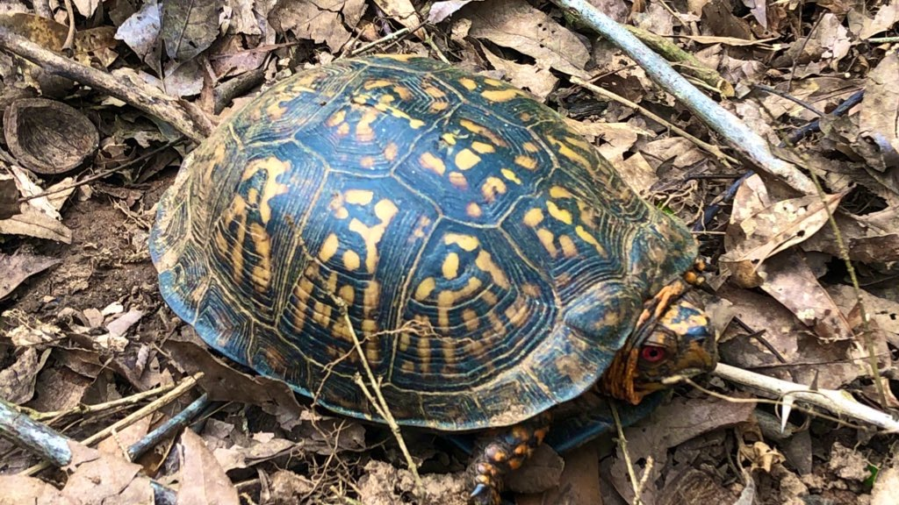

```{r eval=FALSE}
install.packages("bookdown")
```

# What is this?

Written by **J.P. Wares**, Professor, University of Georgia, jpwares [at] uga.edu

This is shared *by-nc-sa/4.0*, I'm not writing it to be some polished final thing but something that shifts through new ideas and new people using or modifying parts of it. This text may be used following these guidelines: https://creativecommons.org/licenses/by-nc-sa/4.0/

This document is being updated for the GENE 8420 course at University of Georgia to improve the experiential nature of learning the methods necessary for the field of "*molecular ecology*". Maintaining it as an .Rmd allows direct analytical opportunities (and familiarity with basic statistical coding approaches) and the ability to incorporate some simple simulation tools using Shiny. It will also let me update as needed in a straightforward way.

## Why write this?

For most of my career as a biologist, I've found myself wanting to know *why things are where they are*. That means I need to know **what** they are, and how they can move; rules like chess but far more complex and varied, and sometimes involving low probabilities. I need to know these things with varying degrees of precision given the questions being asked about those organisms. The 'molecular ecology' approaches we will learn and evaluate in here have helped a lot with this pursuit, but of course it all roots in knowing as much as you can about the organisms - life history, ecology, development and maturation - otherwise. 

<br>

```{r, out.width='90%', fig.align='center', fig.cap='...',echo=FALSE}

```

**Surely you already have some thoughts on how turtles move, and what that could mean for the spatial distribution of diverse phenotypes and molecular diversity within their range? (photo: J. Wares)** 
\newpage

## Why would I use this?

I *think* I'm writing this in a way that more advanced students can skim the first few chapters and gain something from focusing on the latter ones; a more novice course might only get through the first several chapters and then just read appropriate-focused papers (e.g. in an undergrad/grad version of this class). I want to think about how to *teach* molecular ecology, not just about how to do it. It seems there has to be some coding expertise that comes into play at this point, and some experiential practice. So, I think this is what is going to work. I hope.

## Organization (Syllabus)

### Expectations for all students

Most elements of the class, including the schedule, are handled at the class website: sites.google.com/view/gene-8420-spr-2023/syllabus

Doing well requires your engagement in the class – which includes *preparation* for class, *focus* during our activities, *presence* and responsiveness, asking *questions* by whatever format, *listening* to others, referring to *specific* ideas from readings/discussion, and *synthesis* of all this information. 

You will be graded based on:

1. short-answer quizzes, which will count towards 50% of your grade. I don't love quizzes but they will individually be low-stakes and ensure your attention to the material stays current with the class. These will happen roughly every 2 weeks. 

2. 2-page "data reaction reports" will require you to do some analysis and make interpretations of that analysis, there will be fewer of these through the semester and they count towards 25% of your grade.

3. a data analysis project of your own design, using available data whether published or unpublished, is worth 25% of your grade. A proposal for this project is due in February, a draft of it in March, and the final report in April. 
\newpage

## Topics we will cover

([**Chapter 1: **](#Ch1) Overview of text)

([**Chapter 2: **](#Ch2) Basics of genomic data)

([**Chapter 3: **](#Ch3) Mutational diversity)

([**Chapter 4: **](#Ch4) Types of spatial diversity)

([**Chapter 5: **](#Ch5) Population models)

([**Chapter 6: **](#Ch6) Adding in reality of landscapes)

([**Chapter 7: **](#Ch7) Getting into selection etc.)

([**Chapter 8: **](#Ch8) The phenotype and quantitative traits)

([**Chapter 9: **](#Ch9) Parentage)

([**Chapter 10: **](#Ch10) Intuition and surprises)
\newpage

## Experiential learning

The first day of classes we will prep our computers for using R/RStudio for a major resource in this class. If at all possible, before the class begins you should install R:

https://www.r-project.org

and RStudio (free version):

https://rstudio.com/products/rstudio/

Please note the risk in all of this is that *packages* and *versions* of software are constantly changing, and sometimes code that has been working will stop (and vice-versa) because of these changes. Additionally, a key element of making this work - currently - is making sure that the *path* is set correctly so that this .Rmd file can find figures and code to interact with. I'm hoping I've set this up so that everything works from the directory you downloaded, but we will double-check today.

```{r setup2, include=FALSE}


# students should make these lines active to install packages that they may need.
#get package names
pckgs <- c("tidyverse", "shiny", "wesanderson","devtools","learnPopGen")

#determine if packages are installed already
miss <- pckgs[!pckgs %in% installed.packages()]

#install missing packages
if(length(miss)) install.packages(miss, dependencies = TRUE)
# going to try shiny_popgen but not sure how to include in Rmd yet...
library(tidyverse)
library(shiny)
library(wesanderson)
library(devtools)
```

## R Markdown and Shiny 

This is an R Markdown document, with Shiny apps built in. At this point in time, the Shiny apps are all written by the talented Dr. Silas Tittes and are available at https://github.com/silastittes/shiny_popgen. 

What does that mean? Markdown is a simple formatting syntax for authoring HTML, PDF, and Microsoft Word documents. For more details on using R Markdown see <http://rmarkdown.rstudio.com>. Adding the Shiny apps means that the document is *interactive*. The only downside is that it means that users must have **R** and **RStudio** installed, plus a few R packages, on their computer. 

(OK, another downside is it is going to be difficult to read in a hammock. Or, at least, you should read something else if you are in a hammock.) 

The upside is that it is more of a living document. It means that as data change, the output of analysis can change. It also means that R code can be built directly into the document so that you can see how some figures or modules are generated, and you can build on this knowledge. You can embed an R "code chunk" like this:

```{r driftsim}

library(learnPopGen)

drift.selection(p0=0.1,Ne=500,w=c(1,1,1),ngen=400,nrep=4)

```


I'm putting this text together using R Markdown in particular so that examples can be incorporated that students can then work with to try and understand how varying the input information affects our expectations about the molecular data used to answer ecological questions. For example, the code chunk above - and the figure it produces - not only illustrates *genetic drift* (here, an example where one of 2 alleles is initiated in a population at a frequency of 0.1, and the "effective population size" about which we will learn more, is 500; there are 4 replicate simulations - in fact you should notice that the figure is distinct every time you run this document!), but actually provides the code for the illustration that can be modified as knowledge of the process becomes more advanced (when looking at the R Markdown code document itself in *RStudio*, if you hit the green 'play' button in the upper right corner of the "code chunk" you can do the simulation over and over, and you can look at the code and probably figure out quickly how to change the parameters it runs under). 

By organizing this material the way I think it may come across to beginning students in the field, I hope to avoid the personal puzzle of when I initially shifted this class from 8000-level (intermediate grad course) to 4000-level (advanced undergrads with fewer prerequisites) by clarifying these probabilistic processes with illustrations based on simulations that the students can themselves repeat.

Because I'm using **Shiny** code for many of the documents in this class, you cannot "Knit" this document into a static form, but instead will hit "Run Document" (up near the top of the RStudio screen) once it is loaded into R and that will generate a browser text that is dynamic in some places to let *you* run the simulations. It is a work in progress, but for now it does mean that to work with this you must have access to a computer that will run R and RStudio, at a minimum.

This will be less a textbook that you read for complete comprehension, and more something you read to generate questions that we discuss; I am trying to "flip the classroom" and organize for future classes at the same time. Some aspects will need to be explained in class or using diverse media to make sense. When I was a sophomore learning cell biology, I know that I tested well on the subject but in the end, had zero clue what gel electrophoresis meant until I did it on a daily basis. (super basic intro to "electrophoresis": https://www.youtube.com/watch?v=ZDZUAleWX78) So, **your job is to ask questions!** That way, we learn more completely not just from me, but from each other and from our inquiry.

<style>
div.blue { background-color:#e6f0ff; border-radius: 5px; padding: 20px;}
</style>
<div class = "blue">
\newpage
For other users of this document, please note: I use a lot of examples I am familiar with, meaning they are often projects I'm an author on, or was on that person's committee, or whatever. There is so much other *fantastic* science out there, this isn't about ego though: it's just my ability to immediately dig deeper with those as examples not just of how the science *can* be done, but also about when it *could have been done better*. Also, I'm a marine ecologist; when I talk about plants, it is basically because of great colleagues who have entranced me with their weird and important terrestrial photosynthetic life, and mammals and fish similarly: I credit cool colleagues who have brought me into the fold. If you end up using this as an instructor, I encourage you to think about including your own, even better, examples.

Plus, I can imagine now I can just look in here for some of the papers I want others to refer to, you know - what was that paper I cited about *XXXXXX*? Oh yeah it was in chapter 4...

</div>